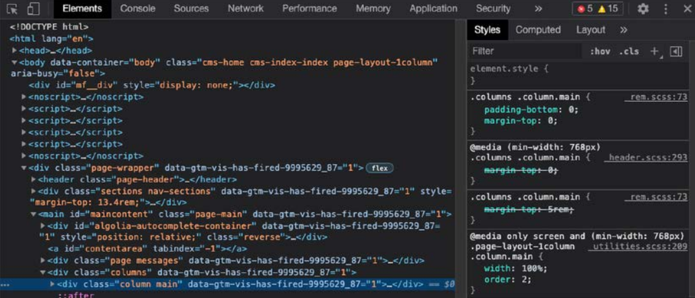
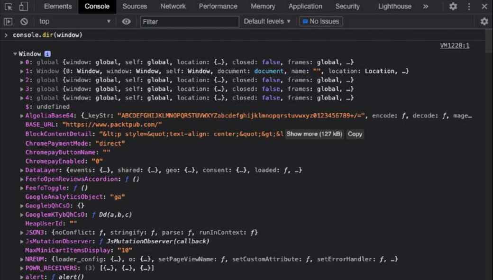

# Lenguaje de Programación I
## Profesor: Lic. Juan José González Ramírez
### Email: juanftp100.edu@gmail.com
### Github: 
- [Repositorio del profe - docencia](https://github.com/gallopeladoprofe)
- [Repositorio del profe - personal](https://github.com/gallopelado)

Aviso: Este documento está en constante actualización, favor dirigirse al email en caso de encontrar errores. Muchas gracias :sunglasses: :stuck_out_tongue_closed_eyes: :heartbeat:

## Capítulo 1 - Javascript
Javascript es un lenguaje de programación que puede ser utilizado tanto en el cliente como en el servidor para aplicaciones. Del lado del servidor está la lógica del *backend* que usualmente corren en computadoras de algún datacenter e interactúa con la base de datos, mientras que el lado del cliente es cuando se está usando algún dispositivo del usuario, a menudo el navegador.

De seguro habrás utilizado alguna funcionalidad escrita en Javascript. Si usaste un navegador web, como Chrome, Firefox, Safari, o Edge, entonces definitivamente lo utilizaste. Javascript está por toda la web. Si hiciste enter a una página web y esta te pregunto por las cookies e hiciste clik para aceptarlas, el popup desapareció. Esto es Javascript funcionando. Y si quiere navegar un sitio web y un sub-menu se abre, eso significa también Javascript. A menudo, cuando filtras productos en un sitio web de compras, esto significa Javascript. ¿Y que hay acerca de los chats que inicias conversando despues de haber permanecido una cierta cantidad de tiempo en un sitio web? Bueno, adivinaste, ¡es Javascript!

Tenemos muchísimas interacciones en un sitio web gracias a Javascript; los botones que estás haciendo click, tarjetas de cumpleaños que estás creando, cosas que estás calculando. Cualquier cosa que requiera mas que un sitio web estático necesita Javascript.

En este capítulo vamos a ver los siguientes temas:
- ¿Por qué debería aprender Javascript?
- Configurar mi entorno de trabajo
- ¿Cómo el navegador entiende Javascript?
- Usando la consola del navegador
- Agregando Javascript a una página web
- Escribiendo código de Javascript

### ¿Por qué debería aprender Javascript?
Hay muchas razones para aprender Javascript. Javascript se originó en 1995, y es considerado un el más ampliamente utilizado. Esto es porque Javascript es el lenguaje que soportan y entienden los navegadores web. Tienes todo lo que necesitas en tu navegador web para interpretar código y un editor de texto.

Es un gran lenguaje para los nuevos en el ambiente, y para los más avanzados desarrolladores que por lo menos sabe algo de Javascript porque en algún momento lo utlizaron. Javascript es una gran decisión para los novatos por muchas razones. La primera es que puedes empezar construyendo bonitas aplicaciones utilizando Javascript más rápido de lo que imaginas. Cuando lleguemos al *capítulo de los loops*, serás capaz de escribir complejos script que interactúan con usuarios. Al final serás capaz de escribir páginas web dinámicas que hacen un montón de cosas.

Javascript puede ser utilizado para escribir diferentes tipos de aplicaciones y scripts. Puede ser utilizado para la programación del navegador web, pero también la capa de lógica que no vemos (como la conexión a la base de datos) de una aplicación puede ser programadam, a traves de juegos, scripts de automatización, y para otros propósitos. Javascript puede ser utilizado con diferentes estilos de programación, el cual quiere decir diferentes formas para estructurar y escribir código. Si nunca escribiste código antes puede que no del todo sea enteramente necesario para este nivel, utilizar la programación (semi) orientado-objeto, funcional, y procedimental, ellos son nada más que diferentes paradigmas de programación.

Hay una tonelada de bibliotecas y frameworks que puedes utilizar una vez que aprendes lo básico de Javascript. Estas bibliotecas y frameworks realmente mejorarán el tiempo de vida de tu software y harán un montón de cosas más fácil y también terminar más con menos tiempo. Ejemplos de estas grandiosas bibliotecas y frameworks son React, Vue.js, jQuery, Angular, y Node.js. No te preocupes de ellas de momento.

Finalmente, mencionaremos la comunidad de Javascript. Javascript es un lenguaje de programación muy popular y mucha gente lo usa. Para alguien que está iniciando no debería de haber ningún problema para quien no pueda encontrar alguna solución en internet.

La comunidad de Javascript es enorme. Los foros de Stack OverFlow contienen un montón de ayuda de todo tipo, también solución a errores. Encontrarás en esa web muchísimas soluciones a problemas comunes y sus trucos.

Si Javascript es tu primer lenguaje de programación, eres nuevo en toda la comunidad, sigue intentando y aprendiendo, pronto entenderás los suficiente.

### Configurar mi entorno de trabajo
Hay muchas manera para configurar tu entorno de trabajo para codificar. Para los nuevos, tu computadora probablemente ya tiene toda las mínimas cosas que necesitarás para codificar Javascript. Recomendamos hacer tu vida más fácil y usar un IDE.

### IDE
Un **Integrated Development Enviroment**(Entorno integrado de desarrollo) es una aplicación especial que es usada para escribir, correr, y hacer debug del código. Tu tan solo pueder abrirlo como cualquier programa. Por ejemplo, para escribir un documento, necesitas abir un programa, seleccionar el archivo correcto, y empezar a escribir. Codificar es similar. Abres el IDE y escribes el código. Si quieres ejecutar código, el IDE a menudo tiene botones especiales para esto. Presionando este botón iniciará el programa dentro del IDE. Para Javascript, podrías encontrarte abriendo el navegador manualmente en ciertos casos sin embargo.

Un IDE hace más cosas sin embargo; *como coloreado y resalte de sintaxis*. Esto significa que ciertos elementos en tu código tendrán cierto color, y puedes verlo fácilmente cuando algo está mal. Otra gran característica es la *autosugerencia*, donde el editor te ayuda con opciones en el lugar donde estás escribiendo código. Esto a menudo es llamado *autocompletado*. Muchos IDEs tienen plugins y otras herramientas especiales que hacen más intuitivo y agradable el trabajo, por ejemplo el **hot reload in the browser**(recarga el navegador en caliente cuando hacemos cambios).

Hay muchos IDEs por ahí y ellos se diferencian en las cosas que tienen para ofrecer. **Utilizaremos [Visual Studio Code](https://code.visualstudio.com/)** para este módulo, pero eso es una preferencia personal. Otros populares también son Atom, Sublime Text, y WebStorm.

Hay muchos IDEs en la Internet pero debes escoger aquellos que soporten la sintaxis Javascript.

### Navegador(Web browser)
También necesitarás un navegador, todos menos Internet Explorer.

### ¿Cómo el navegador entiende Javascript?
*Javascript* es un lenguaje **interpretado**, esto significa que la computadora entiende mientras está ejecutando. Algunos lenguajes pueden ser procesados antes de la ejecución, esto es llamado **compilación**, pero no Javascript. La computadora solamente puede interpretar Javascript al vuelo(en el momento). El "motor(engine)" que entiende Javascript será llamado intérprete.


**Una página web no es Javascript**. Las páginas webs está escritas en tres lenguajes: HTML, CSS y Javascript.

**HTML** determina que estará en la página; el contenido de la pagina en él. Si hay un párrafo en la página, el HTML de la página contiene un párrafo. Y si es un heading(encabezado), HTML será usando para agrer un heading y así sucesivamente. Aquí un pequeño ejemplo que creará una página web con un texto ```Hello world``` en él:

```HTML
<html>
    <body>
        Hello world!
    </body>
</html>
```

Luego veremos lo que es el *Document Object Model*, vamos a ver primero un curso rápdio en HTML, no te preocupes si nunca viste algo como esto.

**CSS** es la capa de la página web. Por ejemplo, si el color del texto es azul, esto es realizado por CSS. El Font size(tamaño de fuente), font family(tipo o familia de fuente), y la posición en la página son determinados por CSS. Javascript es la pieza final en este rompecabezas, el cual define *qué puede hacer la página y como interactúa con el usuario o el backend*.

Cuando estamos tratando con Javascript, inevitablemente pasarás por un término muy pronto, **ECMAScript**. Esta es una especificación o estandarización del lenguaje Javascript. El actual estándar es **ECMAScript 6**(también referido como **ES6**). Los navegadores usan esta especificación para soportar Javascript (especialmente en algo llamado **Document Object Model(DOM)**. Javascript tiene muchas implementaciones que podrían diferir ligeramente, pero el ECMAScrip puede ser considerado la especificación básica que lo incluye.

### Usando la consola del navegador
De seguro habrás visto esto antes, o no, pero los navegadores tienen una función incluida. Si pulsas la tecla *F12* sobre una ventana de Windows mientras estás en un navegador, o clic derecho y **Inspeccionar**, se visualizará, algo similar a esto.

Luce así;


Este screenshot contiene múltiples pestañas en la parte de arriba. Ahora estamos mirando la pestaña "element", el cual contiene todo el HTML y CSS (¿recuerdas estos?). Si haces click sobre la pestaña "console", encontrarás al final del panel un lugar para escribir código algo de código directamente. Se podría ver algunas advertencias o mensajes de error en esta pestaña. Esto no es común, y no te preocupes si la página está funcionando.

La consola es usada por los desarrolladores para registrar que está ocurriendo y hacer algo de debug.
Debugging es encontrar el problema cunaod una aplicación no está mostrando el comportamiento deseado. La consola muestra algunas pistas acerca de lo que está ocurriendo y si registrar mensajes sensibles. Esto es de hecho el comando que ahora vamos aprender:

```javascript
console.log("Hello world!");
```

Si haces clic en esta consola, ingresa primero el código de Javascript abajo y luego aprieta *Enter*, esto mostrará una salida de tu código allí dentro. Debería mosrtar algo parecido a lo siguiente:


Tú estarías trabajando con la sentencia `console.log()` muchas veces a través del módulo para testear tu código y ver los resultados. También hay otros métodos, como `console.table()`, que crea una tabla cuando es ingresado datos que pueden ser mostrados como tabla. Otro comando es `console.error()`, el cual registra los dtos ingresados, pero con un estilo que muestra advertencia por el hecho de que es un error.

#### Ejercicio 1.1
Trabajando con la consola:
1. Ingresa a la consola del navegador, escribe `4 + 10`, presiona *Enter*. ¿Qué respuesta puedes ver?
2. Utiliza `console.log()`, poniendo un valor dentro del paréntesis. Intenta ingresar tu nombre con comillas (esto de hecho indica que es un texto string).

### Agregando Javascript a una página web
Hay dos formas de enlazar Javascript a una página web. El primer tipo es el de escribir directamente Javascript en el HTML rodeado de dos etiquetas `<script>`. En HTML, la primera etiqueta `<script>`, es para declarar lo que será ejecutado en el script. Luego tenemos el contenido que debería estár dentro de este elemento. Siguiente, cerramos el script con la misma etiqueta, pero precedida de una barra, `</script>`. O puedes enlazar un fichero de Javascript al documento HTML usando la etiqueta script al inicio del head del HTML de la página.

#### Directamente en HTML
Aquí hay un ejemplo de como escribir muy fácil una página web que muestra una ventana emergente(pop-up), diciendo `Hi there!`:

```htmlembedded
<html>
    <script>
        alert("Hi there!");
    </script>
</html>
```


El comando `alert` creará una ventana emergente(pop-up) que provee un `mensaje`. Este mensaje está especificado en medio de paréntesis detrás del alert.

Ahora mismo, tenemos el contenido directamente dentro de nuestro las etiquetas `<html>`. Esta no es la mejor práctica. Necesitaremos crear dos elmentos dentro `<html>`, `<head>` y el `<body>`.
En el elemento head, vamos a escribir los metadatos y también utilizaremos esta parte para conectar archivos externos a nuestra HTML. En el body, tenemos el contenido de la página web.

También necesitamos permitir al navegador saber que clase de document estamos trabajando con la declaración `<!DOCTYPE>`. Siempre al inicio del HTML. Ejemplo:

```HTML
<!DOCTYPE html>
<html>

<head>
    <title>Aquí va en la pestaña de tu navegador</title>
</head>

<body>
    El contenido de la página web
    <script>
        console.log("Hi there!");
    </script>
</body>

</html>
```

#### Ejercicio 1.2
Javascript en una página HTML:
1. Inicia el editor de código y crea un archivo HTML.
2. Dentro del archivo, coloca las etiquetas HTML, doctype, HTML, head, y body, luego procede a agregar las etiquetas de script.
3. Coloca algún código de Javascript dentro del script tag. Puedes usar `console.log("¡Hola mundo!")`.

### Enlazando un archivo externo a nuestra página web
También puedes enlazar un archivo a un documento HTML. Esto es considerado una buena práctica, como organiza mejor el código y evitas páginas HTML muy largas, debido a Javascript. Otro de los beneficios es que puede reutilizar el Javascript en otra página web de tu website sin estar copiando y pegando. Decimos que sin tenemos el mismo Javascript en 10 páginas y tu necesitas hacer cambios en el script.
Podrías solamente tener el cambio para un archivo y si lo hiciste de esta manera vamos a mostrarte en este ejemplo:

Primero vamos a crear un archivo de Javascript por separado. Estos archivos deben tener la extensión `.js`.
Lo llamaremos `ch1_alert.js`. Este será el contenido de nuestro archivo:

`alert("Diciendo hola desde un archivo diferente");`

Luego vamos a crear un archivo HTML por separado (usando la extensión `.html` otra vez).
Vamos a poner este contenido:

```HTML
<!DOCTYPE html>
<html>
<body>
    <script type="text/javascript" src="./ch1_alert.js"></script>
</body>
</html>

```

Debes estar seguro de colocar los archivos en la misma ubicación, o sino debes especificar la ruta hacia el archivo de Javascript en tu HTML. Los nombres son *case-sensitive* y deben coincidir exactamente.

Tienes dos opciones. Puedes utilizar una ruta relativa o absoluta. Veamos, tu computadora tiene una *raíz*. Para Linux o MacOS, este es `/`, para Windows, usualmente es `C:/`. La ruta del archivo que inicia desde la raíz es la ruta absoluta. Esta es la forma más fácil de agregar porque funciona en tu computadora. Pero esto tiene trampa: solamente en tu computadora, y si luego este directorio es movido a otro servidor, la ruta absoluta no será valida.

La segunda, y más segura opción es usar rutas relativas. Especificas como obtener el archivo desde el archivo donde estas en ese momento. Y si no estás en el misma carpeta, tendrás solo que insertar el nombre. Si esta no es llamada "ejemplo" que esta dentro de la carpeta donde tu archivo esta, debes especificar `ejemplo/nombreDelArchivo.js`. Y una carpeta, se especifica `../nombreDelArchivo.js`.


Si abres el archivo HTML, esto es lo que se mostrará:


#### Ejercicio 1.3
Enlazando a un archivo de Javascript:
1. Crear un archivo separado llamado `app` con la extensión `.js`.
2. Dentro del archivo`.js`, agrega algo de código de Javascript.
3. Enlaza al `.js` dentro del HTML creado.
4. Abre el HTML dentro de tu navegador y revisa si el código de Javascript se ejecutó apropiadamente.

### Escribiendo código de Javascript
Entonces, ahora que tenemos mucho contexto, ¿cómo es que se escribe código de Javascript?
Hay muchas cosas a tener en mente, tales como formatear el código, usar la sangría, los puntos y comas, y adición de comentarios.

### Formatear código
El código necesita ser bien formateado. Si tienes un archivo muy grande con muchas líneas de código y no apegaste a algunas reglas básicas de formateo, va a ser difíci de entender lo que has escrito. Entonces, ¿qué son las reglas básicas de formateo? Las dos más importantes por ahora son la *sangría y el punto y coma*. También la convención de nombrado.

### Sangría(Indentations) y espacios en blanco (whitespace)
Cuando estás escribiendo código, a menudo una línea de código pertenece a cierto bloque de código(código dentro dos de llaves ´{ como esto }´) o sentencia padre. Si es este caso, das una sangría al c´dogio para estar seguros que se puede ver más fácil que parte es del bloque y cuando un nuevo bloque empieza. No necesitas entender el siguiente código, pero este demuestra la legibilidad con y sin sangría.

Sin nuevas líneas:

```Javascript

let status = "new"; let scared = true; if (status === "new") { console.
log("Bienvenido a Javascript"); if(scared) { console.log("No te preocupes
todo estará bien"); } else { console.log("¡Eres valiente! ¡Lo harás genial!"); } 
} else { console.log("Bienvenido de vuelta, Sé que te gustará"); }

```
 Con nuevas líneas pero sin sangrías:
 
```Javascript
 
let status = "new";
let scared = true;
if (status === "new") { 
console.log("Bienvenido a Javascript"); 
if(scared) { 
console.log("No te preocupes todo estará bien"); 
} else { 
console.log("¡Eres valiente! ¡Lo harás genial!"); 
} 
} else { 
console.log("Bienvenido de vuelta, Sé que te gustará"); 
}
 
```

Con nuevas líneas y sangrías

```Javascript
 
let status = "new";
let scared = true;
if (status === "new") { 
    console.log("Bienvenido a Javascript"); 
    if(scared) { 
        console.log("No te preocupes todo estará bien"); 
    } else { 
        console.log("¡Eres valiente! ¡Lo harás genial!"); 
    } 
} else { 
    console.log("Bienvenido de vuelta, Sé que te gustará"); 
}
 
```

Así como puedes ver, ahora puedes fácilmente distinguir los bloques de código finales. Esto es donde el `if` tiene su correspondiente `}` con el mismo nivel de sangría. En el ejemplo sin sangrías, tendríamos que contar las llaves para determinar cuando el bloque `if` terminaría. Sin embargo esto no es necesario para trabajar código, asegurate de usar la sangría bien. Te lo agradecerás luego.

### Punto y coma (semicolons)
Después de cada sentencia, deberías insertar un punto y coma. Javascript es muy permisivo y entiende muchas situaciones en el cual olvidas una, pero desarrollar es el hábito de agregar una línea después de otra línea. Cuando declaras un bloque de código tal como un `if` o un loop, no debería terminar con un punto y coma. Solamente si son sentencias separadas.

### Comentarios de código
Con los comentarios, puedes decirle al intérprete que ignore algunas líneas del archivo. Ellos no serán ejecutados si son comentados. Esto es a menudo útil para permitir o evitar la ejecución de una parte del código. Esto podría ser una de las siguientes razones:
1. No quieres ejecutar una pieza de código mientras se ejecuta el script, entonces comentas la línea que será ignorada por el intérprete.
2. Metadatos. Agregando un poco de contexto al código, tales como autor, una descripción de qué cubre el archivo.
3. Agregando comentarios para especificar partes del código para explicar que está ocurriendo o porque ciertas opciones fueron hechas.

Hay muchas formas de escribir comentarios. Puedes escribir una *single-line* o un *multi-line* de comentarios. Ejemplo:

```Javascript!

// Soy una single line o comentario de una línea
// console.log("comentario single line, no registrado");

/* Soy una multi-line o comentario de varias líneas. Cualquier cosa que está en medio de la barra
y el asterisco no serán ejecutadas.
console.log("No seré registrado, porque soy un comentario");
*/

```
El precendente fragmento de código, puedes ver ambos estilos de comentarios. El primero es una *single-line*. Esto también es un *inline comment* o comentario de una línea. Cualquier cosas después de `//` en la línea será ignorada. La segunda es la *multiline*; esta es escrita empezando con `/*` y terminando con `*/`.

#### Ejercicio 1.4
Agregando comentarios
1. Agrega una nueva sentencia en tu código de Javascript configurando el valor de una variable. Cubriremos esto en siguientes lecciones, de momento puedes utilizar la siguiente línea: `let a = 10;`
2. Agregar un comentario al final de la sentencia indicando que estás seteando el valor de `10`.
3. Imprime el valor usando `console.log()`. Agrega un comentario explicando que esto hará.
4. Al final de tu código de Javascriptm utiliza un *multi-line comment*. En un script real de producción, podrías usar este espacio para agregar brevemente una reseña.

### Prompt
Otra cosa que nos gustaría mostrar aquí es el promp. Este funciona muy parecido al alert, pero en vez de este, toma valores del usuario. Aprenderemos como guardar variables pronto, y una vez que lo sepamos, podrás guardar el resultado de este prompt y hacer algo con el. Adelántate y cambia el `alert()` por un `prompt()`, por ejemplo:

`prompt("Holis, ¿cómo estas?")`


El valor que se ingresó(cualquier otro valor ingresado) será retornado al script, y puede ser usado en tu código. Esto es genial para obtener entradas del usuario.

### Números randómicos o aleatorios
Para hacer más entretenidos los ejercicios en estas primeras etapas, me gustaría mostrarte como se generan números aleatorios en Javascript. Esta bien si no entiendes bien esta parte y qué está pasando, solamente nos conviene saber que este comando crea un número aleatorio:

`Math.random();`

También se puede hacerlo en la consola y ver el resultado que aparece en la misma:

`console.log(Math.random());`

Este número será decimal entre 0 y 1. Si quisiesemos números entre 0 y 100, podemos multiplicarlo por 100, ejemplo:

`console.log(Math.random() * 100);`

Ejemplo usado en la consola del navegador:


Y si no queremos que los resultados sean decimales, podemos utilizar el la función `Math.floor` en el, el cual redondeará el valor a un `integer`:

`console.log(Math.floor(Math.random() * 100));`


#### Proyecto 1
#### Creando un archivo HTML y enlazando con un archivo de Javascript
Crear un archivo HTML con su archivo de Javascript por separado. Luego, conecta el archivo de Javascript al archivo de HTML.
1. En el archivo de Javascript, muestrar tu nombre en la consola y agrega un *multi-line* comentario a tu código.
2. Intenta comentar el mensaje de la consola en tu archivo de Javascript para que nada se muestre en la consola.

#### Quiz 1
1. ¿Cuál es la sintaxis HTML para agregar un archivo externo de Javascript?
2. ¿Puedes ejecutar Javascript en un archivo sin la extensión JS en tu navegador?
3. ¿Cómo escribir un *multi-line* comentario en Javascript?
4. ¿Cuál es la mejor forma de remover una línea de código en ejecución que quieres mantener como si fuese un debug?

## Capítulo 2 - Javascript Essentials
En este capítulo vamos a tratar, con bloques esenciales de construcción de Javascript: variables y operadores. Vamos a empezar con las variables, que son, y qué tipos de datos existen. Necesitamos estas estructuras básicas para guardar y trabajar con valores de variables en nuestros scripts, y hacerlos dinámicos.

Una vez hayamos cubeirto las variables, estaremos listos para trabajar con los operadores.
Aritméticos, asignación, condicionales y operadores lógicos que será debatidos en esta etapa. Necesitamos operadores para modificar nuestras variables o para decir algo acerca de ellas. Podremos hacer cálculos basados en factores que el usuario ingresa.

A lo largo de esto, vamos a cubir los siguientes temas:
- Variables
- Tipos de datos primitivos
- Analizando y modificando tipos de datos
- Operadores

### Variables
Las variables son el primer bloque de construcción cuando estás aprendiendo algún lenguaje. *Las variables son valores* en tu código que representan diferentes valores en algún momento del programa.

Un ejemplo de dos variables en un script:

```javascript

primernombre = "Rosa";
x = 2;

```

Y ellas pueden ser representadas con un nuevo valor mientras el código esté en ejecución:

```javascript

primernombre = "Sara";
x = 8;

```

Sin variables, una pieza de código haría exactamente lo mismo en el mismo tiempo cuando es ejecutada. Sin embargo puede seguir siendo útil en algunos casos, puede hacer cosas más potentes trabajando con variables que te permiten hacer diferentes cosas cada vez.

### Declarando variables
Cuando vas a crear variables, debes declararlas primero. Y necesitas una palabra "especial" que es: `let, var` o `const`. Luego vamos a discutir, el uso de esos tres argumentos. La segunda vez que llamas a la variable, solamente usas el nombre existente para asignar un nuevo valor:

```javascript

let primernombre = "Rosa";
primernombre = "Celina"

```

En nuestros ejemplos, asignaremos un valor a nuestras variables en el código. Esto es llamado "hardcoded" o "en duro" desde que el valor definido en tu script lo hiciste tú en vez de que haya sido dinámicamente. Esto es algo que comúnmente no harás muy a menudo, los valores usualmente vienen de cajas de texto que están en alguna página web, algún formulario, datatables, etc. Esto hace a nuestro código adaptable a nueva información, sin tener que reescribir el código.

Hemos solamente establecido como son de poderosas los bloques de construcción de variables en código.  Ahora vamos a *hardcodear* variables en nuestro script, y por lo tanto nuestras varibales no variarán después de codificar cambios en el programa. Sin embargo, pronto vamos aprender a como hacer que nuestras variables tomen valores de otros lugares.

### let, var y const
Una definición de variable consiste en tres partes: una palabra clave que defina-variable(`let`, `var` o `const`), un nombre, y un valor. Empecemos con las diferencias entre `let, var` o `const`.

```javascript

let nr1 = 12;
var nr2 = 8;
const PI = 3.14159;

```

`let` y `var` son usadas por variables que podrían tener un nuevo valor asignado algún lugar en el programa. La diferencia en entre `let` y `var` es compleja. Tiene que con el *contexto*.

`var` tiene algo llamado **global scope** y `let` tiene **block scope**. Global scope o *contexto global* significa que puedes usar las variables definidas con `var` en todo el script. En otras palabas, el Block scope o *contexto de bloque* significa que solamente puedes utilizar variables definidas con `let` en un específico bloque de código en el cual se ha definido. Recuerda que un bloque de código siempre empieza con `{` y termina con `}`.

En otras palabras, `const` es usado por variables que *solamente* serán asignadas **una vez(constante)**, por ejemplo, el valor de pi, el cual no cambia. Si intentas reasignar un valor declarado con `const`, obtendrás un error:

```javascript

const algunaConstante = 3;
algunaConstante = 10,

```

El resultado de esto será:

`Uncaught TypeError: Assignment to constant variable`

Nosotros estaremos usando `let` en la mayoría de los ejemplos.

### Nombrado de variables
Hay algunas convenciones en cuanto al nombrado de variables:
- Las variables empiezan en **minúsculas** y deben ser **descriptivas**. Si algo almacena la edad, no lo llames `x`. Esto es para que cuando leas tu código luego puedas entenderlo y que hiciste solamente leyendo.
- Las variables **no contienen espacios**, pero se puede usar **guión bajo**. Si usas un espacio, Javascript no podrá reconocerlo.

---

Nota: Usaremos camel case. Esto significa que cuando queremos usar múltiples palabras que describen una variable, empezaremos con *minúscula*, luego por cada nueva palabra usaremos la primera letra en *mayúscula*, por ejemplo: `edadDelComprador`.

---

El valor de tus variables pueden ser cualquier cosa.

### Tipos de datos Primitivos
Ahora ya sabes que son las variables y por qué necesitamos de ellas en nuestro código, es tiempo para mirar los diferentes tipos de valores que podemos almacenar en variables. Las variables obtienen un valor asignado. Y estos valores pueden ser de diferentes tipos. Javascript no es exigente en cuanto a tipos. Esto significa que *Javascript determina el tipo basado en el valor*. El tipo no es necesario nombrarlo explícitamente. Por ejemplo, si declara un valor 5, Javascript automáticamente lo definirá como un tipo `number`.

#### String
Un string o cadena es usado para alamcenar valor de texto. Es una secuencia de caracteres. Hay muchas maneras de declarar un string:
- Dobles comillas (double quotes)
- Comillas simples (single quotes)
- Comillas invertidas (backticks): para *template strings* en el cual puedes usar variables directamente en el string

Las comillas simples y dobles puede ser usadas de la misma manera:

```javascript

let singleString = 'Holis';
let doubleString = "¿Cómo estas?";

```
---

Nota: Puedes usar la opción que prefieras, a no ser que estés trabajando en un código donde el cual una de las opciones han sido tomadas. De vuelta, la *consistencia* es la clave.

---

La principal difenncia entre comillas simples y dobles es cuando quieres usar caracteres literales en doble comillas, y viceversa. Si tu quieres declarar un string con comillas simples, el string terminará cuando la última comilla se ponga, no importad si esta a la mitad de la palabra. Por ejemplo:

```javascript

let funActivity = 'Let's learn Javascript';

```

Esta será reconocida como un string, pero luego que, el conjunto de caracteres que siguen no podrán ser interpretadas por Javascript. Sin embargo, si declaras el string usando dobles comillas, no terminará con la última comilla, ejemplo:

```javascript

let funActivity = "Let's learn Javascript";

```

En la misma idea con comillas dobles, el siguiente ejemplo no funcionará:

```javascript

let pregunta = "¿Te gustaría aprender Javascript? "Si!"";

```

Otra vez el compilador no distinguirá entre comillas dobles en un mismo contexto y mostrará un error.

En las comillas invertidas(backticks), puedes apuntar la variable y el valor de la misma será sustituida dentro de la línea, ejemplo:

```javascript

let lenguaje = "Javascript";
let mensaje = `Aprendamos ${lenguaje}`;
console.log(mensaje);

```

Así como puedes ver, especificarás estas variables con bastante e interesante sintaxis, no te sientas intimidado. La razón es que esto simplifica los casos de tener que mezclar las comillas dobles o simples cuando están juntas y así evitamos concatenaciones innecesarias.

### Escapar caracteres
Decimos que queremos tener comillas simples, dobles e invertidas en nuestro string. Podríamos tener un problema, como esto no puede estar listo con los ingredientes que tenemos ahora. Hay un carácter especial que podemos usar para decirle a Javascript, "No tomes el siguiente carácter como normalmente lo haces". Esto es el escapado de caracteres, un *backslash*

En este ejemplo, el *backslash* puede ser usado para asegurar que el intérprete no vea la comilla doble o simple y terminar muy rápido:

```javascript

let str = "Hola, ¿cuál es tu nombre? ¿Es \"Juan\"?";
console.log(str);
let str2 = 'Hola, ¿cuál es tu nombre? ¿Es "Juan"?';
console.log(str2);

```

Este log muestra en la consola:

```
Hola, ¿cuál es tu nombre? ¿Es "Juan"?
Hola, ¿cuál es tu nombre? ¿Es "Juan"?

```

Así como puedes ver, ambos tipos de comillas dentro de los strings fueron mostrado sin errores. Esto es porque el *backslash* antes de la comilla le da un significado diferente. En este caso, el significado es que debería ser un carácter literal en vez de un indicador de fin de la cadena.

El carácter de escape tiene aún más propósitos. Puedes usarlo para crear una punto de ruptura con `\n`, o incluir el *backslash* en el texto con `\\`:

```javascript

let str3 = "Nueva \nlínea";
let str4 = 'Estoy conteniendo un backslash: \\!';
console.log(str3);
console.log(str4);

```

La salida de estas lineas son:

```
Nueva
línea
Estoy conteniendo un backslash: \!
```

### Number
El tipo de dato number es usado para representar, números. En muchos lenguajes, hay una muy clara diferencia entre los tipos numéricos. Los desarrolladores de Javascript decidieron ir por un tipo de dato por todos los números: number. Para ser más precisos, ellos decidieron ir por algo llamado *64-bit floating-point number*. Esto significa que ellos pueden guardar numeros bastante grandes y ambos tanto con signo o sin signo, números con decimales, y más.

Sin embargo, hay diferentes tipos de numeros que pueden ser representados. Primero que todo, integers, por ejemplo: 4 o 89. Pero los tipos de datos numéricos también pueden ser representados por decimales, exponenciaciones, octales, hexadecimales, y números binarios. Ejemplo:

```javascript

let inrNr = 1;
let decNr = 1.5;
let expNr = 1.4e15;
let octNr = 0o10; //la versión decimal sería ser 8
let hexNr = 0x3E8; // la versión decimal sería 1000
let binNr = 0b101; // la versión decimal sería 5

```

No deberías preocuparte acerca de estos últimos tres si no estas familiarizado con ellos. Estos sin sólo diferentes formas de representar números que puedes encontrarte en el amplio campo de la ciencia de la computación. Entonces los integer son números, como:

```javascript

let intNr2 = 3434;
let intNr3 = -111;

```

Y los de punto flotante son números también:

```javascript

let decNr2 = 45.78;

```

Y los números binarios son números también:

```javascript

let binNr2 = 0b100; // sería un 4

```

### BigInt
Los límites de los tipos de datos numéricos son 2<sup>53</sup>-1 y -(2<sup>53</sup>-1). En caso que necesites números más grandes (o más pequeños), BigInt entra en juego. Un tipo de dato BigInt puede ser reconocido por el posfijo `n`;

```javascript

let bigNr = 90071992547409920n;

```

Veamos que pasa si cuando empezamos a hacer cálculos entre nuestro previo número integer, `intNr`, y BigInt, `bigNr`:

```javascript

let resultado = bigNr + intNr;

```

La salida será:

`Uncaught TypeError: Cannot mix BigInt and other types, use explicit conversions`

Un *Typerror!*, es muy claro acerca de lo que esta funcionando mal. No podemos mezclar BigInt con Number para realizar la operación.

### Boolean
El tipo de dato booleano puede almacenar dos valores: `true` o `false`. No hay nada en medio. El booleano es usado muchas veces en el código, especialmente en expresiones de evaluación:

```javascript

let bool1 = false;
let bool2 = true;

```

En el ejemplo anterior, puedes ver las opciones que tenemos para el tipo de dato Boolean. Es usado para situaciones en el cual necesitas almacenar Falso o Verdadero o Prendido o Apagado, Sí o No, etc. Por ejemplo:

```javascript

let estaBorradoElObjeto = false;

```

O, si la luz está prendida o apagada:

```javascript

let luzEstaPrendida = true;

```

Estas variables sugieren respecticamente que el objeto esta borrado o que la luz esta prendida.

### Symbol
Symbol es un nuevo tipo de dato introducido en ES6 (recuerdas que mencionamos sobre ECMA Script 6) o ES6. Symbol puede ser usado cuando ciertas variables no son iguales, a pesar de su valor y tipo sean el mismo. Ejemplo:

```javascript

let str1 = "JavaScript es divertido";
let str2 = "JavaScript es divertido";
console.log("Estas dos variables son lo mismo: ", str1 === str2);

let sym1 = Symbol("JavaScript es divertido");
let sym2 = Symbol("JavaScript es divertido");
console.log("Estas dos variables son lo mismo: ", sym1 === sym2);

```

La salida sera:
```
Estas dos variables son lo mismo: true
Estas dos variables son lo mismo: false
```

En la primera mitad, Javascript concluye que son lo mismo. Ellos tienen el mismo valor, y el mismo tipo. Sin embargo, en la segunda parte, cada *symbol* es *único*.

En JavaScript, el tipo de dato Symbol se utiliza para crear valores únicos e inmutables. Los símbolos son útiles cuando necesitas crear propiedades de objetos que no colisionarán con otras propiedades, ya que cada símbolo es único. Puedes usarlos como claves de propiedades para evitar posibles conflictos en el nombre de las propiedades. Por lo tanto, por más de que contengan el mismo string, no son lo mismo, y la salida es `false` cuando son comparadas.

Por ejemplo:

```javascript!
const sym = Symbol('miSimbolo');

const obj = {
  [sym]: 'Hola, soy un símbolo'
};

console.log(obj[sym]); // Imprime: Hola, soy un símbolo
```

Aquí, Symbol('miSimbolo') crea un símbolo con una descripción opcional ('miSimbolo' en este caso). La descripción no afecta a la unicidad del símbolo; es solo para propósitos descriptivos.

### Undefined
Javascript es un lenguaje muy especial. Este tiene un tipo de dato especial para las variables a las que no se les asigno un valor. Entonces, su tipo de dato es `undefined` o indefinido:

```javascript!
let noasignado;
console.log(noasignado);
```

La salida será:
`Undefined`

Podemos a propósito asignar un valor `undefined`. Esto es importante saber, que es posible, pero es aún más importante saber que asignarlo es una *mala práctica*:

```javascript!
let terribleCosaParaHacer = undefined;
```

Todo bien, es posible hacerlo, pero **no es recomendado**, por un número de razones -por ejemplo, revisar si dos variables tienen lo mismo. Si una variable es `undefined`, y tu variable fue almacenada con `undefined`, ellos serán iguales. Esto es un error por si estás revisando la igualdad, querrías saber si son de hecho iguales, no solamente si son `undefined`. Imagina la mascota de alguien y su apellido podrían ser consideradas iguales, pero en realidad están vacíos.

### null
En este ejemplo, veremos un error que puede resolverse con un tipo primitivo, `null`. `null` es un valor especial por así decirlo, representa una variable vacía o que tiene un valor desconocido. Cuidado con las mayúsculas, es sensible a ellas, siempre en minúsculas:

```javascript!
let vacio = null;
```

Para resolver el error encontrado de una variable con `undefined`, nota que si pones null, no tendrás el mismo problema. Esta es una de las razones del porque es mejor asignar nukk a una variable cuando intentas decir que estará vacía:

```javascript!
let terribleCosaParaHacer = undefined;
let apellido;
console.log("Mismos undefined: ", apellido === terribleCosaParaHacer);

let buenaPractica = null;
console.log("El null: ", apellido === buenaPractica);
```

La salida en consola:
```
Mismos undefined:  true
El null:  false
```

Esto muestra que de forma automática se pueden crear variables undefined, `apellido`, y deliberadamente otra `terribleCosaParaHacer`, son consideradas iguales, lo cual es problemático. Del otro lado, `apellido` y `buenaPractica`, que fueron explícitamente declarados, con null, no son iguales.

### Analizando y modificando tipos de datos
Vimos los tipos de datos primitivos. Hay algunos métodos preconstruidos en Javascript que nos ayudarán a lidiar con algunos problemas relacionados con los primitivos. *Built-in methods* o métodos preconstruidos son piezas lógicas que pueden ser usadas para escribir lógica de Javascript sin tener que reescribirla tu mismo.

Nota: Ya hemos visto un método built-in: `console.log()`

### Trabajando con `typeof` de variables
Especialmente con null y undefined, puede ser difícil determinar cual es el tipo de dato con el que estamos trabajando. Veamos a `typeof`, este retorna el tipo de dato de la variable. Ejemplo:

```javascript!
testVariable = 1;
variableTypeTest1 = typeof testVariable;
variableTypeTest2 = typeof(testVariable);
console.log(variableTypeTest1);
console.log(variableTypeTest2);
```
Como supnes, ambos métodos retornan un `number`. Los paréntesis no son necesarios porque técnicamente, `typeof` es un operador, no un método, diferente de `console.log()` . Pero, a veces podría ser cómodo usarlo con paréntesis porque hace más facil leer tu código, otro ejemplo:

```javascript!
let str = "holis";
let nr = 7;
let bigNr = 1234567891234n;
let bool = true;
let sym = Symbol("único");
let undef = undefined;
let desconocido = null;

console.log("str", typeof str);
console.log("nr", typeof nr);
console.log("bigNr", typeof bigNr);
console.log("bool", typeof bool);
console.log("sym", typeof sym);
console.log("undef", typeof undef);
console.log("desconocido", typeof desconocido);
```

La salida en consola:
```
str string
nr number
bigNr bigint
bool boolean
sym symbol
undef undefined
desconocido object
```

Hay una extraña salida, el que es `null`. Se ve que el `typeof null` retorna un `object`, de hecho, `null` es un primitivo y no un objeto. Este es un bug que estado siempre y no puede ser removido por problemas de compatibilidad hacia atrás.

### Convirtiendo tipos de datos
Las variables en Javascript pueden cambiar de tipos. Algunas veces esto ocurre de forma automática. ¿Qué ocurriría si hacemos lo siguiente?:

```javascript!
let nr1 = 2;
let nr2 = "2";
console.log(nr1 * nr2);
```
Estamos tratando de multiplicar un tipo Number con una variable de tipo String.
Javascript no retorna ningún error (así como otros lenguajes sí lo hacen), pero primero intenta convertir el string a un numérico. Si esto se puede hacer, se ejecuta sin problemas como si se declarasen dos números. En este caso, `console.log()` escribirá en la consola el `4`.

¡Pero esto es peligroso! Intenta adivinar que sucede con lo siguiente:

```javascript!
let nr1 = 2;
let nr2 = "2";
console.log(nr1 + nr2);
```

Esto va mostrar `22`. El signo `+` también es usado para concatenar strings. Por lo tanto, en vez de convertir un string a number, el number pasará a ser un string, luego se concatenará, cosa que no queremos. Por suerte no debemos confiar en este comportamiento cuando se convierten los tipos de datos. Hay funciones preconstruídas que nos ayudarán en este proceso.

Hay tres métodos de conversión: `String(), Number(), Boolean()`. El primero convierte una variable al tipo String. Es mucho más que tomar cualquier valor, incluyendo undefined y null, pone las comillas alrededor de ello.

El segundo intenta convertir una variable a Number. Si no puede hacerlo, lo convertirá a un valor de tipo `Nan`(Not a Number). `Boolean()` convierte una variable a un Boolean. Esto será true para todo excepto para null, undefined, `0`(number), cadena de texto vacía y NaN. Ejemplo:

```javascript!
let nrToStr = 6;
nrToStr = String(nrToStr);
console.log(nrToStr, typeof nrToStr);

let strToNr = "12";
strToNr = Number(strToNr);
console.log(strToNr, typeof strToNr);

let strToBool = "algún string será retornado como true";
strToBool = Boolean(strToBool);
console.log(strToBool, typeof strToBool);
```

Finalmente, la salida en consola será:
```
6 string
12 'number'
true 'boolean'
```

Vamos a probar un poco tu cerebro. ¿Qué piensas que se mostrará aquí?:

```javascript!
let nr1 = 2;
let nr2 = "2";
console.log(nr1 + Number(nr2));
```

#### Ejercicio 2.1
¿Cuales son los tipos de estas variables listadas abajo? Verifica con`typeof` y muestra la salida del resultado en consola:

```javascript!
let str1 = 'Laurence';
let str2 = "Svekis";
let val1 = undefined;
let val2 = null;
let myNum = 1000;
```

### Operadores
Luego de mirar un poco los *data types* y las formas de convertirlos, es tiempo de ver otros bloques de construcción: operadores

### Operadores Aritméticos
Los operadores aritméticos pueden ser usados para trabajar operaciones con números.

### Adición
La adición en Javascript es muy simple, ya lo vimos. Usamos el símbolo `+`:
```javascript!
let nr1 = 12;
let nr2 = 14;
let result = nr1 + nr2;
```

Sin embargo, este operador puede también ser muy práctico concatenando strings, inclusive el espacio:

```javascript
let str1 = "Holis ";
let str2 = "adición";
let result = str1 + str2;
```

En la consola debería verse:
```
26
Hola adición
```
#### Ejercicio 2.2
Crea una variable para tu nombre, otra variable para tu edad, otra variable para saber si sabes codificar o no en Javascript.
Muestra en la consola, con tu nombre, tu edad y si es true/false:

```
Hola, mi nombre es Mike, tengo 25 años y puedo codificiar en Javascript: true
```

### Substracción
La substracción funciona como lo esperaríamos también. Usamos el signo `-`:
```javascript!
let nr1 = 20;
let nr2 = 4;
let str1 = "Holis";
let nr3 = 3;
let result1 = nr1 - nr2;
let result2 = str1 - nr3;
console.log(result1, result2);
```
La salida es:
`16 NaN`
El primer resultado es `16`. Y lo segundo es un resultado interesante. Nos da un`NaN`, no un error, pero la conclusión a esto es que una palabra y un número no pueden substraerse.

### Multiplicación
Podemos multiplicar dos variables numéricas con el `*`. A diferencia de otros lenguajes, no podemos multiplicar exitosamente un número y un string.
El resultado de multiplicar un numérico y otro que no lo es, retorna `NaN`:
```javascript!
let nr1 = 15;
let nr2 = 10;
let str1 = "Hi";
let nr3 = 3;
let result1 = nr1 * nr2;
let result2 = str1 *nr3;
console.log(result1, result2);
```
La consola muestra:
`150 NaN`

### División
La divisón también es una operación directa. Podemos dividir dos números con `/`:

```javascript!
let nr1 = 30;
let nr2 = 5;
let result1 = nr1 / nr2;
console.log(result1);
```
Muestra en consola:
`6`

### Exponenciación
La exponenciación significa que teniendo cierta base numérica a elevar de un exponente, se usa `**`:

```javascript!
let nr1 = 2;
let nr2 = 3;
let result1 = nr1 ** nr2;
console.log(result1);
```

### Módulo
El módulo es la operación en el cual se determina cuanto es el residuo de la división, se usa `%`:

```javascript!
let nr1 = 10;
let nr2 = 3;
let result1 = nr1 % nr2;
console.log(`${nr1} % ${nr2} = ${result1}`);

let nr3 = 8;
let nr4 = 2;
let result2 = nr3 % nr4;
console.log(`${nr3} % ${nr4} = ${result2}`);

let nr5 = 15;
let nr6 = 4;
let result3 = nr5 % nr6;
console.log(`${nr5} % ${nr6} = ${result3}`);
```

El resultado es:


### Operadores unarios: incremento y decremento

```javascript!

let nr1 = 4;
nr1++;
console.log(nr1);

let nr2 = 4;
nr2--;
console.log(nr2);

```


### Prefijos y posfijos
Podemos tener el operador de incremento despues del operando `x++`, en el cual usamos el operador posfijo. También podemos hacerlo antes `++x`, esto es el prefijo.
El postfix o posfijo es ejecutado despues de enviar a la variable el valor:

```javascript!
let nr = 2;
console.log(nr++);
console.log(nr);
```


Con el prefijo, es ejecutado antes de enviarse a la variable:

```javascript!
let nr = 2;
console.log(++nr);
```


### Combinando operadores
Estos operadores pueden combinarse, y funcionan igual que en matemáticas. Ellos se ejecutan en cierto orden, no necesariamente de izquierda a derecha. Este fenómeno conocido es llamado precedencia de operadores.

| Nombre | Símbolo | Ejemplo |
|--------|---------|---------|
| Agrupación | `(...)` | `(x + y)`|
| Exponenciación | `**` | `x ** y` |
| Prefijos y Posfijos | `--, ++` | `--x, ++y` |
| Multiplicación, división y módulo | `*, /, %` | `x * y, x / y, x % y` |
| Adición y substracción | `+, -` | `x + y, x - y` |

#### Ejercicio 2.3
Investiga y escriba un poco de código para calcular la hipotenusa usando el teorema de Pitágoras, a<sup>2</sup>+b<sup>2</sup> = c<sup>2</sup>


[Algunas funciones math](https://www.freecodecamp.org/espanol/news/funciones-math-en-javascript-explicadas/#:~:text=Math%20Sqrt-,La%20funci%C3%B3n%20Math.,n%C3%BAmero%20negativo%2C%20te%20devuelve%20NaN%20)

Puedes usar la función `prompt()` para obtener el valor de a y b.

Imprime en consola el resultado.

### Operadores de asignación
Ya hemos visto un operador de asignación cuando asignábamos valores a las variables. El carácter básico era `=`. También hay otros disponibles.
Por ejemplo:

```javascript!

x += 5; // significa x = x + 5;
x **= 3; // significa x a la potencia de 3

```

En el primer ejemplo declaramos una variable `x`, lo seteamos con `2` como valor inicial:

```javascript!

let x = 2;
x += 2;
console.log(`Resultado de x = ${x}`);

x -= 2;
console.log(`Resultado de x = ${x}`);

x *= 6;
console.log(`Resultado de x = ${x}`);

x /= 3;
console.log(`Resultado de x = ${x}`);

x **= 2;
console.log(`Resultado de x = ${x}`);

x %= 3;
console.log(`Resultado de x = ${x}`);

```

La salida será: 

```
Resultado de x = 4
Resultado de x = 2
Resultado de x = 12
Resultado de x = 4
```

Calcula el resulta de los últimos dos ejercicios y muestra en pantalla.

#### Ejercicio 2.4
Crea variables para tres números: *a, b, c*. Actualiza los valores de esas variables usando los operadores de asignación:
- Suma *b* en *a*
- Divide *a* con *c*
- Reemplaza el valor de *c* con el módulo de *c* y *b*
- Imprimir los tres números en consola

### Operadores de comparación
Los operadores de comparación son un tipo distinto de lo que hemos visto. En estos se manejan booleanos(`true/false`):

#### Igualdad

```javascript!
let x = 5;
let y = "5";
console.log(x == y);
```

El doble operador de igualdad, dos signos iguales, significa que solamente se revisará el *valor y no el tipo de dato*.

El triple operador de igualdad, escrito con tres signos iguales, significa que evaluará el *valor y el tipo de dato* para determinar si ambos son iguales o no.

```javascript!
let x = 5;
let y = "5";
console.log(x === y);
```

### No igual
Not equal es muy similar al igual, es su opuesto, este retorna `true` si dos variables no son iguales:

```javascript!
let x = 5;
let y = "5";
console.log(x != y);
```

Esto mostrará `false`. Si te estabas preguntando que va pasar si usasemos el de doble igualdad:

```javascript!
let x = 5;
let y = "5";
console.log(x !== y);
```

### Mayor que y menor que
El operador de mayor que retorna true si el de la izquierda es mayor que el de la derecha, se usa el carácter `>`:

```javascript!
let x = 5;
let y = 6;
console.log(x > y);
```

Solamente será `true`, si `y` es mayor que `x`. Y como no es `true`, será `false`.

`y` no es mayor que `y`, entonces mostrará `false`:

```javascript!
console.log(y >= y);
```

No debería de sorprenderte en el caso de menor que:

```javascript!
console.log(y < x); // retorna true
```

Pero en el caso de que `y` sea menor que `y`:

```javascript!
console.log(y < y); // retorna false
```

Dará true si aplicamos igualdad:

```javascript!
console.log(y <= y); // retorna false
```

### Operadores lógicos
Cuando quieras comprobar dos condiciones, o necesitas negarlas, los operadores lógicos `and, or, not` entran en acción.

#### And

```javascript!
let x = 1;
let y = 2;
let z = 3;
console.log(x < y && y < z);
```

#### Or

```javascript!
console.log(x > y || y < z);
console.log(x > y || y > z);
```

#### Negación
En algunos casos tenemos que negar un Boolean.

```javascript!
let x = false;
console.log(!x); // retorna true
```

También podemos agrupar:
```javascript!
let x = 1;
let y = 2;
console.log(!(x < y));
```


#### Proyecto 2
#### Convertidor de millas a kilómetros
Crea una variable que contenga un valor en millas, conviértelo a kilómetros, muestra el mensaje en consola del valor en kilómetros, el formato a mostrar será:

`La distancia de 130 Km es igual a 209.2142 millas`

Referencia, 1 milla es igual a 1.60934 kilómetros

#### Calculadora IMC(Índice de masa corporal)
Utilice la siguente fórmula:


desarrollar un programa que permita ingresar dos valores (peso en Kg) y (altura en metros) utilizando el `prompt()`, realice el cálculo y muestre el resultado en consola:

#### Prueba
1. ¿Qué tipo de dato tiene la siguente variable?
```javascript 
const c = "5";
```
2. ¿Qué tipo de dato tiene la siguente variable?
`const c = 91;`
3. ¿Cuál de los dos es mejor?, línea 1 or línea 2?
```javascript
let empty1 = undefined; //line 1
let empty2 = null; //line 2
```
4. ¿Qué salida producen en consola?
```javascript
let a = "Hello";
a = "world";
console.log(a);
```
5. ¿Qué se mostrará en la consola?
```javascript
let a = "world";
let b = `Hello ${a}!`;
console.log(b);
```
6. ¿Cuál es el valor de a?
```javascript
let a = "Hello";
a = prompt("world");
console.log(a);
```
7. ¿Cuál es el valor de b en la consola?
```javascript
let a = 5;
let b = 70;
let c = "5";
b++;
console.log(b);
```
8. ¿Cuál es el valor de este resultado?
`let result = 3 + 4 * 2 / 8;`
9. ¿Cuál es el valor de total y total2?
```javascript
let firstNum = 5;
let secondNum = 10;
firstNum++;
secondNum--;
let total = ++firstNum + secondNum;
console.log(total);
let total2 = 500 + 100 / 5 + total--;
console.log(total2);
```
10. ¿Qué se mostrará en la consola aquí?
```javascript
const a = 5;
const b = 10;
console.log(a > 0 && b > 0);
console.log(a == 5 && b == 4);
console.log(true ||false);
console.log(a == 3 || b == 10);
console.log(a == 3 || b == 7);
```

## Capítulo 3 - Javascript valores múltiples
Los *data types* básicos ya fueron revisados y ahora es tiempo de mirar algo ligeramente complicado: arrays y objects. En lecciones anteriores, vimos variables que tenían un valor. Para permitir un poco de programación avanzada, objects y arrays pueden contener múltiples valores.

Puedes ver a los objetos como una colección de *propiedades* y *métodos*. Las propiedades pueden puede ser pensadas como variables. Ellas pueden ser simples estructuras de datos como números o strings, pero también otros objetos. Los métodos realizan acciones; ellos contienen cierto número de lines de código que serán ejecutadas cuando son llamadas.

**Un ejemplo de objeto puede un objeto de la vida real, por ejemplo, un perro. El tiene propiedades, como nombre, peso, color y raza.**

También debemos conversar sobre los arrays. **Un array es un tipo de objeto**, que nos permite almacenar múltiples valores. Son parecidos a las listas. Entonces, puedes tener un array de items para comprar de la despensa, el cual contendría los siguientes valores: manzanas, huevos, y pan. Esta lista sería parecida a una variable simple, almacenando múltimples valores.

En este capítulo vamos a ver los siguientes temas:

- Arrays y sus propiedades
- Métodos de los arrays
- Arrays multidimensionales
- Objetos en JavaScript
- Trabajando con objetos y arrays

#### Arrays y sus propiedades
Los arrays son listas de valores. Estos valores pueden ser de cualquier tipo de *data type* y valor. Es a menudo útil para almacenar valores dentro de una variable; por ejemplo, una lista de estudiantes, comestibles, notas. Una vez que empiezas a escribir el script, encontrarás por ti mismo que es necesario usar arrays a menudo; por ejemplo. cuando quieres mantener el seguimiento de lo que el usuario ingresa, o cuando quiere tener una lista de opciones para presentarle al usuario.

#### Creando arrays
Ahora ya sabes que los arrays son geniales, pero hay una manera correcta de hacer y otra mala, te mostraré las dos y me dices cuál esta mal y cuál es la buena:

```javascript
arr1 = new Array("purple", "green", "yellow");
arr2 = ["black", "orange", "pink"];
```

Si adivinaste que la segunda opción, usando corchetes, acertaste. Esta es la mejor y más legible manera de crear un nuevo array. Por otro lado, la primera opción puede hacer cosas inesperadas. Fíjate en las siguientes líneas. ¿Qué opinas que hacen?

```javascript
arr3 = new Array(10);
arr4 = [10];
```

Probablemente, sentiste algo ahí. Ellos no crean un array con el valor, `10`. El segundo, `arr4`, sí lo hace. La primera opción crea un array con 10 valores undefined. Si hacemos console para comprobar:

```javascript
console.log(arr3);
console.log(arr4);
```
Se muestra:
```
[ <10 empty items> ]
[ 10 ]
```

¡Gracias, Javascript! eso ha sido de gran ayuda. A no ser que necesites hacerlo, por favor usa los corchetes.

Como dijimos anteriormente, podemos mezclar los arrays y estos pueden guardar cualquier tipo de variable. Los valores de un array *no son convertidos a ningún tipo de dato*. Javascript simplemente almacena todas las variables con su *propio tipo de dato y valor* en el array:

```javascript
let arr = ["hi there", 5, true];
console.log(typeof arr[0]);
console.log(typeof arr[1]);
console.log(typeof arr[2]);
```

Esto va mostrar en consola:
```
string
number
boolean
```

Algo divertido, el último array que veremos en el caso si definimos una `const`. Puedes cambiar los valores de un array constante :flushed: , pero no puedes cambiar el array en sí mismo :unamused:. Veamos:

```javascript
const arr = ["hi there"];
arr[0] = "new value";
console.log(arr[0]);
arr = ["nope, now you are overwriting the array"];
```

El nuevo valor del primer elemento del array está bien, pero no puedes asignar un nuevo valor a **todo** el array. Veamos en consola:

```
new value
TypeError: Assignment to constant variable.
```

#### Accediendo a los elementos
Los arrays son hermosos porque podemos hacer cosas poderosas con el, siempre y cuando podamos acceder a su contenido. Esto lo haremos por referencia, usando el *índice del array*. Javascript asigna un índice a cada valor del array. El primer valor asignado de la posición 0, el segundo es 1, el tercero 2, etc. Si queremos llamar a un valor en específico, debemos usar el nombre del array y agregarle cochetes con el número del índice en medio.
Veamos:

```javascript
cars = ["Toyota", "Renault", "Volkswagen"];
console.log(cars[0]);
```

Esto debería mostrar en consola `Toyota`, y si hacemos:

`console.log(cars[1]); // muestra Reanult`

Y el 2?:
`console.log(cars[2]); // muestra Volkswagen`

¿Qué pasaría si ponemos un valor más alto que el número de elementos del array?

```javascript
console.log(cars[3]);
console.log(cars[-1]);
```

No hemos asignado un valor al negativo o a un index inexistente, entonces podemos pedirlo, el valor será undefined. Como tal se mostrará indefinido. Javascript no lanzará ningún error por eso.

#### Sobreescribiendo elementos
Los elementos en un array pueden ser sobreescritos. Esto puede ser realizado accediendo a ciertos elementos usando su índice y asignando un nuevo valor:

```javascript
cars[0] = "Tesla";
console.log(cars[0]);
```

Se muestra en consola:

`console.log(cars); // muestra [ 'Tesla', 'Renault', 'Volkswagen' ]`

¿Qué pasa si intentas sobreescribir un elemento que no existe?

`cars[3] = "Kia";`

O incluso un índice negativo:

`cars[-1] = "Fiat";`

Veamos que se muestra en consola:

```
console.log(cars[3]);
console.log(cars[-1]);
```

La salida:
```
Kia
Fiat
```

:satisfied: ¡De repente existen! ¿Cómo esto es posible?

#### La propiedad `length`
Los Arrays tiene una propiedad muy útil: length. Este muestra el número de valores que tiene un Array:

```javascript
colors = ["black", "orange", "pink"]
booleans = [true, false, false, true];
emptyArray = [];
console.log("Length of colors:", colors.length);
console.log("Length of booleans:", booleans.length);
console.log("Length of empty array:", emptyArray.length);
```

Consola:

```
Length of colors: 3
Length of booleans: 4
Length of empty array: 0
```

Pero, ten cuidado que `length` toma el número de elementos de un array, pero también recuerda que los array empiezan en la posición 0. 

Trata de averiguar la salida de esto, que intenta acceder al último elemento del array:

`lastElement = colors[colors.length - 1];`

Bien, recuerdas los index no existentes, veamos este ejemplo:

```javascript
numbers = [12, 24, 36];
numbers[5] = 48;
console.log(numbers.length);
```

El length del array esta solamente contando los integer empezando por el 0 para el más alto índice. Si hay elementos en el medio de una secuencia que no tiene valor, igual será contado. En este caso el length será 6:

`console.log("numbers", numbers);`

La salida:
`numbers [ 12, 24, 36, <2 empty items>, 48 ]`

Porque agregamos un elemento, 48, en el índice 5, entonces se crean dos elementos, en la posición 3 y 4 que contienen elementos vacíos.

#### Ejercicio 3.1
1. Crea un array para usar en tus compras al supermercado, una lista de tres items.
2. Revisa tu lista usando `length`.
3. Actualiza uno de los elementos.
4. Muestra la lista entera en consola

#### Métodos de Array
Ya hemos visto la propiedad `length`. También tenemos otros métodos.
Los *métodos* están en funciones de ciertos objetos. En vez de mantener un valor, como las propiedades, ellas hacen cosas. Esto se cubrirá en el capítulo de funciones.
Por ahora lo que se necesita saber es que puedes llamar a los métodos y funciones, y cuando haces algo de código.

Accidentalmente vimos que podíamos agregar elementos usando nuevos índices. Esta no es la forma apropiada de hacerlo, porque es fácil de cometer errores y accidentalmente sobreescribir algún valor o ignorar cierto índice. La forma correcta de hacerlo es con un método especial. Similarmente, podemos borrar elementos y ordenar los elementos del array.

#### Agregando y reemplazando elementos
Podemos agregar ciertos elementos con el método push `push()`:

```javascript
favoriteFruits = ["grapefruit", "orange", "lemon"];
favoriteFruits.push("tangerine");
```

Los valores agregados estarán al final del array. El método `push` retorna un nuevo `length` del array, en este caso cuatro. Puedes guardar este length en una variable:

`let lengthOfFavoriteFruits = favoriteFruits.push("lime");`

El valor 5 guardado en `lengthOfFavoriteFruits`. Si hacemos console.log de nuestro array, `favoriteFruits`:

`console.log(favoriteFruits);`

Muestra:
`[ 'grapefruit', 'orange', 'lemon', 'tangerine', 'lime' ]`

Eso fue fácil, pero ¿qué pasa si quieres agregar elementos a cierto índice?
Puedes usar el método `splice()`. Este es un poco más difícil:

```javascript
let arrOfShapes = ["circle", "triangle", "rectangle", "pentagon"];
arrOfShapes.splice(2, 0, "square", "trapezoid");
console.log(arrOfShapes);
```

Despues de esto, la salida contendrá:

```javascript
[
'circle',
'triangle',
'square',
'trapezoid',
'rectangle',
'pentagon'
]
```

Así como lo puedes ver, el `square` y el `trapezoid` fueron insertados en el índice 2. El resto del array fue movido a la derecha. El método `splice` toma múltiples parámetros. El primer parámetro, 2 en nuestro caso, es el índice de array sobre el cual queremos empezar a insertar. El segundo parámetro, 0 en nuestro caso, es el número de elementos que queremos eliminar empezando de nuestro previo índice definido. Los parámetros después de, primer 2, `square` y `trapezoid` en nuestro caso.

Veamos otro caso:

```javascript
arrOfShapes.splice(2, 2, "square", "trapezoid");
console.log(arrOfShapes);
```

Esto reemplazaría los elementos `rectangle` y `pentagon` y agrega `trapezoid` en su lugar:
`[ 'circle', 'triangle', 'square', 'trapezoid' ]`

Si incrementamos el segundo parámetro a un número más alto del que dispone nuestro array, esto no afectará el resultado.

```javascript
arrOfShapes.splice(2, 12, "square", "trapezoid");
console.log(arrOfShapes);
```

muestra:

`[ 'circle', 'triangle', 'square', 'trapezoid' ]`

También puedes agregar otro array en tu array. Esto puede hacerse usando el método `concat()`. Esta forma crea un nuevo array que consiste en la *concatenación* de arrays. Los elementos del primer array estarán primeros, y los elementos del argumento de `concat()` serán concatenados al final:

```javascript
let arr5 = [1, 2, 3];
let arr6 = [4, 5, 6];
let arr7 = arr5.concat(arr6);
console.log(arr7);
```

La consola muestra:
`[ 1, 2, 3, 4, 5, 6 ]`

`concat()` puede hacer todavía más cosas! Podemos agregar valores valores también. Podemos agregar un valor o varios valores separados por comas:

```javascript
let arr8 = arr7.concat(7, 8, 9);
console.log(arr8);
```

El nuevo valor del array sera:
`[ 1, 2, 3, 4, 5, 6, 7, 8, 9 ]`

#### Borrando elementos
Hay muchas maneras en el cual se pueden borrar elementos de un array. Removiendo el último elemento con `pop()`:

`arr8.pop();`

La consola muestra:
`[ 1, 2, 3, 4, 5, 6, 7, 8 ]`

Y si quisiésemos borrar el primer elemento, usaremos `shift()`. Esto reducirá todos los índices de una vez:

`arr8.shift();`

El nuevo array será:
`[ 2, 3, 4, 5, 6, 7, 8 ]`

¿Recuerdas `splice()`? Esta es una forma muy especial de usarla también para borrar valores. Especificamos el índice desde donde queremos empezar a borrar, y luego el número de elementos que queremos borrar:

`arr8.splice(1, 3);`

La consola muestra:
`[ 2, 6, 7, 8 ]`

Así como puedes verlo, 3 elementos empezando por la segunda posición de index fueron eliminados. Los valores 3, 4 y 5 se . Si no deseas cambiar ninguno de los siguientes índices, puedes también usar el operador delete. Esto no es un método, pero puedes usar para cambiar el valor en cierta posición del array a undefined:

`delete arr8[0];`

Muestra:
`[ <1 empty item>, 6, 7, 8 ]`

Esto es útil cuando estás confiando sobre un índice o length por alguna razón. Por ejemplo, si estás manteniendo la entrada de un usuario, y quieres determinar el número de entradas del usuario basado en un array que el usuario está ingresando, el borrado decrece el número de inputs.

#### Búsqueda de elementos -  Finding
Si quieres revisar si un valor está presente en un array, puedes usar el método `find()`. Este método funciona un poco diferente. Es de hecho una función. Esta función será ejecutada sobre cada elemento del array hasta que encuentra una coincidencia, y si no, retorna undefined.

No te preocupes si esto es difícil ahora. Vamos a escribir la función en dos formas. De hecho ambas hacen lo mismo, excepto que la primera opción revisa si un elemento es igual a 6, y la segunda si un elemento es igual a 10:

```javascript
arr8 = [ 2, 6, 7, 8 ];
let findValue = arr8.find(function(e) { return e === 6});
let findValue2 = arr8.find(e => e === 10);
console.log(findValue, findValue2);
```

La consola mostrará 6 y undefined porque puede encontrar el elemento que es 6, pero no se puede encontrar el número 10.

Una función puede tomar ciertas entradas. En este caso, toma los elementos del array como input. Cuando el elemento del array es igual a 6 `(findValue)` o 10 `(findValue2)`, retorna el elemento. Mas adelante veremos las funciones.

A menudo, no solamente necesitas encontrar el elemento, pero necesitas saber en qué posición esta. Es puede realizarse con el método `indexOf()`. Este método retorna el índice sobre el valo encontrado. Si un valor existe en un array más de una vez, se retorna la primera ocurrencia. Si el valor no se encuentra, se retorna -1:

```javascript
arr8 = [ 2, 6, 7, 8 ];
let findIndex = arr8.indexOf(6);
let findIndex2 = arr8.indexOf(10);
console.log(findIndex, findIndex2);
```

Entonces, el primero retornará 1 desde que está el index en la posición 6 en el array. El segundo retorna -1 porque no existe 10 en el array.

Si quieres encontrar la siguiente ocurrencia de un número en específico, puedes agregar un segundo argumento a `indexOf()`, especificando desde qué posición debería empezar a buscar:

```javascript
arr8 = [ 2, 6, 7, 8 ];
let findIndex3 = arr8.indexOf(6, 2);
```

En este caso, el valor de `findIndex3` será -1, porque 6 no se puede encontrar empezando por el index 2.

También la última ocurrencia puede ser encontrada. Esto es gracias al método `lastIndexOf()`:

```javascript
let animals = ["dog", "horse", "cat", "platypus", "dog"];
let lastDog = animals.lastIndexOf("dog");
```

El valor de `lastDog` será 4 porque es la última ocurrencia de dog en el array.

### Ordenación - Sorting
También hay métodos para ordenar array. Ordena números de pequeños a grandes y strings de A a la Z. Puedes llamar a `sort()` en un array y ordenar los valores:

```javascript
let names = ["James", "Alicia", "Fatiha", "Maria", "Bert"];
names.sort();
```

La consola muestra:
`[ 'Alicia', 'Bert', 'Fatiha', 'James', 'Maria' ]`

Así como puedes ver, el array ahora está ordenado alfabéticamente. Para números, el ordenamiento es ascendente:

```javascript
let ages = [18, 72, 33, 56, 40];
ages.sort();
```

muestra:
`[ 18, 33, 40, 56, 72 ]`

#### Reversing
Los elementos de un array pueden ser invertidos llamando al método `reverse()`. Este pone el último elemento primero, y el primer elemento al final. No importa si está ordenado o no, solamente invierte el orden:


Antes del reverse():
`[ 'Alicia', 'Bert', 'Fatiha', 'James', 'Maria' ]`

Ahora:

`names.reverse();`

muestra: 
`[ 'Maria', 'James', 'Fatiha', 'Bert', 'Alicia' ]`

Ejercicio 3.2
1. Crear un array vacío para usar en una lista de compras.
2. Agregar `leche, pan, manzanas` a tu lista.
3. Actualizar `pan` con `bananas` y huevos.
4. Remover el último elemento del array y mostrar en consola.
5. Ordenar la lista alfabéticamente
6. Encuentra y muestra la salida del index del valor "leche".
7. Después de `bananas`, agrega `zanahorias` y `lechuga`.
8. Crea una nueva lista conteniendo `jugo` y `pop`.
9. Combina ambas listas, agrega la nueva lista dos veces al final de la primera lista.
10. Obtener el último valor de index de `pop` y muestra en consola.
11. Imprime el array resultante en consola.

### Arrays multidimensionales
Establecimos que son los arrays y que pueden contener valores de cualquier tipo. Esto significa que los arrays también pueden contener otros arrays (y de paso, estos arrays... otros arrays). Esto es llamado array multidimensional. Suena complicado, pero es solo un array de arrays: una lista de listas:

```javascript
let someValues1 = [1, 2, 3];
let someValues2 = [4, 5, 6];
let someValues3 = [7, 8, 9];
let arrOfArrays = [someValues1, someValues2, someValues3];
```

Entonces podemos crear un array con arrays existentes. Esto es llamado un array de dos dimensiones. Algo como esto:

`let arrOfArrays2 = [[1, 2, 3], [4, 5, 6], [7, 8, 9]];`

Si quieres acceder a los elementos del array interno, tienes que especificar el index dos veces:

`let value1 = arrOfArrays[0][1];`

Algo más loco:

`arrOfArraysOfArrays = [arrOfArrays, arrOfArrays, arrOfArrays];`


se verá en consola:

```javascript
[
[ [ 1, 2, 3 ], [ 4, 5, 6 ], [ 7, 8, 9 ] ],
[ [ 1, 2, 3 ], [ 4, 5, 6 ], [ 7, 8, 9 ] ],
[ [ 1, 2, 3 ], [ 4, 5, 6 ], [ 7, 8, 9 ] ]
]
```

Podemos probar:

`let middleValue = arrOfArraysOfArrays[1][1][1];`


#### Ejercicio 3.3
1. Crear un array que contenga tres valores, 1, 2, 3.
2. Anidar el array original en un nuevo array, tres veces.
3. Mostrar en pantalla el valor 2 de uno de los arrays en la consola

### Objetos en Javascript
Ahora es momento de aprender otra estructura de datos compleja que puede contener mas de un valor: !objetos! Los objetos son muy útiles y puede ser utilizados para describir cosas de la vida real como también conceptos más complejos y abstractos que permiten flexibilidad en tu código.

Secretamente, ya fuiste introducido a los objetos :smirk:, porque los arrays son un tipo especial de objeto. Los Arrays son objetos con *propiedades indexadas*. Todos los objetos, también los objetos que veremos, son objetos con propiedades nombradas. Esto significa que un en vez de un index numérico generado automáticamente, vamos a crear un propiedad personalizada y *descriptiva*.

Como podemos ver en el siguiente código, los arrays son definidos por Javascript siendo de tipo objeto:

```javascript
let arr = [0, 1, 2];
console.log(typeof arr);
```

La salida será:
`Object`

Los *Objetos* no son tan diferentes que los objetos de la vida real. Ellos *tienen(have)* propiedades y *pueden(can)* realizar acciones, métodos. Un objeto es una oportunidad de agrupar múltiples variables dentro de una. Se puede hacer esto con las llaves(`{}`). Veamos al objeto `dog`:

```javascript
let dog = { dogName: "JavaScript",
        weight: 2.4,
        color: "brown",
        breed: "chihuahua",
        age: 3,
        burglarBiter: true
    };
```

Creamos la variable `dog` y la añadimos como objeto. Podemos reconocer que es un objeto mirando sus `{  }`. En medio de las llaves(`curly braces`), vemos un montón de propiedades y sus valores.
Si alguna vez te preguntaste si algo debería ser una propiedad, puedes probar la plantilla en tu pensamiento:

\*nombreobjeto\* tiene un (has a) \*nombreDePropiedad\*

Por ejemplo, un perro tiene un nombre(name), un perro tiene un color, un perro tiene un peso(weight). Esto es ligeramente diferente para las propiedades Boolean, por el cual debes usar "es(is)" o "no es(is not)" en vez de "tiene".

Podemos acceder a las propiedades de este objeto de forma muy similar a como lo haríamos con un array. Esta vez, no vamos a estar usando un index numérico, pero si el nombre de la propiedad, para obtener el valor:

`let dogColor1 = dog["color"];`

Hay otra forma de hacer lo mismo. En vez de utilizar los corchetes(`[]`), podemos utilizar el nombre de la propiedad:

`let dogColor2 = dog.color;`

Esto parece familiar. ¿Recuerdas como obteníamos la propiedad `length` de un array? pues de la misma manera.

### Actualizando objetos
Podemos cambiar el valor de las propiedades de los objetos. Otra vez, esto es similar a un array porque un array es un objeto también, tenemos dos opciones:

```javascript
dog["color"] = "blue";
dog.weight = 2.3;
```
Esto cambió las propiedades de nuestro perrito:dog: chihuahua en Javascript. El color se actualiza a `"blue"` y pierde algo de `weight`, más o menos 0.1, si mostramos en consola:

`console.log(dog);`

Muestra:

```javascript
{
    dogName: 'JavaScript',
    weight: 2.3,
    color: 'blue',
    breed: 'chihuahua',
    age: 3,
    burglarBiter: true
}
```

Esto es fácil de notar que si cambiamos el tipo de dato de una de nuestras propiedades, por ejemplo:

`dog["age"] = "three";`

Esto no es un problema. Javascript lo cambiará por completo, el valor y su tipo en la nueva situación.

Otro elemenot a notar es si ahora usamos el literal string para referirnos a la propiedades del objeto, podemos también trabajar con variables para lograrlo. Por ejemplo:

```javascript
let variable = "age";
console.log(dog[variable]);
```

Esto mostrará `chihuahua`. Y cuando actualizamos el valor accesado por esta manera, es exacatamente como lo haríamos con el literal string:

```javascript
variable = "breed";
console.log(dog[variable]);

dog[variable] = "dalmata";
console.log(dog["breed"]);
```
Mostrará en consola `dalmata`

#### Ejercicio 3.4
1. Crear un nuevo objeto `myCar` de un auto. Agrega algunas propiedades, incluyendo, pero no limitado a, `hacer` y `modelo`y valores típicos de tu auto. Siéntete libre de usar booleanos, strings o númericos.
2. Crear una variable que pueda almacenar el `color`. Esta variable puede ser utilizada por el literal string para referenciar a color de `myCar`. Luego, usa la variable dentro `[]` para asignar un nuevo valor a la propiedad de `myCar`.
3. Utiliza la misma variable y asigna una nueva propiedad string, por ejemplo `enVenta`. Usa los `[]` otra vez para asignar un nuevo valor a `enVenta` para indicar si el auto está disponible para la venta.
4. Muestra en consola el `hacer` y `modelo`.
5. Muestra en consola el valor de `enVenta`.

### Trabajando con objetos y arrays
Cuando trabajamos con objetos y arrays, a menudo estarán combinados.

### Objetos en objetos
Veamos el objeto company(compañía). Esta company tiene un address(dirección). Y este address es otro objeto. Si damos nuestra address estamos usando un objeto dentro de un objeto:
```javascript
let company = { companyName: "Healthy Candy",
                activity: "food manufacturing",
                address: {
                    street: "2nd street",
                    number: "123",
                    zipcode: "33116",
                    city: "Miami",
                    state: "Florida"
                },
                yearOfEstablishment: 2021
            };
```

Así como puedes ver, nuestro objeto `company` tiene un address de tipo objecto. Esto puede ir a niveles mucho más profundos de lo necesario.

Para modificar una de las propiedades de address aqui, podemos hacerlo de las siguientes maneras:

```javascript
company.address.zipcode = "33117";
company["address"]["number"] = "100";
```

### Arrays en objetos
Nuestro objeto company podría tener un rango de actividades en vez de uno. Podemos reemplazar la actividad de nuestro previo ejemplo con un array:

```javascript
company = { companyName: "Healthy Candy",
            activities: ["food manufacturing","improving kids' health", "manufacturing toys"],
            address: {
                street: "2nd street",
                number: "123",
                zipcode: "33116",
                city: "Miami",
                state: "Florida"
            },
            yearOfEstablishment: 2021
        };
```

Hemos usado un array en nuestro objeto company. Puedes simplemente usar el `[]` para obtener el valor de dicho array mencionando primero a la propiedad:

`let activity = company.activities[1];`

Aquí podemos llamar al objeto del cual estamos interesados, luego el array, `activities`, con la referencia para la posición del index, el cual es 1.

### Objetos en arrays
También es posible que en vez de una dirección(address), nuestra company tenga una lista de address. Podemos lograr esto creando un array de objetos. En este caso:

```javascript
let addresses = [{
        street: "2nd street",
        number: "123",
        zipcode: "33116",
        city: "Miami",
        state: "Florida"
    },
    {
        street: "1st West avenue",
        number: "5",
        zipcode: "75001",
        city: "Addison",
        state: "Texas"
    }];
```

Entonces, los arrays pueden ser recuperados con `[]` y luego la propiedad que necesitemos:
`let streetName = addresses[0].street;`

### Objetos en arrays en objetos
Solamente para mostrar que esto también es posible. Vamos a agregar a este array de address de objetos a nuestro objeto company:

```javascript
company = { companyName: "Healthy Candy",
    activities: [ "food manufacturing","improving kids' health","manufacturing toys"],
    address: [{
        street: "2nd street",
        number: "123",
        zipcode: "33116",
        city: "Miami",
        state: "Florida"
        },
        {
        street: "1st West avenue",
        number: "5",
        zipcode: "75001",
        city: "Addison",
        state: "Texas"
    }],
    yearOfEstablishment: 2021
};
```

Y para acceder a uno de ellos:

`let streetName = company.address[0].street;`

Como puede verlo, podemos seguir este orden de manera indefinida para lograr alcanzar el valor que necesitemos

#### Ejercicio 3.5
1. Crear un objeto llamado persona que contenga un array vacío llamado `amigos`.
2. Crear tres variables, cada una conteniendo un objeto, que contiene uno de los primeros nombres, apellidos y ID.
3. Agregar los tres amigos al array `amigos`.
4. Muestra en consola.

#### Proyecto 3
Toma el siguiente array:

```javascript
const theList = ['Laurence', 'Svekis', true, 35, null, undefined,
{test: 'one', score: 55}, ['one', 'two']];
```

Manipula tu array usando varios métodos, tales como `pop(), push(), shift(), unshift()`, y transforma en lo siguiente:

`["FIRST", "Svekis", "MIDDLE", "hello World", "LAST"]`

Puedes tomar los siguientes pasos o adoptar tu solución:
- Remover el primer y último ítem
- Agregar `FIRST` al inicio del array
- Asignar `hello World` para el cuarto valor de item
- Asignar `MIDDLE` para el tercer index
- Add `LAST` a la última posición del array
- Mostrar la salida en consola

##### Catálogo de productos de una compañía
En este proyecto, vas a implementar una estructura de datos para el catálogo de un producto y crear consultas para traer los datos.
1. Crear un array para guardar el inventario que almacena los items
2. Crear tres items, cada uno teniendo como propiedades el nombre, modelo, costo y cantidad
3. Agrega los tres items en el array principal usando un método de array, luego muestra en consola el inventario
4. Accede a ka cabtudad del tercer item, luego muestra en consola. Experimenta agregand y accediento a más elementos dentro de tu estructura de datos

#### Quiz 2
1. ¿Puedes usar `const` para actualizar los valores dentro de un array?
2. ¿Cuál es la propiedad en un array que da el número de items contenidos en un array?
3. ¿Cuál es la salida en consola?: 
```javascript
    const myArr1 = [1,3,5,6,8,9,15];
    console.log(myArr1.indexOf(0));
    console.log(myArr1.indexOf(3));
```
4. ¿Como se puede reemplazar el segundo elemento en un array `myArr = [1,3,5,6,8,9,15]` con el valor 4?
5. ¿Cuál es la salida en consola?
```javascript
const myArr2 = [];
myArr2[10] = 'test'
console.log(myArr2);
console.log(myArr2[2]);
```
6. ¿Cuál es la salida en consola?
```javascript
const myArr3 = [3,6,8,9,3,55,553,434];
myArr3.sort();
myArr3.length = 0;
console.log(myArr3[0]);
```

## Capítulo 4 - Sentencias lógicas
En este capítulo vamos a ver los siguientes temas:

- Sentencias if y else
- else if
- Operadores condicionales ternarios
- sentencias switch

### Sentencias if y else
Podemos tomar decisiones en nuestro código usando if else. Es muy simple con esta plantilla:

**if *algunacondicion* es true, entonces cierta acción pasará, else otra acción pasará**

Por ejemplo, si está lloviendo, abriré el paraguas, sino voy a dejar el paraguas en casa:

```javascript
let rain = true;
if(rain){
    console.log("** Trayendo mi paraguas **");
} else {
    console.log("** Puedo dejar el paraguas en casa **");
}
```

En este caso se mostrará:

`** Trayendo mi paraguas **`

Empezamos con if, después de esto, tenemos el `()`, y escribimos algo dentro de él. Cualquier cosa dentro de ellos será convertido a Boolean**. Si el valor es true, se ejecutará el bloque a continuación.
El siguiente bloque es opcional, el else. Y solamente será ejecutado cuando la expresión del else sea falsa. Si no hay else el programa igual continuará funcionando.

```javascript
if(expression) {
// código asociado del bloque if
// solamente será ejecutado si la expression es true
} else {
// código asociado del bloque else
// no necesitamos el bloque else, es opcional
// solamente será ejecutado si la expression es false
}
```

Otro ejemplo. Si la edad es menor que 18, mostrar en consola que el acceso es prohibido, en caso contrario, la persona podrá entrar:

```javascript
if(age < 18) {
    console.log("Lo siento, pero no puedes entrar si eres menor de 18");
} else {
    console.log("Bienvenido/a!");
}
```

Hay un error común en la codificación del if. Si tengo hecho el siguiente bloque:

```javascript
let hobby = "dancing";
if(hobby = "coding"){
    console.log("** I love coding too! **");
} else {
    console.log("** Can you teach me that? **");
}
```

Mostrará en consola
`** I love coding too! **`

¿Por qué crees que pasa esto?

#### Ejercicio 4.1
1. Crea una variable con un valor Boolean
2. Muesrta el valor de la variable en consola
3. Revisa si la variable está true y si lo es, mostrar un mensaje en consola, usando lo siguiente:
```javascript
if(myVariable){
    //action
}
```
4. Agrega otra sentencia con el `!` en frente de la variable para revisar si la condición `no` es true, y crea un mensaje que mostrar el mensaje en consola. Deberías tener dos sentencias, una con el `!` y otra sin ella. Puedes tambieén agregar un if y else.
5. Cambia la variable por su opuesto para ver el resultado.

### Sentencia else if
Esta es una variación del else, ejemplo:
```javascript
let age = 10;
let cost = 0;
let message;
if (age < 3) {
    cost = 0;
    message = "Access is free under three.";
} else if (age >= 3 && age < 12) {
    cost = 5;
    message ="With the child discount, the fee is 5 dollars";
} else if (age >= 12 && age < 65) {
    cost = 10;
    message ="A regular ticket costs 10 dollars.";
} else {
    cost = 7;
    message ="A ticket is 7 dollars.";
}
console.log(message);
console.log("Your Total cost "+cost);
```

¿Dónde crees que entrará?

Otro ejemplo:
```javascript
if(age < 3){
    console.log("Access is free under three.");
} else if(age < 12) {
    console.log("With the child discount, the fee is 5 dollars");
} else if(age < 65) {
    console.log("A regular ticket costs 10 dollars.");
} else if(age >= 65) {
    console.log("A ticket is 7 dollars.");
}
```

#### Ejercicio 4.2
1. Crear usando `prompt()` para preguntar la edad
2. Convertir la respuesta de prompt a un número
3. Declarar un variable message que sirva para guardar el mensaje en consola para el usuario
4. Si el input edad es igual o mayor a 21, escribir en message "mostrar tu cédula para comprar alcohol"
5. Si el input edad es igual o mayor que 19, escribir en message "mostrar tu cédula pero tienes prohibido comprar alcohol"
6. Poner por defecto un else para escribir en message "la variable no es true"
7. Muestra la respuesta de message en la consola

### Operador condicional ternario
La sintax es asi:

`operand1 ? operand2 : operand3;`

Si operand1 es verdadero entonces se hace operand2, sino se hace operand3

Ejemplo:
`let access = age < 18 ? "prohibido" : "permitido";`

también así:

`age < 18 ? console.log("prohibido") : console.log("permitido");`

#### Ejercicio 4.3
1. Crear un valor Boolean paraun ID
2. Usar el operador ternario, crear una variable message que revisará si su ID es valido y también permitir a una persona en un lugar o no
3. Mostrar el contenido de message en consola

### Sentencia switch
if y else son buenos para evaluar condiciones booleanas. Hay otras formas de hacer lo mismo, pero en algunos casos, es mejor reemplazarlos con un switch.

Ejemplo:

```javascript
if(activity === "Get up") {
    console.log("It is 6:30AM");
} else if(activity === "Breakfast") {
    console.log("It is 7:00AM");
} else if(activity === "Drive to work") {
    console.log("It is 8:00AM");
} else if(activity === "Lunch") {
    console.log("It is 12.00PM");
} else if(activity === "Drive home") {
    console.log("It is 5:00PM")
} else if(activity === "Dinner") {
    console.log("It is 6:30PM");
}
```

Esto podría ser reemplazado por switch:

```javascript
switch(expression) {
    case value1:
        // code to be executed
        break;
    case value2:
        // code to be executed
        break;
    case value-n:
        // code to be executed
        break;
}
```

Ejemplo reescrito:

```javascript
switch(activity) {
    case "Get up":
        console.log("It is 6:30AM");
    break;
    case "Breakfast":
        console.log("It is 7:00AM");
        break;
    case "Drive to work":
        console.log("It is 8:00AM");
        break;
    case "Lunch":
        console.log("It is 12:00PM");
        break;
    case "Drive home":
        console.log("It is 5:00PM");
        break;
    case "Dinner":
        console.log("It is 6:30PM");
        break;
}
```

Mostrará:

`It is 12:00PM`

### El caso default

```javascript
switch(expression) {
    case value1:
        // code to be executed
        break;
    case value2:
        // code to be executed
        break;
    case value-n:
        // code to be executed
    break;
    default:
        // code to be executed when no cases match
        break;
}
```
En default es como el else de if, cuando no se puedan evaluar ninguno de los casos, entra:

Ejemplo:

```javascript
switch(activity) {
    case "Get up":
        console.log("It is 6:30AM");
        break;
    case "Breakfast":
        console.log("It is 7:00AM");
        break;
    case "Drive to work":
        console.log("It is 8:00AM");
        break;
    case "Lunch":
        console.log("It is 12:00PM");
        break;
    case "Drive home":
        console.log("It is 5:00PM");
        break;
    case "Dinner":
        console.log("It is 6:30PM");
        break;
    default:
        console.log("I cannot determine the current time.");
        break;
}
```

Mostrará:
`I cannot determine the current time.`

Ejercicio 4.4
Como vimos al principio, existe la biblioteca `Math.random()` que retorna un número aleatorio en el rango de 0 a 1, incluido el 0 pero no no1. Puedes escalar eso con un rango deseado y el resultado pasarlo por `Math.floor()` para redondear.

Ejemplo:

```javascript
// random number between 0 and 1
let randomNumber = Math.random();
// multiply by 10 to obtain a number between 0 and 10
randomNumber = randomNumber * 10;
// removes digits past decimal place to provide a whole number
randomNumber = Math.floor(randomNumber);
```
En este ejercicio, vamos a crear una Mágica bola 8 con respuestas aleatorias
1. Empieza seteando la variable un valor random. El valor asignado será generando números de 0 a 5, con posibles 6 resultados. Puedes incrementar el valor de este número.(No olvides redondear)
2. Crear una variable respuesta que diga "algo ha ido mal"
3. Crear un prompt que diga "Pregúntame lo que quieras"
4. Crear una variable pregunta y almacena la respuesta del paso 3
5. Crear 6 respuestas usando switch, usa la variable del paso 2
6. Crear una variable salida que diga "Me preguntaste " + pregunta + ". Pienso que la respuesta es " + respuesta
7. Usa template string `${}` en vez de concatenar en el paso 6
8. Mostrar en consola el resultado.

### Combinando casos

```javascript
switch(grade){
    case "F":
    case "D":
        console.log("You've failed!");
        break;
    case "C":
    case "B":
        console.log("You've passed!");
    break;
    case "A":
        console.log("Nice!");
        break;
    default:
        console.log("I don't know this grade.");
}
```

Aunque es más legible usar el if-else:

```javascript
if(grade === "F" || grade === "D") {
    console.log("You've failed!");
} else if(grade === "C" || grade === "B") {
    console.log("You've passed!");
} else if(grade === "A") {
    console.log("Nice!");
} else {
    console.log("I don't know this grade.");
}
```

#### Ejercicio 4.5
1. Crear una variable llamada `prize` y usa un prompt para preguntar al usuario y setear la variable con un número del 0 al 10
2. Convertir la respuesta del prompt a tipo number
3. Crear una variable para usar como salida de mensaje conteniendo el valor "Mi selección es: "
4. Usar el switch (y tu creatividad:stuck_out_tongue_winking_eye:), proveer una respuesta correspondiente al premio dependiendo del número seleccionado
5. Usar el `break` del switch para agregar y combinar premios
6. Mostrar un mensaje de respuesta concatenando el premio

#### Proyecto 4
##### Evaluando el número del juego
Pregunta al usuario para que ingrese un número y revisar si este número es mayo que, igual que, o menor que un número dinámico en tu código. Muestra el resultado del usuario en consola.

#### Juego del "friend checker"
Pregunta al usuario para que ingrese un nombre, usando switch para retornar una confirmación que el usuario es un amigo si el nombre seleccionado es conocido en los casos. Puedes agregar una respuesta por defecto en donde no se sabe que persona es debido a que el nombre es desconocido. Muestra en consola.

#### Juego de "Piedra, papel y tijeras" (Hard level -  inténtalo y pruébate de lo que eres capaz :muscle:)
Este juego es de un jugador contra la computadora, si ambos harán selecciones aleatorias de piedra, papel o tijera (alternativamente puedes crear una versión real). La piedra puede romper la tijera, el papel puede tapar la roca y la tijera cortar el papel. Puedes usar Javascript para crear este juego, aplicando lógica con todo lo aprendido. Este proyecto tiene un poco más de dificultad, aquí te dejo algunas sugerencias:
1. Crear un array conteniendo las variables, piedra, papel y tijeras
2. Setear una variable que genera números aleatorios 0-2 para el jugador y hacer lo mismo para la selección de la computadora. El número representa el index en el array de los 3 items
3. Crear una variable para almacenar la respuesta para el usuario. Este puede mostrar el resultado aleatorio para el jugador y luego el resultado para la computadora, luego el match del item
4. Crear una condición para manejar las selecciones del jugador y computadora. Si ambos son lo mismo, el resultado es un empate
5. Usa condiciones para aplicar la lógica del juego y retornar los resultados correctos
6. Agrega un nuevo mensaje de salida que muestra la selección del jugador versus la computadora y el resultado del juego

#### Quiz 3
1. ¿Qué se mostrará en la consola?

```javascript
const q = '1';
switch (q) {
    case '1':
        answer = "one";
        break;
    case 1:
        answer = 1;
        break;
    case 2:
        answer = "this is the one";
        break;
    default:
        answer = "not working";
}
console.log(answer);
```

2. ¿Qué se mostrará en la consola?

```javascript
const q = 1;
switch (q) {
    case '1':
        answer = "one";
    case 1:
        answer = 1;
    case 2:
        answer = "this is the one";
    break;
    default:
        answer = "not working";
}
console.log(answer);
```

3. ¿Qué se mostrará en la consola?

```javascript
let login = false;
let outputHolder = "";
let userOkay = login ? outputHolder = "logout" : outputHolder = "login";
console.log(userOkay);
```

4. ¿Qué se mostrará en la consola?

```javascript
const userNames = ["Mike", "John", "Larry"];
const userInput = "John";
let htmlOutput = "";
if (userNames.indexOf(userInput) > -1) {
    htmlOutput = "Welcome, that is a user";
} else {
    htmlOutput = "Denied, not a user ";
}
console.log(htmlOutput + ": " + userInput);
```
5. ¿Qué se mostrará en la consola?

```javascript
let myTime = 9;
let output;
if (myTime >= 8 && myTime < 12) {
    output = "Wake up, it's morning";
} else if (myTime >= 12 && myTime < 13) {
    output = "Go to lunch";
} else if (myTime >= 13 && myTime <= 16) {
    output = "Go to work";
} else if (myTime > 16 && myTime < 20) {
    output = "Dinner time";
} else if (myTime >= 22) {
    output = "Time to go to sleep";
} else {
    output = "You should be sleeping";
}
console.log(output);
```

6. ¿Qué se mostrará en la consola?

```javascript
let a = 5;
let b = 10;
let c = 20;
let d = 30;
console.log(a > b || b > a);
console.log(a > b && b > a);
console.log(d > b || b > a);
console.log(d > b && b > a);
```

7. ¿Qué se mostrará en la consola?

```javascript
let val = 100;
let message = (val > 100) ? `${val} was greater than 100` :
`${val} was LESS or Equal to 100`;
console.log(message);
let check = (val % 2) ? `Odd` : `Even`;
check = `${val} is ${check}`;
console.log(check);
```

## Capítulo 5 - Loops
Estamos empezando a comprender mejor a Javascript. Este capítulo se enfocará en algo muy importante, el control del flujo: loops(bucles). Los loops ejecutan bloques de código un cierto número de veces. Podemos usar loops para hacer muchas cosas, como repetir operaciones cada tanto o iterar sobre datasets, arrays y objetos.

En este capítulo vamos a ver los siguientes temas:
- `while`
- `do while`
- `for`
- `for in`
- `for of`

### while loops
El primer loop que vamos a ver es el **while loop**. Un `while` ejecuta un cierto bloque de código siempre y cuando una expresión sea `true`, ejemplo:

```javascript
while (condition) {
// code that gets executed as long as the condition is true
}
```

Un ejemplo más real:

```javascript
let i = 0;
while (i < 10) {
    console.log(i);
    i++;
}
```

En consola:
```
1
2
3
4
5
6
7
8
9
```

Estos tres pasos está ocurriendo aquí:
1. Se crea la variable `i`, se asigna a `0`;
2. Se inicia el `while` y se verifica si la condición de `i < 10` sea `true`;
3. Si la condición es `true`, el código muestra el valor de `i` en consola, luego se incrementa el valor en `1`;
4. La condición es evaluada de vuelta; 1 sigue siendo menos que 10;
5. La condición es de vuelta `true`, se muestra en consola el valor de `i`, luego se incrementa el valor en `1`;
6. Cuando la variable `i` llegue a `10`, la condición ya no será válida porque `i(10) < 10`, i que vale 10 no es mayor que 10;
7. El bucle termina.

Usando un array:

```javascript
let someArray = ["Mike", "Antal", "Marc", "Emir", "Louiza", "Jacky"];
let notFound = true;
while (notFound && someArray.length > 0) {
    if (someArray[0] === "Louiza") {
        console.log("Found her!");
        notFound = false;
    } else {
        someArray.shift();
    }
}
```

La salida en consola es:
```
Found her!
false
```

¿Por qué crees que el `&& someArray.length > 0` se agregó en la condición del `while`? Si no lo hacemos quedaremos atascados en algo llamado bucle infinito, entonces nos aseguramos que mientras `notFound` sea `true` el array vaya siendo descontado de a uno usando `.shift()`, en algún momento se acabarán los elementos del array o si se encuentra antes un elemento que sea válido en el if, la condición `notFound` sea falsa.

Podríamos seguir haciendo cosas más sofisticadas fácilmente con bucles. Veamos que tan fácil es llenar un array usando la *secuencia de Fibonacci*:

```javascript
let nr1 = 0;
let nr2 = 1;
let temp;
fibonacciArray = [];
while (fibonacciArray.length < 25) {
    fibonacciArray.push(nr1);
    temp = nr1 + nr2;
    nr1 = nr2;
    nr2 = temp;
}
```

En consola:
```
[
0,
1,
1,
2,
3,
5,
8,
13,
21,
34,
55,
89,
144,
233,
377,
610,
987, 1597, 2584, 4181,
6765, 10946, 17711, 28657, 46368
]
```

#### Ejercicio 5.1
En este ejercicio vamos a crear un juego para adivinar el número que toma el ususario y responder basado en qué tan preciso el usuario fue.
1. Crear una variable para almacenar el valor max del número a adivinar.
2. Crear una variable para almacenar un valor random usando `Math.floor(Math.random() * max) + 1`.
3. Si hace falta, mostrar en consola para ver como genera el paso 2.
4. Crear una variable para ser utilizada como seguimiento si la respuesta es correcta o no y setearlo como Boolean false. Podemos actualizarlo a true si el usuario acierta.
5. Usar el `while` para iterar un prompt que pregunte al usuario para que ingrese un número entre 1 y 5, convierta a Number para compararlo con el número random.
6. Dentro del `while`, revisar si está usando una condición si el valor del prompt es igual a la solución. Aplicar la lógica que si el número es correcto, puedes setear el status de true y romper el while. Proveer al jugado alguna pista de como adivinar, si ha sido alto o bajo, e iniciar otro propmt hasta que el usuario haya adivinado correctamente. De esta manera podemos usar un loop para mantener preguntando hasta que la solución sea correcta, y en ese punto poder para la iteración de nuestro código.

### do while
En algunos casos, necesitamos ejecutar el bloque de código almenos una vez. Por ejemplo, si necesitamos validar el input de un usuario, hay que preguntar al menos una vez. Tambié si querer conectarnos a una base de datos o alguno recurso externo. Ejemplo:

```javascript
do {
// code to be executed if the condition is true
} while (condition);
```

Un ejemplo con prompt:

```javascript
let number;
do {
    number = prompt("Please enter a number between 0 and 100: ");
} while (!(number >= 0 && number < 100));
```

La salida será:

```
Please enter a number between 0 and 100: > -50
Please enter a number between 0 and 100: > 150
Please enter a number between 0 and 100: > 34
```

#### Ejercicio 5.2
En este ejercicio vamos a crear un contador básico que incrementa dinámicamente una variable consistiendo en un valor
1. Inicia una variable contado con 0
2. Crear una variable, step, para incrementar tu contador
3. Agrega al `do while`, imprimiento el contador para la consola incrementando el step en cada loop
4. Continuar el loop hasta que el contador sea igual a 100 o mayor a 100.

### for loops
**for loops** son un tipo especial de bucle. La sintaxis podría ser un poco confusa al principio, pero solo al principio. En realidad son muy útiles.

Un ejemplo:

```javascript
for (initialize variable; condition; statement) {
// code to be executed
}
```

Dentro de los paréntesis del `for`, hay tres partes separadas por `;`. Lo primero inicializa las variables que pueden ser usadas dentro del `for loop`. Lo segundo es una condición: si la condición es `true`, entonces el loop continuará. Esta condición será revisada despues de la inicialización de las variables antes de la primera interación (siempre será así cuando la condición evaluada sea `true`). Por último está la sentencia `i++`, esto se ejecutará en cada iteración:
1. Inicialización de variables
2. Revisa la condición
3. Si la condición es `true`, ejecuta el bloque de código. Si la condición es `false`, terminará el loop
4. Se ejecuta la sentencia (la tercera parte, por ejemplo `i++`)
5. Vuelve al paso 2

Un ejemplo:
```javascript
for (let i = 0; i < 10; i++) {
    console.log(i);
}
```

Esto mostrará en consola:

```javascript
[
    0, 1, 2, 3, 4, 5, 6, 7, 8, 9, 10, 11,
    12, 13, 14, 15, 16, 17, 18, 19, 20, 21, 22, 23,
    24, 25, 26, 27, 28, 29, 30, 31, 32, 33, 34, 35,
    36, 37, 38, 39, 40, 41, 42, 43, 44, 45, 46, 47,
    48, 49, 50, 51, 52, 53, 54, 55, 56, 57, 58, 59,
    60, 61, 62, 63, 64, 65, 66, 67, 68, 69, 70, 71,
    72, 73, 74, 75, 76, 77, 78, 79, 80, 81, 82, 83,
    84, 85, 86, 87, 88, 89, 90, 91, 92, 93, 94, 95,
    96, 97, 98, 99
]
```

También podemos crear un array conteniendo solamente valores pares:
```javascript
let arr = [];
for (let i = 0; i < 100; i = i + 2) {
    arr.push(i);
}
```

Resultando en este array:
```javascript
[
    0, 2, 4, 6, 8, 10, 12, 14, 16, 18, 20,
    22, 24, 26, 28, 30, 32, 34, 36, 38, 40, 42,
    44, 46, 48, 50, 52, 54, 56, 58, 60, 62, 64,
    66, 68, 70, 72, 74, 76, 78, 80, 82, 84, 86,
    88, 90, 92, 94, 96, 98
]
```

Muy comúnmente, veras `i++` en la tercera parte del loop, pero toma nota que tu puedes escribir cualquier sentencia aqui. En este caso estamos usando `i = i + 2` para agregar 2 al valor previo cada tanto, creando un array con números pares.

#### Ejercicio 5.3
En este ejercicio vamos a usar un `for loop` para crear un array que almacena objetos. Empezando por crear un array vacío, el bloque de código del loop va crear un objeto que sea insertado en el array.
1. Crear un array vacio `myWork`.
2. Usar el `for loop`, crear una lista de 10 objetos, cada objeto tendra numerado (Lección 1, Lección 2, Lección 3...) con una alternativa `status` que sea `true/false` para cada item indicando si la lección será este año, por ejemplo: `name: "Leccion 1", status: true`
3. Puedes especificar el status usando el operador ternario para revisar si la lección está activa o no.
4. Push del objeto en `myWork`.
5. Mostrar en consola.

### Loops anidados o Nested loops
A veces es necesario usar un loop dentro de otro loop. Un loop dentro de un loop es llamado *nested loop*. Esta no es la mejor solución al problema. Es un signo que tan pobre está escrito el código ("apesta" el código), pero por ahora es una buena solución:

Ejemplo:
```javascript
while (condition 1) {
    // code that gets executed as long as condition 1 is true
    // this loop depends on condition 1 being true
    while (condition 2) {
        // code that gets executed as long as condition 2 is true
    }
}
```

Un ejemplo agregando arrays:
```javascript
let arrOfArrays = [];
for (let i = 0; i < 3; i++){
    arrOfArrays.push([]);
    for (let j = 0; j < 7; j++) {
        arrOfArrays[i].push(j);
    }
}
```

En consola:
```javascript
[
    [
        0, 1, 2, 3, 4, 5, 6
    ],
    [
        0, 1, 2, 3, 4, 5, 6
    ],
    [
        0, 1, 2, 3, 4, 5, 6
    ]
]
```

También podemos graficar como tabla:

```javascript
console.table(arrOfArrays);
```

### Loops and arrays
Si no estás convencido de que tan extremadamente útiles son los loops. Los loops o bucles hacen la vida más fácil con arrays.

Podemos combinar la propiedad `length` y la condición de la parte del loop o while:

```javascript
let arr = [some array];
for (initialize variable; variable smaller than arr.length; statement)
{
    // code to be executed
}
```

Ejemplo:

```javascript
let names = ["Chantal", "John", "Maxime", "Bobbi", "Jair"];
for (let i = 0; i < names.length; i ++){
    console.log(names[i]);
}
```

Muestra:
```javascript
Chantal
John
Maxime
Bobbi
Jair
```

También podemos modificar el array:

```javascript
let names = ["Chantal", "John", "Maxime", "Bobbi", "Jair"];
for (let i = 0; i < names.length; i ++){
    names[i] = "hola " + names[i];
}
```

Muestra:
```javascript
[
    'hola Chantal',
    'hola John',
    'hola Maxime',
    'hola Bobbi',
    'hola Jair'
]
```

También revisar validaciones dentro:
```javascript
let names = ["Chantal", "John", "Maxime", "Bobbi", "Jair"];
for (let i = 0; i < names.length; i ++){
    if(names[i].startsWith("M")){
        delete names[i];
        continue;
    }
    names[i] = "hello " + names[i];
}
console.log(names);
```

Muestra:
```javascript
[
    'hello Chantal',
    'hello John',
    <1 empty item>,
    'hello Bobbi',
    'hello Jair'
]
```

##### ¿Qué piensas de este bloque de código?
```javascript
let names = ["Chantal", "John", "Maxime", "Bobbi", "Jair"];
for (let i = 0; i < names.length; i++){
    names.push("...");
}
```

El programa entrará en *bucle infinito*. Porque a medida que agregas items en names, eso agranda el array y para colmo se analiza en `names.length`, si siempre crece nunca parará de revisarse si es menor que 0

#### Ejercicio 5.4
1. Crear un array de nombres de frutas
2. Ingresar cinco(5) frutas usando el `prompt()` para pedirle al usuario
3. Guardar cada fruta en el array y salir
4. Mostrar en consola el resultado

### for of
Hay otro tipo de loop que podemos usar para iterar elementos de un array: el **for of loop**. No se puede usar para cambiar el valor asociado con el index como hacíamos en el otro for, pero para procesar valores es una opción legible.

Ejemplo de sintaxis:

```javascript
let arr = [some array];
for (let variableName of arr) {
    // code to be executed
    // value of variableName gets updated every iteration
    // all values of the array will be variableName once
}
```

Se puede leer asi: "Por cada valor del array, llamá a `variableName` y hacé lo siguiente":
```javascript
let names = ["Chantal", "John", "Maxime", "Bobbi", "Jair"];
    for (let name of names){
    console.log(name);
}
```
En este caso especificamos una variable temporal, llamada `name`. Ella es utilizada para pegar el valor de la *iteración actual*, y luego la siguiente, es reemplazada por el siguiente valor, se muestra en consola:

```javascript
Chantal
John
Maxime
Bobbi
Jair
```

Hay alguna limitaciones aqui, no podremos modificar el array, pero podríamos escribir todos los elementos a una base de datos o archivos, o enviar a algún lado. La ventaja aquí es que no podemos accidentalmente quedarnos en un bucle infinito o ignorando valores.

#### Ejercicio 5.6
1. Crear un array vacío
2. Ejecutarlo 10 veces, incrementando el valor del array
3. Mostrar en consola

### Loops y objetos
También se pueden iterar los objetos:smirk:, en este caso usaremos el `for in loop`.

### for in
Manipular objeto con loops puede ser una variación del `for of`, el **for in**. El `for in` es parecido al anterior. Otra vez, necesitamos especificar una variable temporar, también referida como la key, para cada guardar cada propiedad del valor en el. Ejemplo:

```javascript
let car = {
    model: "Golf",
    make: "Volkswagen",
    year: 1999,
    color: "black",
};
for (let prop in car){
    console.log(car[prop]);
}
```

En consola:
```javascript
Golf
Volkswagen
1999
black
```

Si sólo mostramos la propiedad, como esto:
```javascript
for (let prop in car){
    console.log(prop);
}
```

#### Ejercicio 5.7
En este ejercicio vamos a estar probando este for:
1. Crear un objeto simple con tres ítems dentro.
2. Usando el `for in`, traer las propiedades y valores del objeto y mostrar en consola.
3. Crear un array conteniendo los mismos tres ítems. Usando el `for` normal o el `for in`, mostrar en consola.

### Convirtiendo e iterando objetos para arrys
Se puede hacer asi:
- Convertir las keys de un objeto en array
- Convertir los valores de un objeto en array
- Convertir los key-values a un array

Ejemplo:

```javascript
let car = {
    model: "Golf",
    make: "Volkswagen",
    year: 1999,
    color: "black",
};

let arrKeys = Object.keys(car);
console.log(arrKeys); // muestra [ 'model', 'make', 'year', 'color' ]

// Podemos iterarlo para mostrar las keys
for(let key of Object.keys(car)) {
    console.log(key);
}

// Podemos iterarlo para mostrar los valores
for(let key of Object.values(car)) {
    console.log(key);
}

// Podemos usar la forma anterior y básica, pero algo complicada
let arrKeys = Object.keys(car);
for(let i = 0; i < arrKeys.length; i++) {
    console.log(arrKeys[i] + ": " + car[arrKeys[i]]);
}


// Podemos hacer lo mismo, pero usando entries:
let arrEntries = Object.entries(car);
console.log(arrEntries);

// Entries retorna un array de 2 dimensiones, con pares key-value
for (const [key, value] of Object.entries(car)) {
    console.log(key, ":", value);
}
```

### break y continue
Como sus nombres lo indican el break para el bucle y el continue lo prosigue:

Usemos esta variable:
```javascript
let cars = [
{
        model: "Golf",
        make: "Volkswagen",
        year: 1999,
        color: "black",
    },
    {
        model: "Picanto",
        make: "Kia",
        year: 2020,
        color: "red",
    },
    {
        model: "Peugeot",
        make: "208",
        year: 2021,
        color: "black",
    },
    {
        model: "Fiat",
        make: "Punto",
        year: 2020,
        color: "black",
    }
];
```

#### Usando el break:

```javascript
for (let i = 0; i < 10; i++) {
    console.log(i);
    if (i === 4) {
        break;
    }
}
```

Si el color del auto es "black":

```javascript
for (let i = 0; i < cars.length; i++) {
    if (cars[i].year >= 2020) {
        if (cars[i].color === "black") {
            console.log("I have found my new car:", cars[i]);
            break;
        }
    }
}
```

#### Usando el continue

```javascript
for (let car of cars){
    if(car.color !== "black"){
        continue;
    }
    if (car.year >= 2020) {
        console.log("we could get this one:", car);
    }
}
```

#### Ejercicio 5.8
1. Practicar cada uno de los ejercicios
2. Escribir en un index y un script
3. Mostrarlos en consola
4. Subir a Github

#### Prueba
1. ¿Qué se muestra aqui?
```javascript
let step = 3;
for (let i = 0; i < 1000; i += step) {
    if (i > 10) {
        break;
    }
    console.log(i);
}
```

2. ¿Cuál es el valor final de `myArray`, que se muestra en consola?
```javascript
const myArray = [1,5,7];
for(el in myArray){
    console.log(Number(el));
    el = Number(el) + 5;
    console.log(el);
}
console.log(myArray);
```

## Capítulo 6 - Funciones
Las funciones son un gran bloque de construcción que reducirá un montón de código en tu app. Puedes llamar a una función en cualquier momento, puedes escribirla como una especie de template con variables. Dependiendo de como se escriba, puede ser reusado en multitud de situaciones.

En este capítulo vamos a ver los siguientes temas:
- Funciones básicas
- Argumentos en funciones
- Return
- Scope o contexto de variable en funciones

### Funciones básicas
Ya hemos visto funciones desde hace rato. Recuerda a `prompt()`, `console.log()`, `push()` y `sort()`. Ellas son funciones. las funciones son un grupo de sentencias, declaración de variables, loops y un gran montón de cosas juntas.
Llamar a una función significa que un grupo entero de sentencias o líneas de código serán ejecutadas.

### Invocando funciones
Podemos reconocer funciones por el párentesis de inicio y cierre `()`. Invocarlas es:
```javascript
nameOfTheFunction();
functionThatTakesInput("the input", 5, true);
```
Estamos invocando a `nameOfTheFunction` sin argumentos, y a otra función `functionThatTakesInput` que tiene tres argumentos.

### Escribiendo funciones
Escribir una función puede hacerse con una palabra clave. Ejemplo:
```javascript
function nameOfTheFunction() {
    //contenido de la funcion
}

// Y para llamarla
nameOfTheFunction();
```

Vamos a escribir una función que te salude:
```javascript
function sayHello() {
    let you = prompt("What's your name? ");
    console.log("Hello", you + "!");
}

//llamarla
sayHello(); // muestra: What's your name? >
```

Ahh, ¿Pueden las variables contener funciones?... pos si:kissing:
```javascript
let varContainingFunction = function() {
    let varInFunction = "I'm in a function.";
    console.log("hi there!", varInFunction);
};

// invocar
varContainingFunction();
```

Las variables contienen cierto valor y *son* algo; ellas no *hacen* nada. Las funciones sí son acciones. Ellas son un montón de sentencias que pueden ser ejecutadas cuando son llamadas. Javascript no va ejecutarlas si no son invocadas.

### Nombrado de funciones
Recuerda:
- Usa el *camelCase* para tus funciones, es más fácil de leer e identificar funciones.
- Nombres descriptivos, siempre es mejor: ej.: `sumarNumeros` que simplemente llamarmo `miFuncion`
- Usar un verbo que describa lo que hace la función: hacer una acción. Ej.: en vez de `Hola`, llamar `decirHola`

#### Ejercicio 6.1
1. Crear una función que tome dos parámetros, suma estas dos y retorna el resultado
2. Crear dos variables con dos valores diferentes.
3. Usa la función con las dos variables creadas, muestra el resultado en consola.
4. Crear una segunda llamada a la función usando dos numeros diferentes.

#### Ejercicio 6.2
Vamos a crear un programa que randómicamente describe un numero ingresado.
1. Crear un array con palabras descriptivas.
2. Crear una función que contenga el `prompt()` preguntando por el nombre ingresado.
3. Seleccionar números random del array usando `Math.random()`.
4. Muestra el resultado del prompt y el valor seleccionado del array.
5. Invoca la función.

### Parámetros y argumentos
Ambos términos son comúnmente usandos para significar que información es pasada a una función
```javascript
function tester(para1, para2){
    return para1 + " " + para2;
}
const arg1 = "argument 1";
const arg2 = "argument 2";
tester(arg1, arg2);
```

Un parámetro es definido como una variable listada dentro de los paréntesis de la definición de una función, el cual define el scope de la función:
```javascript
function myFunc(param1, param2) {
    // code of the function;
}
```

```javascript
function addTwoNumbers(x, y) {
    console.log(x + y);
}

//invocarla
addTwoNumbers(1,1);
addTwoNumbers(8,36);
```

Otros ejemplos conocidos:
```javascript
console.log("this is an argument");
prompt("argument here too");
let arr = [];
arr.push("argument");
```

#### Ejercicio 6.3
Crear una calculadora básica que tome dos números y un string que indique el tipo de operacion. El resultado de esta función debe ser mostrado en consola invocando con sus diferentes operaciones.
- sumar
- restar
- multiplicar
- dividir

### Parámetros por defecto o no adecuados
¿Qué pasa sin llamamos a `addTwoNumbers()` sin argumentos? Piensa un momento.

Algunos lenguajes van a hacer crash, pero no en Javascript. Javascript da automáticamente el tipo de variable por defecto que es undefined. Y `undefined + undefined` es igual a `NaN`.

En vez de eso, podemos decir a Javascript que tome parámetros por defecto:
```javascript
function addTwoNumbers(x = 2, y = 3) {
    console.log(x + y);
}

//invócalas en tu consola
addTwoNumbers();
addTwoNumbers(6, 6);
addTwoNumbers(10);

// ¿Y si hacemos esto?
addTwoNumbers(1,2,3,4);
```

### Funciones especiales y operadores
Hay a menudos formas especiales de escribir funciones, también operadores. Estamos hablando de las funciones flecha y el operador *spread* y *rest*. Las funciones flecha son grandiosas por enviar funciiones como parámetros y usar notaciones más cortas. El operador *spread* nos hace la vida más fácil y flexible cuando enviamos argumentos y trabajar con arrays.

### Funciones flecha
Las funciones flecha (arrow functions) son una manera especial de escribir funciones que puede se confusa al iniciar.
Ellas lucen así:
```javascript
(param1, param2) => body of the function;

//sin parametros
() => body of the function;

//O con un parámetro (los paréntesis no son necesarios)
param => body of the function;

//multilínea con paréntesis
(param1, param2) => {
    // line 1;
    // any number of lines;
};
```

Las funciones flecha son útiles si deseas escribir una implementacion en el mismo instante, como dentro de otra función como un parámetro. Esto es porque ellas son una notación corta para escribir funciones. Son más utlizadas en cuando se usan en una sola línea de código o sentencia.

Veamos, reescribir esto a una función flecha:
```javascript
function doingStuff(x) {
    console.log(x);
}

let doingArrowStuff = x => console.log(x);

//invocarlas
doingArrowStuff("Great!");
};
```

Eso va a mostrar en consola `Great!`. Si hay más de un argumento, vamos a usar paréntesis:
```javascript
let addTwoNumbers = (x, y) => console.log(x + y);

//invocar
addTwoNumbers(5, 3);//va mostrar el número 8
```
¿Y si no hay argumentos? Debemos usar el paréntesis:
```javascript
let decirHola = () => console.log("hola");
```

Como ejemplo final, podemos combinar la función flecha con algunos métodos *built-in o preconstruidos*.
Por ejemplo, podríamos usar `foreach()` sobre un array. Este método ejecuta una cierta función por cada elemento en el array, mira:
```javascript
const arr = ["squirrel", "alpaca", "buddy"];
arr.forEach(e => console.log(e));
```

La salida en consola:
```console
squirrel
alpaca
buddy
```

### Operador spread
El operador spread. Consiste en tres puntos usados antes de una expresión o string, y propaga los argumentos o elementos de un array:
Suena un poco complicado, veamos:
```javascript
let spread = ["so", "much", "fun"];
let message = ["JavaScript", "is", ...spread, "and", "very", "powerful"];
```
Los valores de ese array convertidos en este:
```javascript
['JavaScript', 'is', 'so', 'much', 'fun', 'and', 'very', 'powerful']
```
Así como puedes ver, los elementos del operador spread convierte elementos individuales en un array. El operador spread propaga el array para elementos individuales en un nuevo array. También puede ser utilizado para enviar múltiples argumentos a una función:
```javascript
function addTwoNumbers(x, y) {
console.log(x + y);
}
let arr = [5, 9];
addTwoNumbers(...arr);// mostrará 14
```

Este operador permite tener una copia de un gran array o string en una función, el cual ahorra tiempo y reduce la complejidad. Puedes llamar a una función con múltiples operadores spread, ejemplo:
```javascript
function addFourNumbers(x, y, z, a) {
    console.log(x + y + z + a);
}
let arr = [5, 9];
let arr2 = [6, 7];
addFourNumbers(...arr, ...arr2); //muestra 27

//la manera clásica
addFourNumbers(5, 9, 6, 7); //muestra 27
```

### Operador rest
Similar que el operador spread, existe el rest. Tiene el mismo símbolo como el operador spread, pero es usado dentro de la función. Recuerdas que pasaría si enviamos un argumento demasiadas veces, como aqui:
```javascript
function someFunction(param1, param2) {
    console.log(param1, param2);
}
someFunction("hi", "there!", "How are you?");
```
Nada realmente, esto prentendría que solamente se envió dos argumentos y se muestra el *hi there*. Si usasemos el operador rest, este permitirá enviar cualquier cantidad de argmentos y traducirlos dentro de una array. Ejemplo:

```javascript
function someFunction(param1, ...param2) {
console.log(param1, param2); //muestra hi [ 'there!', 'How are you?' ]
}
someFunction("hi", "there!", "How are you?");
```
#### Retornando valores de función
Hay algo muy importante que hace a la funciones muy útiles de los que son: *retornan valores*.
Las funciones pueden darnos retorno de un resultado cuando lo especificamos.
El retorno de un valor puede ser almacenado en una variable. ya lo hemos hecho, ¿recuerdas?:
```javascript
let materiaFavorita = prompt("¿Cuá es mi materia favorita?");
```
Estamos almacenando el resultado de nuestra función `prompt()` en la variable `materiaFavorita`. Veamos otro:
```javascript
let result = addTwoNumbers(4, 5);
console.log(result);
```
Se muestra:
```console
9
undefined
```
El valor `9` es mostrado porque hay un `console.log()` en `addTwoNumbers()`. Sin embargo con `result` no hay nada, es `undefined`. Cambiemos un poco con esto:
```javascript
function addTwoNumbers(x, y) {
    return x + y;
}
```
Ves, usamos el `return` al final de la función para retornar el valor de la suma de `x + y`. Si ahora vuelves a ejecutar la función de antes, deberá mostrar el `result`.

¿Qué piensas del siguiente bloque de código?
```javascript
let resultsArr = [];
for(let i = 0; i < 10; i ++){
    let result = addTwoNumbers(i, 2*i);
    resultsArr.push(result);
}
console.log(resultsArr);
```

Muestra:
```console
[
    0, 3, 6, 9, 12,
    15, 18, 21, 24, 27
]
```

#### Retornando valores con la función flecha
Ejemplo:
```javascript
let addTwoNumbers = (x, y) => x + y;

let result = addTwoNumbers(12, 15);
console.log(result); //muestra 27
```

Prueba con esta:
```javascript
let addTwoNumbers = (x, y) => {
    console.log("Adding...");
    return x + y;
}
```

#### Scope o contexto en funciones
##### Variables locales en funciones
Las variables locales son las que están en el contexto dentro de la función donde se crearon. Esto es verdad para las variables usando `let` y `var`. Hay una difenrencia entre ellas, el cual vamos a tocar también. Los parámetros de función(ellas no usan `let` o `var`) son también locales. Esto suena confuso, pero el siguiente código demostrará lo que quiero decir:
```javascript
function testAvailability(x) {
    console.log("Available here:", x);
}
testAvailability("Hi!"); //muestra Available here: Hi!
console.log("Not available here:", x); //lanza un error ReferenceError: x is not defined
```
Cuando llamamos dentro de una función, `x` se mostrará. La sentencia fuera de la función falla, porque `x` es una variable local de la función `testAvailability()`. Esto muestra que los parámetros de la función **no son accesibles** desde fuera de ella.
Ellas están fuera del scope o contexto de la función. Veamos otro ejemplo:
```javascript
function testAvailability() {
    let y = "Local variable!";
    console.log("Available here:", y);
}
testAvailability(); //muestra Available here: Local variable!
console.log("Not available here:", y); //lanza un error ReferenceError: y is not defined
```
Variables definidas dentro de la función no están disponibles fuera de la función también.

Para los novatos, puede ser confuso combinar variables locales con `return`. Veamos:
```javascript
function testAvailability() {
    let y = "I'll return";
    console.log("Available here:", y);
    return y;
}
let z = testAvailability(); //muestra Available here: I'll return
console.log("Outside the function:", z); //muestra Outside the function: I'll return
console.log("Not available here:", y); //retorna error ReferenceError: y is not defined
```

#### let versus var variables
La diferencia entre `let` y `var` es que `var` es algo llamado *function-scoped* el cual describiremos abajo. `let` no es de ese tipo, porque es *block-scoped*. Un bloque es definido por dos llaves `{ }`. El código dentro de estas llaves es donde `let` está disponible.

Veamos la diferencia en acción:
```javascript
function doingStuff() {
    if (true) {
        var x = "local";
    }
    console.log(x);
}
doingStuff(); //muestra local
```
Si usamos `var`, la variable se convierte en *function-scoped* y está disponible para cualquiera en el bloque de la función(incluso si se definió antes con el valor undefined). En consecuencia, despues de que el bloque `if` haya cerrado,`x` continua estando accesible.

Veamos que pasa si en el mismo ejemplo usamos `let`:
```javascript
function doingStuff() {
    if (true) {
        let x = "local";
    }
    console.log(x);
}
doingStuff(); //lanza un error ReferenceError: x is not defined
```
Estamos obteniendo el error que `x` no está definida. Desde que `let` es exclusivamente *block-scoped*, `x` se sale del scope cuando termina el bloque `if`, lo que la hace inaccesible.

Una diferencia final entre `let` y `var` está relacionado con el orden de declaración en un script.
Prueba usando el valor de `x` antes de tener definido con `let`:
```javascript
function doingStuff() {
    if (true) {
        console.log(x);
        let x = "local";
    }
}
doingStuff();
```
Esto va darnos un **ReferenceError** porque `x` no está inicialziado. Esto es porque las variables declaradas con `let` no pueden ser accedidas antes de estar definidas, incluso dentro del mismo bloque. ¿Qué piensas que pasará del siguiente bloque de código?
```javascript
function doingStuff() {
    if (true) {
        console.log(x);
        var x = "local";
    }
}
doingStuff();
```
Ahora no mostrará ningún error. Cuando usamos una variable `var` antes de ser definida, solamente obtendremos undefined. Esto es debido a un fenómeno llamado *hoisting*, el cual significa que usando una variable `var` antes de ser declarada resulta en la variable siendo undefined en vez de darnos un **ReferenceError**.

### Capítulo 7 - Clases
Ya vimos lo que son los objetos, las clases son planos o plantillas para la creación de un objeto.
Las clases nos adentran a la programación orientada a objetos, el cual es el más importante avance de diseño en el desarrollo de software. Este desarrollo redujo la complejidad de las aplicaciones e incrementa la mantenibilidad un montón.

Entonces, en la programación orientada a objetos y clases son de gran importancia para *computer science* en general. Este no es necesariamente el caso cuando estamos en Javascript. Las clases en Javascript son algo especial comparados con otros lenguajes de programación. Las clases son *envoltorios* con algo de funciones especiales.
Esto significa que de hecho ellos son una sintaxis alternativa para definir objetos usando una función constructora.

En este capítulo vamos a ver los siguientes temas:
- Programación orientada a objetos
- Clases y objetos
- Clases
- Herencia(Inheritance)
- Prototypes

### Programación orientada a objetos
Antes de empezar hablemos un poco de la POO. La **P**rogramación **O**rientada a **O**bjetos es un paradigma de programación importante donde el código es estructurado en objetos, alineándose para mayor mantenibilidad y hacer código reusable. Trabajar con POO te enseña a tratar de pensar en un montón de temas dentro de los objetos, agrupando propiedades de tal manera que puedan ser *envueltas* en un plano llamado clase. Esto a su vez podría ser propiedades heredadas de una clase padre.

Por ejemplo, si estamos pensando en un animal, puede venir a nosotros ciertas propiedades: nombre, peso, altura, velocidad máxima, color, y muchas cosas. Y luego pensar en especies de peces, podemos reutilizar todas las propiedades de "animal" y agregarlas a algunas propiedades de los peces. Lo mismo para los perros; si pensamos en un perro, podemos reusar las propiedades de "animal" y agregar algunas propiedades específicas de los perros. Esta es la manera de reutilizar código de nuestra clase animal. Y cuando nos demos cuenta que olvidamos una propiedad muy importante de muchos animales en nuestra aplicación, podemos añadirlo a la clase animal.

Esto es muy importante para lenguajes como Java, .Net, y otros clásicos orientados a objeto. Javascript no necesariamente gira en torno a los objetos.

### Clases y objetos
Así como en el *Capítulo 3, Javascript múltiples valores*. Las propiedades de un objeto son sensibles a los nombres:
```javascript
let dog = { dogName: "JavaScript",
    weight: 2.4,
    color: "brown",
    breed: "chihuahua"
};
```

Las clases en Javascript encapsulan datos y funciones que son parte de ella. Si creas una clase, puedes luego crear objetos que esa clase usa, ejemplo:
```javascript
class ClassName {
    constructor(prop1, prop2) {
        this.prop1 = prop1;
        this.prop2 = prop2;
    }
}

let obj = new ClassName("arg1", "arg2");
```

La palabra reservada *this* significa que la propiedad pertenece al objeto.

Recordemos que las clases son un tipo especial de función sobre la superficie. Podemos crear objetos con esta función también:
```javascript
function Dog(dogName, weight, color, breed) {
    this.dogName = dogName;
    this.weight = weight;
    this.color = color;
    this.breed = breed;
}

let dog = new Dog("Jacky", 30, "brown", "labrador");
```

El ejemplo de dog podemos definirno usando la sintaxis especial:
```javascript
class Dog {
    constructor(dogName, weight, color, breed) {
        this.dogName = dogName;
        this.weight = weight;
        this.color = color;
        this.breed = breed;
    }
}
let dog = new Dog("JavaScript", 2.4, "brown", "chihuahua");
```

Esto resulta en un objeto con las mismas propiedades. Si lo mostramos en consola, seremos capaces de ver algo como:
```javascript
console.log(dog.dogName, "is a", dog.breed, "and weighs", dog.weight,"kg."); //muestra JavaScript is a chihuahua and weighs 2.4 kg.
```

### Clases
Te estarás preguntando, si las clases hacen exactamente lo mismo que definiendo un objeto, ¿para qué necesitamos entonces las clases? La respuesta esta en que las clases son esencialmente planos para la construcción de un objeto. Esto quiere decir que necesitamos hacer menos cosas si es que por ejemplo necesitamos 20 perros de la clase perro. Si vamos a crear objetos debemos especificar todos los nombres de propiedades cada vez. Y sería fácil de cometer errores así.

Así como mostramos en las secciones anteriores, usamos la palabra reserada `class` para decirle a Javascript que queremos crear una clase. Luego, darle un nombre. Es la convención para iniciar nombre de clase que estas empiecen con la primer letra en mayúsculas.

#### Constructores
El constructor es un método especial que usamos para *incializar* objetos con nuestro plano de la clase. *Solamente puede exister un constructor por clase*. Este constructor contiene propiedades que serán seteadas cuando se inicializa la clase.

Un ejemplo:
```javascript
class Person {
    constructor(firstname, lastname) {
        this.firstname = firstname;
        this.lastname = lastname;
    }
}
```

Mirando en la superficie, Javascript crea una función especial basada en este constructor. Esta función obtiene el nombre de la clase, luego creará un objeto con dadas propiedades. Con esta función especial, puedes crear instancias(objetos) de la clase.

Aquí se muestra como puedes crear un objeto de la clase `Person`:
```Javascript
let p = new Person("Maaike", "van Putten");
```

La palabra `new` es que dice a Javascript para que mire la función especial constructor en la clase `Person` y crea un nuevo objeto. El constructor es llamado y retorna una instancia del objeto persona con las propiedades específicas. Este objeto es almacenado en la variable `p`.
Si usamos nuestra variable `p` en el logging, puedes ver las propiedades que se cargaron:
```javascript
console.log("Hi", p.firstname); //muestra Hi Maaike
```
Que piensas si creamos una clase sin todas esas propiedades:
```javascript
let p = new Person("Maaike");

console.log("Hi", p.firstname, p.lastname); //muestra Hi Maaike undefined
```

Puedes especificar valores por defecto:
```javascript
constructor(firstname, lastname = "Doe") {
    this.firstname = firstname;
    this.lastname = lastname;
}
```
#### Ejercicio 7.1
Toma los siguientes ejemplos y crea una clase persona, muestra las instancias de nombres de amigos:
1. Crear la clase para `Persona` que incluya el constructor para `nombres` y `apellidos`.
2. Crear una variable y asigna un valor de `new Persona` usando los nombres y apellidos de tus amigos.
3. Ahora agrega una segunda variable con otro nombre de amigo usando su primer nombre y último nombre
4. Muestra ambos amigos en consola saludando un "Hola".

#### Métodos
En una clase, podemos especificar funciones. Esto significa que nuestro objeto puede empezar haciendo cosas usando las propiedades, por ejemplo, mostrando el nombre. Funciones en clases son llamadas *métodos*. Cuando definimos estos métodos, no utilizamos la palabra reservada *function*. Ejemplo:

```javascript
class Person {
    constructor(firstname, lastname) {
        this.firstname = firstname;
        this.lastname = lastname;
    }
    greet() {
        console.log("Hi there! I'm", this.firstname);
    }
}
```

Podemos llamar directamente al método `greet` de un objeto persona así:
```javascript
let p = new Person("Maaike", "van Putten");
p.greet(); //muestra Hi there! I'm Maaike
```

Puedes especificar los métodos que desees en una clase y como quieras. En este ejemplo, estamos usando `firstname`. Cuando estamos diciendo `this.property`, lo estamos haciendo. Si tenemos una persona con diferente valor de `firstname`, por ejemplo, Rob, será mostrado `Hi there! I'm Rob`.

Así como las funciones, los métodos pueden tener parámetros y retornar resultados:
```javascript
class Person {
    constructor(firstname, lastname) {
        this.firstname = firstname;
        this.lastname = lastname;
    }
    greet() {
        console.log("Hi there!");
    }
    compliment(name, object) {
        return "That's a wonderful " + object + ", " + name;
    }
}
```

El método `compliment` no muestra nada por si mismo, solamente retorna datos y si queremos verlo, debemos hacer `console.log()`:
```javascript
let compliment = p.compliment("Harry", "hat");
console.log(compliment); //muestra That's a wonderful hat, Harry
```

#### Ejercicio 7.2
Trae el nombre completo de tus amigos:
1. Usando la clase `Persona` del ejercicio 7.1, agrega un método llamado `nombreCompleto`, que retorna la concatenación de `nombres` y `apellidos`.
2. Crear valores para `persona1` y `persona2` usando datos de dos amigos.
3. Usando `nombreCompleto` dentro de la clase, retornar el nombre completo de uno o ambas personas.

#### Propiedades
Las propiedades, a veces son llamados campos, guardan los datos de las clases. Ya lo hemos visto en algunas propiedades, cuando las creamos en nuestro constructor:
```javascript
class Person {
    constructor(firstname, lastname) {
        this.firstname = firstname;
        this.lastname = lastname;
    }
}
```
Aquí, la clase `Person` tiene dos propiedades del constructor: `firstname` y `lastname`. las propiedades pueden ser agregadas y removidas como lo hicmos con los objetos. Estas propiedades puedes ser accesadas desde afuera de la clase, asií como vimos cuando logueamos desde una instancia:
```javascript
let p = new Person("Maaike", "van Putten");
console.log("Hi", p.firstname);
```

A veces esto no es deseable, el de mostrar o dar acceso directamente. Nosotros queremos que la clase esté bajo control de las propiedades bajo varias razones, quizás queremos validar una propiedad para asegurar cierto valor. Por ejemplo imagina que estamos queriendo valdiar una edad que no sea meno que 18. Podemos lograr esto accediendo haciendo privada la propiedad, usando el símbolo `#`:

```javascript
class Person {
    #firstname;
    #lastname;
    constructor(firstname, lastname) {
        this.#firstname = firstname;
        this.#lastname = lastname;
    }
}
```
Ahora mismo, `firstname` y `lastname` no pueden ser accedidos desde afuera de la clase. Si pruebas:
```javascript
let p = new Person("Maria", "Saga");
console.log(p.firstname); //muestra undefined
```
Si queremos estar seguros que solamente creamos objetos con los nombres que empiecen con "M", podemos modificar un poco el constructor:
```javascript
constructor(firstname, lastname) {
    if(firstname.startsWith("M")){
        this.#firstname = firstname;
    } else {
        this.#firstname = "M" + firstname;
    }
    this.#lastname = lastname;
}
```
Probemos:
```javascript
let p = new Person("kay", "Moon");
```

#### Getter y Setters
Los Getters y Setters son propiedades especiales que pueden ser usadas para obtener datos de una clase y setear campos de la misma. Getter y Setter son propiedades computadas. Eso significa que son más como propiedades que como funciones. Les llamamos accesores. Ellas lucen como un poco como funciones, porque tienen el `()`, pero no lo son.

Los *accesores* empiezan con las palabras clave `get` y `set`. Son consideradas buena practica para hacer los atributos de clase privados lo máximo que se pueda y que solamente sean accesibles con los getters y setters. Este principio se llama **encapsulación**. La clase encapsula datos, y el objeto está en control de sus propios campos.

Se realiza de la siguiente manera:
```javascript
class Person {
    #firstname;
    #lastname;
    constructor(firstname, lastname) {
        this.#firstname = firstname;
        this.#lastname = lastname;
    }
    get firstname() {
        return this.#firstname;
    }
    set firstname(firstname) {
        this.#firstname = firstname;
    }
    get lastname() {
        return this.#lastname;
    }
    set lastname(lastname) {
        this.#lastname = lastname;
    }
}
```

El getter se usa para obtener el valor de una propiedad. Por lo tanto, no toma ningún parámetro, pero retorna la prpiedad. El setter es otra forma de: tomar un parámetro, asignar el nuevo valor a la propiedad, por ejemplo, una validación. El setter puede contener más lógica. El getter puede ser usado desde afuera del objeto como si fuese una propiedad. Las propiedades no están directamente accesible desde afuera de la clase, pero pueden ser accedidas vía getter para obtener el valor y vía setter para actualizar el valor. Ejemplo:
```javascript
let p = new Person("Maria", "Saga");
console.log(p.firstname); //muestra Maria
```

Hemos creado un nuevo objeto Person con un el `firstname` `Maria` y un `lastname` `Saga`. La salida muestra el primer nombre, el cual es posible porque tenemos un accesor getter. También podemos setear un valor para alguna cosa. Actualicemos `Maria` a `Adnane`:
```javascript
p.firstname = "Adnane";
```

Hasta este punto no está pasando nada especial. Podemos hacer una validación similar a la que hicimos en el constructor pero en el setter:
````javascript
set firstname(firstname) {
    if(firstname.startsWith("M")){
        this.#firstname = firstname;
    } else {
        this.#firstname = "M" + firstname;
    }
}
````

Estp revisará si la primera letra de `firstname` empieza con mayúsculas, si lo es, actualiza el valor, sino, concatena una `M` enfrente del parámetro.

Nota que no accedemos a firstname como si fuese una función. Si pegas los paréntesis `()` antes, obtendrás un error que te dirá que esto no es una función.

### Herencia(Inheritance)
La herencia es uno de los conceptos claves de la POO. Este concepto dice que *existen clases que pueden tener clases hijas* que puedan heredar las propiedades y métodos de su clase padre. Por ejemplo, si necesitas un montón de objetos de vehículo en tu aplicación, puedes especificar una clase llamada `Vehicle`, el cual especifica que compartirá algunas propiedades y métodos. Luego podrías seguir adelante y crear clases hijas basadas en `Vehicle`, por ejemplo, `bote, auto, bicicleta, motocicleta`.

Ejemplo:
```javascript
class Vehicle {
    constructor(color, currentSpeed, maxSpeed) {
        this.color = color;
        this.currentSpeed = currentSpeed;
        this.maxSpeed = maxSpeed;
        }
    move() {
        console.log("moving at", this.currentSpeed);
    }
    accelerate(amount) {
        this.currentSpeed += amount;
    }
}
```

Tenemos dos métodos en nuestro `Vehicle`, `move` y `accelerate`. Esto puede ser una clase `Motorcycle` con una herencia usando la palabra `extends`:
```javascript
class Motorcycle extends Vehicle {
    constructor(color, currentSpeed, maxSpeed, fuel) {
        super(color, currentSpeed, maxSpeed);
        this.fuel = fuel;
    }
    doWheelie() {
        console.log("Driving on one wheel!");
    }
}
```
Con `extends` estamos especificando que cierta clase es hija de otra clase. En este caso, `Motorcycle` es una clase hija de `Vehicle`. Esto significa que tendremos acceso a las propiedades y métodos de `Vehicle` en nuestra clase `Motorcycle`. Hemos agregado un método especial `doWheelie()` o andar en una rueda, es una acción que solamente tiene sentido en las motocicletas y no en autos.

La palabra `super` en el constructor llama al constructor padre(`Vehicle`). Esto asegura que esos campos del padre son seteados y que todos los métodos estén disponibles para hacer cualquier cosa. Llama a `super()` no es opcional, *debes hacerlo* si estás usando la herencia desde otra clase, sino obtendrás un `ReferenceError`.

Gracias a que accedemos a los campos de `Vehicle` en `Motorcycle`, esto funcionará.
```javascript
let motor = new Motorcycle("Black", 0, 250, "gasoline");
console.log(motor.color); //muestra Black
motor.accelerate(50);
motor.move(); //muestra moving at 50
```

No podemos acceder a ninguna propiedad o método específica de `Motorcycle` en nuestra clase `Vehicle`.
Esto es porque no todos los vehículos son motocicletas, entonces no podemos asegurar que tendremos todas las propiedades o métodos de un hijo.

Otro ejemplo usando características del padre:
```javascript
class Motorcycle extends Vehicle {
    constructor(color, currentSpeed, maxSpeed, fuel) {
        super(color, currentSpeed, maxSpeed);
        this.fuel = fuel;
    }
    doWheelie() {
        console.log("Driving on one wheel!");
    }
    cambiarColor() {
        // accediendo a la propiedad del padre
        this.color = "rojo"
    }
    ejecutarMetodoDelPadre() {
        // accediendo al metodo del padre
        super.move();
    }
}
```

Es posible usar getter y setters aquí.

### Prototypes
Prototype es el mecanismo en Javascript que hace posible que tengamos objetos. Cuando nada está especificado en la creación de una clase, el objeto hereda de `Object.prototype prototype`, esta es una de las más complejas creaciones en Javascript que podemos usar. No hace falta ver como esta implementada, podemos considerarla como la base del objeto que está en la zona más alta por consiguiente siempre está presente.

Hay una propiedad llamada `prototype` disponible en todas las clases, y siempre su nombre será "prototype". Podemos accederla así:
```javascript
ClassName.prototype
```

Veamos un ejemplo de como utilizarla, crearemos una clase:
```javascript
class Person {
    constructor(firstname, lastname) {
        this.firstname = firstname;
        this.lastname = lastname;
    }
    greet() {
        console.log("Hi there!");
    }
}
```

Agreguemos una función a esta clase usando `prototype`:
```javascript
Person.prototype.introduce = function () {
    console.log("Hi, I'm", this.firstname);
};
```

`prototype` es una propiedad que almacena todas las propiedades y métodos de un objeto en Javascript. Entonces, agregando una función usando prototype es agregar una función a la clase. Puedes usar prototype para agregar propiedades y métodos a un objeto, así como hicimos en el ejemplo de abajo:
```javascript
Person.prototype.favoriteColor = "green";
```

Instanciamos para ver:
```javascript
let p = new Person("Maria", "Saga");
console.log(p.favoriteColor); //muestra green
p.introduce(); //muestra Hi, I'm Maria
```
Entonce, los métodos y propiedades definidos usando `prototype` son realmente igual a como los definidos usando class. Esto quiere decir que podemos sobreescribirlos para una cierta instancia y esto no sobreescribirá a otras. Por ejemplo, si teniamos una segunda persona, esta persona puede sobreescribir el `favoriteColor` y esto no afectará a nuestro primer objeto `Maria`.

Esto es algo que no deberías usarlo si es que tienes el control sobre el código de una clase y si quiere hacer que el cambio sea permante, mejor haz el cambio en la clase.
Sin embargo, puedes expandir objetos existentes tanto como sea necesario y bajo ciertas condiciones. Es también importante saber que los objetos preconstruidos de Javascript tienen prototypes y heredan de `Object.prototype`. Sin embargo, mejor asegurarse de no modificar este prototype desde el principio porque afectará en cómo Javascript funciona.

#### Ejercicio 7.3
Crear una clase que contenga las propiedades para diferentes especies de animales y que el sonido de cada especie corresponda, crear dos o más animales:
1. Crear un método que imprima tal animal y su sonido.
2. Agregar usando prototype con otra acción para el animal.
3. Mostrar en consola un objeto animal.

#### Proyecto: App de Seguimiento de empleado
Crear una clase seguimiento de empleados de una compañía:
1. Usar nombres y apellidos y el número de años trabajados como valores en el constructor.
2. Crear dos o más personas con su valores y años trabajados. Agregar las personas en un Array.
3. Crea un método usando `prototype` para retornar el detalle los nombres y apellidos y cuanto tiempo estuvieron trabajando en la compañía.
4. Iterar el contenido del array para mostrar en la salida de consola, agregando algún texto para mostrar.

#### Quiz 4
1. ¿Cuál es la palabra clave para crear una clase?
2. ¿Cómo definirías una clase para que las primeras letras de los nombres y apellidos sean realizados?
3. ¿Cuál es el concepto de una cosa que gana propiedades y comportamiento de otra cosa?
4. ¿Cuál de las siguientes son verdaderas acerca del método constructor?
   - Se ejecuta automáticamente cuando se crea un objeto.
   - Solamente debe ser agregado una vez.
   - Debe incluir la palabra clase `constructor`.
   - Es usado para inicializar propiedades de objetos.
   - Puede ser utilizado cuando tiene múltiples valores.
5. Soluciona el problema del siguiente código donde el prototype muestra la salida del primer y ultimo nombre de Person en la consola. ¿Cuál es la correcta sintaxis para el prototype de Person?
```javascript
function Person(first,last) {
    this.first = first;
    this.last = last;
}
// ¿Cuál debe ser?: A, B, or C?
const friend1 = new Person("Laurence", "Svekis");
console.log(friend1.getName());

// A)
Person.prototype.getName = (first,last) {
    return this.first + " " + this.last;
};

// B)
Person.prototype.getName = function getName() {
    return this.first + " " + this.last;
};

// C)
Person.prototype = function getName() {
    return this.first + " " + this.last;
};

```

## Capitulo 9 - The Document Object Model
El **Document Object Model (DOM)** o el modelo de documento de objeto. En este capítulo, vamos a introducirnos al DOM. Esto es un concepto fundamental que necesitas entender antes de trabajar con páginas web en Javascript. Este toma una página HTML y lo transforma en un árbol lógico. Si no sabes nada de HTML, no te preocupes. Vamos a realizar una sección corta de él.

Una vez que estemos seguros que sabemos algo de HTML, podemos introducirnos a algo llamado **Browser Object Model (BOM)**. El BOM tiene todos los métodos y propiedades para que Javascript pueda interactuar con el navegador. Esta relacionado con las páginas visitadas, el tamaño de la ventana del navegador y también el DOM.

El DOM contiene los elementos HTML de una página web. Con Javascript, podemos seleccionar y manipular partes del DOM. Esto lleva a interactuar con páginas webs en vez de hacerlas estáticas.

¡Podremos crear páginas webs interactivas!

En este capítulo vamos a ver los siguientes temas:
- Curso relámpago de HTML
- Introducción al BOM
- Introducción al DOM
- Tipos de elementos del DOM
- Seleccionar elementos de una página

### Curso relámpago de HTML

### Introducción al BOM
HTML significa **Hyper-Text Markup Language** o lenguaje de marcado de hipertexto, es un lenguaje que dibuja el contenido de las páginas web. Los navegadores web entienden HTML y lo representan en un formato que veremos:

Puedes probar esto en tu vscode:

```html
<!DOCTYPE html>
<html>
    <head>
        <title>Tab in the browser</title>
    </head>
<body>
    p>Hello web!</p>
</body>
</html>
```

HTML consiste en elementos. Estos elementos contienen etiquetas o *tags* y atributos.

#### Elementos HTML
Como puedes ver, HTML consiste en palabras mediante `<este símbolo de mayor/menor>`.
Cualquier elemento que es abierto debe ser cerrado. Si abrimos con `<elemento>`, cerramos con `</elemento>`.

Todo lo que está en medio es parte del elemento. Hay algunas excepciones acerca de esto en cuanto al cierre. Si vemos lo siguiente, el elemento `<p>` está dentro del elemento `<body>`:
```html
<body>
    <p>Hello web!</p>
</body>
```

Entonces, los elementos pueden contener otros elementos. Los elementos pueden únicamente ser cerrados si los otros elementos internos también han sido cerrados. Ejemplo:
```html
<externo>
    <sub>
        <interno>
        </interno>
    </sub>
</externo>
```
Y la mala manera:
```html
<externo>
    <sub>
        <interno>
    </sub>
        </interno>
</externo>
```
Nota que, estos elementos ya están creados con sus nombres en específico. En el último ejemplo, cerramos el `sub` antes que el `<interno>`. Esta forma es incorrecta; debes siempre cerra cada elemento con sus respectivos elementos. Podemos llamar a los elementos internos *elementos hijos* y a los elementos externos *elementos padres*. La forma correcta del HTML:
```html
<body>
    <div>
        <p>
        </p>
    </div>
</body>
```
La mala forma:
```html
<body>
    <div>
        <p>
    </div>
        </p>
</body>
```
Los diferentes elementos representan diferentes piezas de esta etapa. La etiqueta `p` representa párrafos. Otra muy común es `h1`, representa un título grande. Lo que es más importante saber es el árbol de elementos de cada página HTML. Los más improtantes: El elemento HTML, el head y el body.

Dentro del elemento HTML, todos los THML tienen un lugar. Puedes solamente tener uno de estos en tu página HTML. Este es el elemento más externo, y todos los otros elementos son contenidos en el. Dentro tiene dos nieveles: `head` y `body`. Si te confundes en el orden de esto, puedes pensar que es como un humano, donde el head es la cabeza y el body para el cuerpo.

En el elemento head, ordenamos un montón de cosas que son importantes para el navegador y no tanto para el usuario. Metadatos, cosas de Javascript, hojas de estilo CSS y datos que necesitan los motos de búsqueda como Google, Bing, como la descripción.

Ejemplo:
```html
<head>
    <title>This is the title of the browser tab</title>
    <meta name="description" content="This is the preview in google">
    <script src="included.js"></script>
</head>
```
El elemento `body` es mayormente usado para el contenido que va aparecer en la página web. Solamente puede haber un elemento `body`. Títulos, párrafos, imágenes, listas, links, botones y mucho más puede ser incluido varias veces dentro del boyd. Por cierto, cada uno de ellos tiene su respectivo *tag* o etiqueta, las imágenes usan `img`, los links `a`. Vamos a ver una tabla donde está los comúnmente usados.

| Tag de apertura | Tag de cierre | Descripción |
|-----------------|---------------|-------------|
| `<p>`           | `</p>`        | Usado para crear párrafos. |
| `<h1>`           | `</h1>`        | Usado para crear títulos; los pequeños son desde `h2` hasta el `h6`. |
| `<span>`           | `</span>`        | Usado para crear contenedores en una línea para contenidos que deben ser separados. |
| `<a>`           | `</a>`        | Usado para crear hiperlinks. |
| `<button>`           | `</button>`        | Usado para crear botones. |
| `<table>`           | `</table>`        | Usado para crear tablas. |
| `<tr>`           | `</tr>`        | Usado para crear una fila de la tabla, debe estar dentro de la tabla. |
| `<td>`           | `</td>`        | Usado para crear datos dentro de las celdas de una fila de la tabla. |
| `<ul>`           | `</ul>`        | Usado para crear listas no ordenadas, con puntos, por ejemplo. |
| `<ol>`           | `</ol>`        | Usado para crear listas ordenadas, numeradas. |
| `<li>`           | `</li>`        | Usado para crear ítems dentro de la lista(ordenada y no ordenada) |
| `<div>`           | `</div>`        | Usado para crear secciones dentro de una página HTML. Es usado como un contenedor o cajas para otros estilos o secciones, pueden ser usados como un plano. |
| `<form>`           | `</form>`        | Usado para crear formularios HTML. |
| `<input>`           | `</input>`        | Usado para crear campos en el cual el usuario pueden introducir información. Estos pueden ser textbox, checkbox, buttons, password, number, dropdown, radio buttons, etc. |
| `<input />`           | No        | Usado para crear campos, igual que el anterior pero sin etiqueta de cierre. |
| `<br>`           | No       | Usado para crear una un enter o nueva línea. |

¿Puedes averiguar qué hace esto?:
```html
<html>
    <head>
        <title>Awesome</title>
    </head>
    <body>
        <h1>Language and awesomeness</h1>
        <table>
            <tr>
                <th>Language</th>
                <th>Awesomeness</th>
            </tr>
            <tr>
                <td>JavaScript</td>
                <td>100</td>
            </tr>
            <tr>
                <td>HTML</td>
                <td>100</td>
            </tr>
        </table>
    </body>
</html>
```

#### Atributos HTML
Los atributos influencian el elemento. Ellos existen dentro del elemento, son especificadas o asignadas a un valor. Por ejemplo, el atributo de (que indica hiperlink) es el `href`. Esto especifica donde el link debe ser redirigido:
```html
<a href="https://google.com">Ask Google</a>
```
Esto muestra un link que dice *Ask Google*. Si haces click, será enviado a Google, esto es gracias al atributo. Aquí una lista corta de ellos:

| Atributo | Descripción | Puede ser usado en qué elemento |
|----------|-------------|---------------------------------|
| `id` | Da un identificador único a un elemento, como por ejemplo, edad | Todos |
| `name` | Usado para nombrar un nombre personalizado a un elemento | input, button, form y muchos otros. |
| `class` | Es un metadata especial que puede ser agregado a un elemento. Resulta en una disposición o plano o para la manipulación de Javascript. | Todos |
| `value` | Setea el valor inicial del elemento. | button, input, li y muchos otros. |
| `style` | Da una disposición específica a un elemento HTML | Todos |

#### El BOM
El BOM, algunas veces llamado el **window browser object**, es un elemento increíble y "mágico" que hace posible para ti que el código de Javascript se comunique con el navegador.
El *window object* contiene todas las propiedades requeridas para representar la ventana del navegador, por ejemplo, el tamaño de la ventana y el historial previamente visitado de las páginas web. El window object tiene variables y funciones globales y estas pueden ser vistas cuando exploramos el window object. La implementación exata del BOM depende de cada navegador y de su versión. Esto es importante tener en mente mientras trabajamos en estas secciones.

Algunos de los más importantes objetos del BOM que vamos a ver son:
- History
- Navigator
- Location

Más adelante vamos a considerar elementos del DOM a detalle. Pero primero, podemos explorar el BOM y mirar los objetos usando el comando `console.dir(window)`. Entraremos en la consola de nuestro navegador.

Podemos acceder a los elementos HTML y a Javascript si vamos alpanel de inspeccionar elementos de nuestro navegador.



Luego tenemos a la pestaña **Console**, el que está al lado de **Elements** en la imagen de abajo.
Puedes escribir el siguiente comando y presionar *Enter* para obtener información acerca del window object:

```javascript
console.dir(window);
```


El `console.dir()` muestra una lista de todas las propiedades de un objeto en específico. Puedes desplegar más opciones en esos pequeños triángulos.

El BOM contiene muchos otros objetos. Podemos acceder a ellos como si mirásemos un objetos, usando el punto, por ejemplo, podemos obtener la propiedad `length` del history (en nuestro navegador) accediendo al objeto `history` del window y luego el length del mismo. Veamos:

```javascript
window.history.length;
```

#### Window history object
La ventana del navegador también contiene un objeto history. Este objeto de hecho puede ser escrito sin usar el prefijo `window` porque este es global, puedes hacer directamente `console.dir(history)`.

Navega por varios sitios y luego experimenta con este comando y descubre que hace:
```javascript
history.go(-1);
```
#### Window navigator object
En el window object que vimos, hay una propiedad llamada `navigator`. Esta propiedad es particularmente interesante porque contiene información acerca del navegador cuando lo estamos usando, cosas como qué navegador es, qué versión tiene, en qué sistema operativo está funcionando el navegador.(En construcción pág. 240)


### Introducción al DOM
(En construcción)
### Tipos de elementos del DOM
(En construcción)
### Seleccionar elementos de una página
(En construcción)

## Capítulo 13 Concurrencia
Es tiempo de temas más avanzados. Vamos a tratar el tema del código asíncrono y algunas opciones para la multitarea. Este concepto es llamado *concurrencia*. No te preocupes si este capítulo es un poco difícil; esto es programación en Javascript de alto nivel. Los temas que abordaremos son:
- Concurrencia (Concurrency)
- Callbacks
- Promesas (Promises)
- `async/await`
- Event loop
Si, esto es difícil, pero entender como sacar ventaja de la concurrencia puede realmente mejorar el rendimiento de tus programas acelerando procesos, el cual es una razón suficiente para entrar en este avanzado tema.

### Entrando en la concurrencia
**Concurrency** es cuando cosas están ocurriendo "al mismo tiempo" o en *paralelo*. Para darte un ejemplo, hablemos acerco de como gestionar mi hogar. Cuando llego a casa un sábado por la noche, tengo una serie de tareas: los niños necesitan comer, bañarlos y llevarlos a la cama, la ropa sucia necesita ordenada y ponerla en el lavarropas, y para ser justos, un montón de cosas más, pero esto es suficiente para ilustrar el ejemplo.

Si pudiera ser capa de hacer esto sin la capacidad de hacer múltiples cosas a la vez, esta sería una noche muy difícil y terminaría tarde. Haría primero la cena -poner la pizza en el horno y esperar lo siguiente -alimentar a los niños, bañarlos después, llevarlos a la cama y luego doblar la ropa, después poner a funcionar el lavarropas otra vez, y esperar hasta que termine. Por suerte, soy multitarea, entonces se vería algo como esto: Pongo la pizza en el horno, mientras tanto, enciendo el lavarropas y doblo las ropas para el lavado, luego alimento a los niños, hago el resto del lavado mientras ellos toman un baño, y termino rapidísimo.

Esto es lo mismo para tu computadora y las aplicaciones que usas. Si no era posible hacer múltiples cosas al mismo tiempo, tú probablemente estarías molesto. No serías capaz de revisar tu email mientras estas escribiendo código, no podrías ser capaz de escuchar música mientras escribes código y muchas cosas más. Esta es tu computadora intercambiando entre diferentes tareas. Lo de "que ocurra al mismo tiempo" pasa al nivel de aplicación. Por ejemplo, podemos llamar a alguna API y no esperar su respuesta pero hacer otra cosa más útil mientras tanto. Podemos hacerlo usando el concepto de concurrencia.

Hay tres estategias en Javascript que tu necesitarás saber cuando trabajas con concurrencia: **callbacks, Promises**, y **async/await**.

### Callbacks
**Callbacks** son la primera cosa que deberíamos entender cuando hablamos de concurrencia. Las buenas nuevas es que el principio del *callback* no es muy difícil de entender. Es solo una función que toma otra función como un argumento, que luego es llamado cuanto el resto de la función inicial finalizó. En otras palabras, es sola una función llamando a otra función, ejemplo:
```javascript
function hacerAlgo(callback) {
    callback();
}
function decirHola() {
    console.log("Hola");
}
hacerAlgo(decirHola);
```
La función `hacerAlgo()` es creada con el parámetro `callback`, es solamente traer cualquier función que está siendo pasada como un argumento. Podemos llamarla usando la función `decirHola` con un argumento, aparentemente este trozo de código es una manera complicad de decir hola e imprimirlo en consola.

Un ejemplo:
```javascript
function jurado(grado) {
    switch(true) {
        case grado == "A":
            console.log("Obtuviste una ", grado, ": ¡Increíble!");
            break;
        case grado == "B":
            console.log("Obtuviste una ", grado, ": bien hecho");
            break;
        case grado == "C":
            console.log("Obtuviste una ", grado, ": bien");
            break;
        case grado == "D":
            console.log("Obtuviste una ", grado, ": hmm...");
            break;
        default:
            console.log("Un ", grado, " ¿Qué?!");
    }
}
function obtenerGrado(puntos, callback) {
    let grado;
    switch(true) {
        case puntos >= 90:
            grado = "A";
            break;
        case puntos >= 80:
            console.log(puntos);
            grado = "B";
            break;
        case puntos >= 70:
            grado = "C";
            break;
        case puntos >= 60:
            grado = "D";
            break;
        default:
            grado = "F";
    }
    callback(grado);
}

obtenerGrado(85, jurado);
```
Hay dos funciones aquí: `jurado()` y `obtenerGrado()`. Llamamos la función `obtenerGrado()` con dos argumentos: `85` y la función `jurado()`. Nota que cuando es llamada una función como un argumento, no incluimos el paréntesis. El `jurado()` es almacenado en un `callback`. Después de determinar el grado, la función que es almacenada en un callback (`jurado()` en este caso) es llamada con el grado.

Esto puede ser otra función que haga cosas más útiles que juzgar, por ejemplo, enviar un email basado en los resultados del test. Si queremos eso, no necesitaríamos cambiar `obtenerGrado()`; solamente necesitamos escribir una nueva función que haga esto y llamar a `obtenerGrado()` con la nueva función como un segundo argumento.

De seguro estás desilusionado, porque esto no es muy emocionante. Los Callbacks se convierten en algo de mucho valor en un contexto asíncrono, por ejemplo, cuando una función sigue esperando por los resultados de una llamada para leer la base de datos antes que el callback vaya a procesar los datos.

Algunas funciones preconstruidas de Javascript trabajan con el principio del callback, por ejemplo, el `setTimeOut()` y el `setInterval()`. Ellas toman una función que es ejecutada luego de un cierto tiempo en el caso de un timeout y cada cierta cantidad de tiempo por un intervalo especificado. Ejemplo:
```javascript
setInterval(motivar, 500);

function motivar() {
    console.log("Lo estas haciendo bien, sigue así!");
}
```
Las funciones que son insertadas como argumentos son llamadas callbacks aquí.
Entender la concurrencia inicia realmente con los callbacks, pero múltiples y anidados callbacks hacen difícil leer código.

Cuando todo esto es escrito en una función con una función anónima dentro, se ve mucha sangría también. Eso es llamado **callback hell** o el **Christmas tree problem** (porque el código se vuelve muy anidado y parece un árbol de navidad).

Los Callbacks son un gran concepto, pero crean código poco legible muy rápido. A menudo hay mejores soluciones, promesa.

#### Ejercicio 13.1
Este ejercicio demostrará como usar una función callback, creando una form de pasar valor de una función a otra invocando un callback. Vamos a crear un callback de saludo usando un nombre completo en un string.
1. Crear una función `saludo()` que tome un argumento, `nombrecompleto`. Ese argumento debería ser un array. Muestra los items del array en consola interpolando dentro un mensaje de saludo.
2. Crear una segunda función que tenga dos argumentos: el primero es un string de nombre completo de usuario y el segundo es un callback.
3. Haz un split del string dentro array.
4. Enviar el el array `nombrecompleto` a `saludo()`.
5. Invocar el proceso del callback.

### Promesas (Promises)
Con **Promises**, podemos organizar la secuencia de nuestro código de forma ligera y fácil de mantener. Una promise es un objeto especial que conecta el código que necesitas para producir un resultado y que necesitas usar ese resultado en el siguiente paso.

Cuando creamos una Promise, damos una función. En el siguiente ejemplo, vamos a usar una "convención", vamos a crear una función inmediatamente. Entonces, dentro de la lista de argumentos vamos a definir una función, a menudo se usa una función flecha o arrow function también. Esta función necesita dos parámetros llamados callbacks. Los llamaremos `resolve` y `reject` aquí.

**PD: Puedes llamar a estos parámetros como quieras, pero los más comunes son `resolve` o `res` y `reject` o `rej`.**

Cuando `resolve()` es llamado, la Promise es presumiblemente exitosa y retorna cualquier cosa entre las funciones flecha y se utiliza `then` como método de la promesa. Si es `reject()` llamada, la Promise falló y va al método `catch()` y si está presente se ejecutan con los argumentos de la misma.

Esta es mucha información que puede ser difícil entender a la primera, por eso aquí hay un ejemplo de Promise para ayudarte:
```javascript
let promise = new Promise(function(resolve, reject) {
    //Hacer algo que pueda tomar tiempo
    //Setearemos x en este ejemplo
    let x = 20;
    if(x > 20) {
        resolve(x); //exitoso
    } else {
        reject("Muy bajo");
    }
});

//Resolver la promesa
promise.then(
    function (value) {
        console.log("Exitoso: ", value);
    },
    function (error) {
        console.log("Error: ", error);
    }
);
```

Primero creamos una Promise. Cuando creamos una Promise, no sabemos cuál es va ser el valor de la misma. Este valor es lo que sea que se haya enviado como un argumento para la función resolve.

Cuando llamamos sobre la Promise, básicamente decimos: *averigua que valor de la promesa es, y si lo sabes, ejecuta una función si la promesa fue resuelta(resolved) o una función diferente si esta ha sido rechazada(rejected)*. Cuando una Promise nunca es resuelta o rechazada, decimos que esta *pending*.

`then()` es una Promise en sí misma, cuando este retorna podemos usar el resultado para la siguiente instancia de `then()`. Esto quiere decir que podríamos "encadenar" los `then()`:
```javascript
const promise = new Promise((resolve, reject) => {
    resolve("Exitoso!");
})
.then(value => {
    console.log(value);
    return "Nosotros";
})
.then(value => {
    console.log(value);
    return "podemos";
})
.then(value => {
    console.log(value);
    return "encadenar";
})
.then(value => {
    console.log(value);
    return "promises";
})
.then(value => {
    console.log(value);
})
.catch(value => {
    console.log(value);
});
```

Esto debería mostrar:
```javascript
Exitoso!
Nosotros
podemos
encadenar
promises
```
La funciones `resolve()` son implementadas con arrow functions. El `return` es el valor de entrada para la siguiente función. Puedes ver que en el último bloque hay un `catch()`. Si alguna de las funciones fallasen y la Promise fuera rechazada, el bloque `catch()` sería ejecutado e imprime lo que sea que la función `reject()` haya enviado al `catch()`. Por ejemplo:
```Javascript
const promise = new Promise((resolve, reject) => {
    reject("oops!");
})
.then(value => {
    console.log(value);
    return "Nosotros";
})
.then(value => {
    console.log(value);
    return "podemos";
})
.then(value => {
    console.log(value);
    return "encadenar";
})
.then(value => {
    console.log(value);
    return "promises";
})
.then(value => {
    console.log(value);
})
.catch(value => {
    console.log(value);
});
```
#### Ejecicio 13.2
En este ejercicio, vas a crear un contador que va imprimir los valores en secuencia usando Promises.
1. Set una Promise que resuelva con los valores de `Start Counting`.
2. Crear una función llamada `counter()` que tiene un argumento que obtiene el valor y muestra en consola.
3. Inicia la siguiente función en el Promise con cuatro instancias de `then()`, el cual debería mostrar un valor en la función counter, y retorna un valor el cual proveerá una entrada para el subsiguiente `then()`. Los valores retornados deberían ser `uno, dos, tres`. Se mostraría así:
```javascript
Start Counting
Uno
Dos
Tres
```