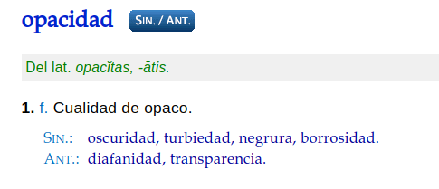

# Introducción a CSS
## Profesor: Lic. Juan José González Ramírez
### Email: juanftp100.edu@gmail.com
### Github: 
- [Repositorio del profe - docencia](https://github.com/gallopeladoprofe)
- [Repositorio del profe - personal](https://github.com/gallopelado)

Aviso: Este documento está en constante actualización, favor dirigirse al email en caso de encontrar errores. Muchas gracias :sunglasses: :stuck_out_tongue_closed_eyes: :heartbeat:. La mayoría de los ejemplos pertenecen a [CSS Tutorial](https://www.w3schools.com/css/default.asp) del inglés.

### ¿Qué es CSS?
CSS es el lenguaje que usamos para estilizar un documento HTML.
CSS describe como los elementos HTML deberían ser mostrados.
Este tutorial va ir de lo básico de CSS a lo avanzado.

#### Ejemplos en cada capítulo
Este tutorial contiene miles de ejemplos de CSS.
En nuestro caso es conveniente crearse un repositorio en Github para ir versionando los avances.

```CSS
body {
  background-color: lightblue; /* cambia de color el fondo del body*/
}

h1 {
  color: white; /* cambia de color de fuente a blanco */
  text-align: center; /* alinea el texto al centro */
}

p {
  font-family: verdana; /* cambia el tipo de fuente del párrafo */
  font-size: 20px; /* cambia el tamaño de la fuente a 20px */
}
```
Ahora veamos el HTML:
```html
<!DOCTYPE html>
<html>
<head>
<style>
body {
  background-color: lightblue;
}

h1 {
  color: white;
  text-align: center;
}

p {
  font-family: verdana;
  font-size: 20px;
}
</style>
</head>
<body>

<h1>My First CSS Example</h1>
<p>This is a paragraph.</p>

</body>
</html>
```

#### Introducción
- CSS es un acrónimo que significa Hoja de estilos cascada (Cascading Style Sheets)
- CSS describe como los elementos HTML son mostrados sobre la pantalla, papel u otro dispositivo multimedia.
- CSS ahorra trabajo. Puede controlar la disposición(*layout*) de múltiples páginas web de una vez.
- Hojas de estilo externas son almacenadas en archivos CSS.

Veamos un ejemplo en línea de [CSS Demo - One HTML Page - Multiple Styles!](https://www.w3schools.com/css/css_intro.asp).

#### ¿Por qué usamos CSS?
CSS se usa para definir estilos para tus páginas web, incluido el diseño, la disposición y variaciones en pantall para diferentes dispositivos y tamaños de pantalla.

#### CSS solucionó un gran problema
HTML nunca tuvo la intención de contener etiquetas para formatear páginas web.
HTML fue creado para describir contenido de una página web, como:
```html
<h1>This is a heading</h1>

<p>This is a paragraph.</p>
```
Cuando las etiquetas como `<font>`, y atributos de color fueron agregadas a la especificación HTML 3.2, empezó la pesadilla para los desarrolladores web.
Desarrollar grandes sitios, donde la fuente y la información de color debían de ser agregadas en cada página, se convirtió en un largo y costoso proceso.

Para solucionar este problema, el consorcio World Wide Web creó CSS.

CSS removió el formateo desde las páginas HTML.

#### CSS ahorra trabajo
La definición de estilos se realizan normalmente en archivos externos con extensión **.css**.
Con un archivo de CSS extenro, puedes cambiar la apariencia de un sitio web modificando en un solo archivo.

#### Sintaxis CSS
Una regla CSS consiste en un selector y una declaración de bloque.


El *selector* marca cual es el elemento HTML al cual quieres darle estilo.
El bloque *declaration* contiene una o más declaraciones separadas por el signo `;`.
Cada declaración de CSS está separada por punto y coma, y los bloques están rodeados de llaves.

Ejemplo:
```css
p {
  color: red;
  text-align: center;
}
```

Ejemplo explicado:
- `p` es un selector en CSS que apunta la etiqueta `<p>` de HTML.
- `color` es una propiedad y `red` es el valor de la propiedad.
- `text-align` es una propiedad y `center` es el valor de la propiedad.

### Selectores en CSS
Un selector en CSS selecciona un(o varios) elemento(os) HTML que quieres darle estilo.

Los selectores son usados para "encontrar" o seleccionar elementos HTML para darles estilo.

Podemos dividirlos en cinco categorías:
- Selectores simples (seleccionar elementos basados en nombre, id, clase).
- Combinator selectors (seleccionan elementos basados en una específica relación entre ellos).
- Pseudo-class selectors (seleccionan elementos basados en un cierto estado).
- Pseudo-elements selectors (seleccionar estilo de una parte de un elemento).
- Attribute selectors (seleccionan elementos basados en un atributo o valor de atributo).

Ejemplo:

Todas las etiquetas `<p>` serán alineadas al centro , y el color de texto será rojo.
```css
p {
  text-align: center;
  color: red;
}
```

#### El selector de id
El selector de id usa el atributo id de un elemento HTML para seleccionarlos.
El id es un elemento único en una página, entonces el id selector es usado para seleccionar un único elemento.
Para seleccionar un elemento que usa id, hay que usar el signo `#` seguido del nombre del id del elemento:

La regla CSS abajo va aplicarse para aquel elemento HTML que tenga el *id="para1"*:
```css
<!DOCTYPE html>
<html>
<head>
<style>
    #para1 {
        text-align: center;
        color: red;
    }
</style>
</head>
<body>

<p id="para1">Hello World!</p>
<p>This paragraph is not affected by the style.</p>

</body>
</html>
```

#### El selector de clase
El selector de clase selecciona un elemento HTML con una clase específica.
Para seleccionar elementos, se utiliza el punto `.` seguido del nombre de la clase.

Ejemplo:
```css
<!DOCTYPE html>
<html>
<head>
<style>
.center {
  text-align: center;
  color: red;
}
</style>
</head>
<body>

<h1 class="center">Red and center-aligned heading</h1>
<p class="center">Red and center-aligned paragraph.</p> 

</body>
</html>

```

También se puede especificar solamente el elemento que tenga esa clase:
```css
p.center {
  text-align: center;
  color: red;
}
```

#### El selector universal
El selector universal es el asterisco (`*`), selecciona todos los elementos de la página:
```css
* {
  text-align: center;
  color: blue;
}
```

#### El selector de grupo
El selector de grupo selecciona todos los elementos HTML con la misma definición de estilo.
Mira el siguiente bloque, h1, h2 y p tienen la misma definición:
```css
h1 {
  text-align: center;
  color: red;
}

h2 {
  text-align: center;
  color: red;
}

p {
  text-align: center;
  color: red;
}
```

Sería mejor agrupar los selectores, para minimzar el código, ejemplo:
```css
h1, h2, p {
  text-align: center;
  color: red;
}
```

#### Ejercicios de CSS Selectors:
1. Asigna el color de texto rojo, para todos los elementos `<p>`.
2. Asigna el color de texto rojo, para el elemento que tenga un id="para1".
3. Asigna el color de texto rojo, para los elementos con `class="colortext"`.
4. Asigna el color de texto rojo, para todos las etiquetas `<p>` y `<h1>`. Utiliza la agrupación para minimizar código.

#### Todos los selectores simples
| Selector | Ejemplo | Descripción |
|----------|---------|-------------|
| `#id` | #primernombre | Selecciona el elemento con el *id="primernombre"* |
| `.class` | .intro | Selecciona todos los elementos con la clase *class="intro"* |
| `elemento.class` | p.intro | Selecciona solamente `<p>` con la clase *class="intro"* |
| `*` | * | Selecciona todos los elementos |
| `elemento` | p | Selecciona todos los elementos `<p>` |
| `elemento, elemento2,..` | div, p | Selecciona todos los `<div>` y todos los `<p>` |

### Como agregar CSS
Cuando un navegador lee una hoja de estilo, este va a formatear el documento HTML de acuerdo con la información en la hoja de estilos.

#### Hay tres formas de usar CSS
- CSS externo
- CSS interno
- CSS en línea

#### CSS externo
Con una hoja de estilos externa, puedes cambiar la apariencia completa de un website en un solo archivo.
Cada página HTML debe incluir una referencia a la hoja de estilos usando la etiqueta `<link>` en el head.

Ejemplo:
```html
<!DOCTYPE html>
<html>
  <head>
    <link rel="stylesheet" href="mystyle.css">
  </head>
  <body>

    <h1>Esto es un título grande</h1>
    <p>Un párrafo.</p>

  </body>
</html>
```
[¡Prueba en línea!](https://www.w3schools.com/css/tryit.asp?filename=trycss_howto_external)

Una hoja de estilos externa puede ser escrita con cualquier editor de texto, debe ser guardada con la extensión **.css**.
El fichero **.css** no debería contener ninguna etiqueta HTML.

Ejemplo:
```css
body {
  background-color: lightblue;
}

h1 {
  color: navy;
  margin-left: 20px;
}
```
---
**Atención:** No agregar espacios en medio de la propiedad (20) y la unidad (px):
Incorrecto(espacio): `margin-left: 20 px;`
Correcto(espacio): `margin-left: 20px;`
---

#### CSS interno
También puede usarse CSS en un documento HTML.
El css interno se define dentro de la etiqueta `<style></style>` del head.

Ejemplo:
```html
<!DOCTYPE html>
<html>
  <head>
  <style>
    body {
      background-color: linen;
    }

    h1 {
      color: maroon;
      margin-left: 40px;
    }
  </style>
  </head>
  <body>

	<h1>This is a heading</h1>
	<p>This is a paragraph.</p>

  </body>
</html>
```
[¡Prueba en línea!](https://www.w3schools.com/css/tryit.asp?filename=trycss_howto_internal)


#### CSS en línea
El estilo *inline* podría ser aplicado a un elemento.
Para usar el estilo inline, se debe agregar el atributo `style` a un elemento. Este atributo puede contener propiedades CSS.

Ejemplo:
```html
<!DOCTYPE html>
<html>
	<body>

		<h1 style="color:blue;text-align:center;">This is a heading</h1>
		<p style="color:red;">This is a paragraph.</p>

	</body>
</html>
```
[¡Prueba en línea!](https://www.w3schools.com/css/tryit.asp?filename=trycss_howto_inline)

#### Hojas de estilo múltiple
Si algunas propiedades fueron definidas para el mismo selector (elemento) en diferentes hojas de estilo, el valor de la última hoja de estilo leída será usado.

Asumimos que una **hoja de estilos externa** está siendo aplicada al elemento `<h1>`:
```css
h1 {
  color: navy;
}
```

Luego, asumimos que hay **estilos internos** que también modifican al elemento `<h1>`:
```css
h1 {
  color: orange;
}
```

Si el estilo interno es definido **después** de un link externo, el <h1> será orange:
```html
<head>
<link rel="stylesheet" type="text/css" href="mystyle.css">
<style>
	h1 {
	color: orange;
	}
</style>
</head>
```
#### Orden en cascada
¿Cuál será el estilo a usarse cuando hay más de uno en el documento HTML?

Todoslos estilos en una página será interpretados en un nuevo estilo virtual de reglas, donde el número uno tiene la mayor prioridad de todas:
1. Estilo en línea(inline dentro del elemento HTML)
2. Hojas de estilos interna y externa (en la sección del head)
3. Por defecto del navegador

Entonces, un estilo inline tiene la mayor prioridad, y va a sobreescribir estilos internos y externos como también lo que el navegador maneja por defecto.

[¡Prueba en línea!](https://www.w3schools.com/css/tryit.asp?filename=trycss_howto_cascade)

Ejercicio:
Agregar un estilo externo con la URL: "mystyle.css".
```html
<head>

</head>

<body>
  <h1>This is a heading</h1>
  <p>This is a paragraph</p>
  <p>This is a paragraph</p>
</body>
```

### Comentarios en CSS
Los comentarios en CSS no son mostrados en el navegador, pero ellos pueden ayudar a documentar el código fuente.

Los comentarios son usados para explicar código, también para editar.

Los comentarios son ignorados por el navegador.

Un comentario puede ser escrito dentro de las etiquetas `<style>`, empieza con `/*` y termina con `*/`:

Ejemplo:
```css
/* This is a single-line comment */
p {
  color: red;
}
```
[¡Prueba en línea!](https://www.w3schools.com/css/tryit.asp?filename=trycss_comments)

Puedes agregar comentarios donde quieras en el código:
```css
p {
  color: red;  /* Set text color to red */
}
```
[¡Prueba en línea!](https://www.w3schools.com/css/tryit.asp?filename=trycss_comments2)

Incluso en medio del código:
```css
p {
  color: /*red*/blue; 
}
```
[¡Prueba en línea!](https://www.w3schools.com/css/tryit.asp?filename=trycss_comments2_2)

También pueden ocupar múltiples líneas:
```css
/* This is
a multi-line
comment */

p {
  color: red;
}
```
[¡Prueba en línea!](https://www.w3schools.com/css/tryit.asp?filename=trycss_comments3)

#### Comentarios CSS y HTML
Ya sabes que en HTML, los comentarios son `<!--...-->`.

En el ejemplo de HTML:
```html
<!DOCTYPE html>
<html>
	<head>
	<style>
		p {
			color: red; /* Set text color to red */
		}
	</style>
	</head>
	<body>

		<h2>My Heading</h2>

		<!-- These paragraphs will be red -->
		<p>Hello World!</p>
		<p>This paragraph is styled with CSS.</p>
		<p>CSS comments are not shown in the output.</p>

	</body>
</html>
```
[¡Prueba en línea!](https://www.w3schools.com/css/tryit.asp?filename=trycss_comments4)

### Colores en CSS
Los colores son especificados usando nombres de colores, o RGB, HEX, HSL, RGBA, HSLA.

Por nombres de colores:
```html
<!DOCTYPE html>
<html>
<body>

  <h1 style="background-color:Tomato;">Tomato</h1>
  <h1 style="background-color:Orange;">Orange</h1>
  <h1 style="background-color:DodgerBlue;">DodgerBlue</h1>
  <h1 style="background-color:MediumSeaGreen;">MediumSeaGreen</h1>
  <h1 style="background-color:Gray;">Gray</h1>
  <h1 style="background-color:SlateBlue;">SlateBlue</h1>
  <h1 style="background-color:Violet;">Violet</h1>
  <h1 style="background-color:LightGray;">LightGray</h1>

</body>
</html>
```
[¡Prueba en línea!](https://www.w3schools.com/css/tryit.asp?filename=trycss_color_names)
CSS y HTML son compatibles con [140 nombres de colores](https://www.w3schools.com/colors/colors_names.asp)

#### El Background color
Puedes configurar el background color o fondo de los elementos HTML:
<h1 style="background-color:DodgerBlue;">Hello World</h1>
<p style="background-color:Tomato;">Lorem ipsum...</p>

Ejemplo:
```html
<h1 style="background-color:DodgerBlue;">Hello World</h1>
<p style="background-color:Tomato;">Lorem ipsum...</p>
```
[¡Prueba en línea!](https://www.w3schools.com/css/tryit.asp?filename=trycss_color_background)

#### El color del texto
Puedes configurar el color del texto:
<h4 style="color:Tomato;">Hola Mundo</h4>
<p style="color:DodgerBlue;">Lorem ipsum...</p>
<p style="color:MediumSeaGreen;">Ut wisi enim...</p>

Ejemplo:
```html
<h1 style="color:Tomato;">Hello World</h1>
<p style="color:DodgerBlue;">Lorem ipsum...</p>
<p style="color:MediumSeaGreen;">Ut wisi enim...</p>
```

#### El color de borde o border color
Puedes cambiar el color de los bordes:
<h1 style="border:2px solid Tomato;">Hello World</h1>
<h1 style="border:2px solid DodgerBlue;">Hello World</h1>
<h1 style="border:2px solid Violet;">Hello World</h1>

Ejemplo:
```html
<h1 style="border:2px solid Tomato;">Hello World</h1>
<h1 style="border:2px solid DodgerBlue;">Hello World</h1>
<h1 style="border:2px solid Violet;">Hello World</h1>
```

#### Los tipos de valores de colores
CSS permite especificar diferentes tipos de valores como pueden ser: RGB, HEX, RGBA, HSLA:

Usaremos el color "Tomato":
<h1 style="background-color:rgb(255, 99, 71);">rgb(255, 99, 71)</h1>
<h1 style="background-color:#ff6347;">#ff6347</h1>
<h1 style="background-color:hsl(9, 100%, 64%);">hsl(9, 100%, 64%)</h1>

Ejemplo:
```html
<h1 style="background-color:rgb(255, 99, 71);">rgb(255, 99, 71)</h1>
<h1 style="background-color:#ff6347;">#ff6347</h1>
<h1 style="background-color:hsl(9, 100%, 64%);">hsl(9, 100%, 64%)</h1>
```

El mismo color pero con un 50% de transparencia:
<h1 style="background-color:rgba(255, 99, 71, 0.5);">rgba(255, 99, 71, 0.5)</h1>
<h1 style="background-color:hsla(9, 100%, 64%, 0.5);">hsla(9, 100%, 64%, 0.5)</h1>

Ejemplo:
```html
<h1 style="background-color:rgba(255, 99, 71, 0.5);">rgba(255, 99, 71, 0.5)</h1>
<h1 style="background-color:hsla(9, 100%, 64%, 0.5);">hsla(9, 100%, 64%, 0.5)</h1>
```

#### Colores RGB
Un color en RGB representa RED, GREEN, BLUE

Siguiendo esta fórmula:

**rgb(red, green, blue)**

Cada parámetro (red, gree, blue) define la intensidad del color entre 0 y 255.

Por ejemplo, rgb(255, 0, 0) muestra el rojo(red), porque red es el más alto valor y los otros tienen 0.

Para mostrar negro(black), se utiliza todos los parámetros a 0, rgb(0, 0, 0).

Para mostrar blanco(white), se utiliza todos los parámetros a 255, rgb(255, 255, 255).

[¡Prueba en línea!](https://www.w3schools.com/css/css_colors_rgb.asp)

<h2 style="background-color:rgb(255, 0, 0);">rgb(255, 0, 0)</h2>
<h2 style="background-color:rgb(0, 0, 255);">rgb(0, 0, 255)</h2>
<h2 style="background-color:rgb(60, 179, 113);">rgb(60, 179, 113)</h2>
<h2 style="background-color:rgb(238, 130, 238);">rgb(238, 130, 238)</h2>
<h2 style="background-color:rgb(255, 165, 0);">rgb(255, 165, 0)</h2>
<h2 style="background-color:rgb(106, 90, 205);">rgb(106, 90, 205)</h2>

Ejemplo:
```html
<h2 style="background-color:rgb(255, 0, 0);">rgb(255, 0, 0)</h2>
<h2 style="background-color:rgb(0, 0, 255);">rgb(0, 0, 255)</h2>
<h2 style="background-color:rgb(60, 179, 113);">rgb(60, 179, 113)</h2>
<h2 style="background-color:rgb(238, 130, 238);">rgb(238, 130, 238)</h2>
<h2 style="background-color:rgb(255, 165, 0);">rgb(255, 165, 0)</h2>
<h2 style="background-color:rgb(106, 90, 205);">rgb(106, 90, 205)</h2>
```

[¡Prueba en línea!](https://www.w3schools.com/css/tryit.asp?filename=trycss_color_rgb2)

La escala de grises también es usada:
<h2 style="background-color:rgb(60, 60, 60);">rgb(60, 60, 60)</h2>
<h2 style="background-color:rgb(90, 90, 90);">rgb(90, 90, 90)</h2>
<h2 style="background-color:rgb(120, 120, 120);">rgb(120, 120, 120)</h2>
<h2 style="background-color:rgb(180, 180, 180);">rgb(180, 180, 180)</h2>
<h2 style="background-color:rgb(210, 210, 210);">rgb(210, 210, 210)</h2>
<h2 style="background-color:rgb(240, 240, 240);">rgb(240, 240, 240)</h2>

Ejemplo:
```html
<h2 style="background-color:rgb(60, 60, 60);">rgb(60, 60, 60)</h2>
<h2 style="background-color:rgb(90, 90, 90);">rgb(90, 90, 90)</h2>
<h2 style="background-color:rgb(120, 120, 120);">rgb(120, 120, 120)</h2>
<h2 style="background-color:rgb(180, 180, 180);">rgb(180, 180, 180)</h2>
<h2 style="background-color:rgb(210, 210, 210);">rgb(210, 210, 210)</h2>
<h2 style="background-color:rgb(240, 240, 240);">rgb(240, 240, 240)</h2>
```

#### Valores RGBA
RGBA es una extensión de los colores RGB con un nuevo canal, el *alpha* y este especifica la opacidad de un color:
Según la [RAE](https://dle.rae.es/opacidad?m=form):


<h2 style="background-color:rgba(255, 99, 71, 0);">rgba(255, 99, 71, 0)</h2>
<h2 style="background-color:rgba(255, 99, 71, 0.2);">rgba(255, 99, 71, 0.2)</h2>
<h2 style="background-color:rgba(255, 99, 71, 0.4);">rgba(255, 99, 71, 0.4)</h2>
<h2 style="background-color:rgba(255, 99, 71, 0.6);">rgba(255, 99, 71, 0.6)</h2>
<h2 style="background-color:rgba(255, 99, 71, 0.8);">rgba(255, 99, 71, 0.8)</h2>
<h2 style="background-color:rgba(255, 99, 71, 1);">rgba(255, 99, 71, 1)</h2>

Ejemplo:
```html
<h2 style="background-color:rgba(255, 99, 71, 0);">rgba(255, 99, 71, 0)</h2>
<h2 style="background-color:rgba(255, 99, 71, 0.2);">rgba(255, 99, 71, 0.2)</h2>
<h2 style="background-color:rgba(255, 99, 71, 0.4);">rgba(255, 99, 71, 0.4)</h2>
<h2 style="background-color:rgba(255, 99, 71, 0.6);">rgba(255, 99, 71, 0.6)</h2>
<h2 style="background-color:rgba(255, 99, 71, 0.8);">rgba(255, 99, 71, 0.8)</h2>
<h2 style="background-color:rgba(255, 99, 71, 1);">rgba(255, 99, 71, 1)</h2>
```

#### Colores en Hexadecimal
Un color hexadecimal es especicado de la siguiente manera:

| #RRGGBB | Donde RR(red) | GG(green) | BB(blue) |
|---------|---------------|-----------|----------|

**#rrggbb**

Donde rr (red), gg (gree), bb (blue) son valores hexadecimales entre 00 y ff (lo mismo que 0-255).

Por ejemplo, #ff0000 es rojo, porque el más alto valor es (ff) y los otros son los más bajos (00).

Para mostrar el negro, se usa 00 en todos, #000000

Para mostrar blanco, se usa ff ent todos, #ffffff

[¡Prueba en línea!](https://www.w3schools.com/css/css_colors_hex.asp)

<h2 style="background-color:#ff0000;">#ff0000</h2>
<h2 style="background-color:#0000ff;">#0000ff</h2>
<h2 style="background-color:#3cb371;">#3cb371</h2>
<h2 style="background-color:#ee82ee;">#ee82ee</h2>
<h2 style="background-color:#ffa500;">#ffa500</h2>
<h2 style="background-color:#6a5acd;">#6a5acd</h2>

Ejemplo:
```html
<h2 style="background-color:#ff0000;">#ff0000</h2>
<h2 style="background-color:#0000ff;">#0000ff</h2>
<h2 style="background-color:#3cb371;">#3cb371</h2>
<h2 style="background-color:#ee82ee;">#ee82ee</h2>
<h2 style="background-color:#ffa500;">#ffa500</h2>
<h2 style="background-color:#6a5acd;">#6a5acd</h2>
```

La escala de grises:
<h2 style="background-color:#3c3c3c;">#3c3c3c</h2>
<h2 style="background-color:#616161;">#616161</h2>
<h2 style="background-color:#787878;">#787878</h2>
<h2 style="background-color:#b4b4b4;">#b4b4b4</h2>
<h2 style="background-color:#f0f0f0;">#f0f0f0</h2>
<h2 style="background-color:#f9f9f9;">#f9f9f9</h2>

```html
<h2 style="background-color:#3c3c3c;">#3c3c3c</h2>
<h2 style="background-color:#616161;">#616161</h2>
<h2 style="background-color:#787878;">#787878</h2>
<h2 style="background-color:#b4b4b4;">#b4b4b4</h2>
<h2 style="background-color:#f0f0f0;">#f0f0f0</h2>
<h2 style="background-color:#f9f9f9;">#f9f9f9</h2>
```

#### Valores de 3 dígitos
A veces es posible ver 3 dígitos de código hexadecimal.

Estos tres dígitos son una forma corta de usar en vez de seis.

Estos siguen la misma forma que rgb:

**#rgb**

Donde r, g, b son red, green y blue que pueden ser valores entre 0 y f.

Los tres dígitos únicamente pueden ser usados por (RR, GG, BB) en un mismo componente. Entonces, si tenemos #ff00cc, podría ser #f0c.

Ejemplo:

```css
body {
  background-color: #fc9; /* same as #ffcc99 */
}

h1 {
  color: #f0f; /* same as #ff00ff */
}

p {
  color: #b58; /* same as #bb5588 */
}
```
[¡Prueba en línea!](https://www.w3schools.com/css/tryit.asp?filename=trycss_color_hex_3digit)

#### Colores HSL
HSL significa hue(color, matiz), saturation(saturación) y lightness(luminosidad)

**hsl(hue, saturation, lightness)**

Hue es el grado de color entre 0 a 360. 0 es red, 120 es green y 240 es blue.

La saturación es el porcentaje. 0% para grises y 100% para color completo.

Lightness también es porcentaje. 0% es negro, 50% ni claro ni oscuro, 100% es blanco.

[¡Prueba en línea!](https://www.w3schools.com/css/css_colors_hsl.asp)

<h2 style="background-color:hsl(0, 100%, 50%);">hsl(0, 100%, 50%)</h2>
<h2 style="background-color:hsl(240, 100%, 50%);">hsl(240, 100%, 50%)</h2>
<h2 style="background-color:hsl(147, 50%, 47%);">hsl(147, 50%, 47%)</h2>
<h2 style="background-color:hsl(300, 76%, 72%);">hsl(300, 76%, 72%)</h2>
<h2 style="background-color:hsl(39, 100%, 50%);">hsl(39, 100%, 50%)</h2>
<h2 style="background-color:hsl(248, 53%, 58%);">hsl(248, 53%, 58%)</h2>

Ejemplo:
```html
<h2 style="background-color:hsl(0, 100%, 50%);">hsl(0, 100%, 50%)</h2>
<h2 style="background-color:hsl(240, 100%, 50%);">hsl(240, 100%, 50%)</h2>
<h2 style="background-color:hsl(147, 50%, 47%);">hsl(147, 50%, 47%)</h2>
<h2 style="background-color:hsl(300, 76%, 72%);">hsl(300, 76%, 72%)</h2>
<h2 style="background-color:hsl(39, 100%, 50%);">hsl(39, 100%, 50%)</h2>
<h2 style="background-color:hsl(248, 53%, 58%);">hsl(248, 53%, 58%)</h2>
```

#### Saturation
La saturación es la intensidad de un color

100% es color puro, sin escala de grises.

50% es 50% de gris, pero el color aún se puede ver.

0% es completamente gris, no se ve el color.

<h2 style="background-color:hsl(0, 100%, 50%);">hsl(0, 100%, 50%)</h2>
<h2 style="background-color:hsl(0, 80%, 50%);">hsl(0, 80%, 50%)</h2>
<h2 style="background-color:hsl(0, 60%, 50%);">hsl(0, 60%, 50%)</h2>
<h2 style="background-color:hsl(0, 40%, 50%);">hsl(0, 40%, 50%)</h2>
<h2 style="background-color:hsl(0, 20%, 50%);">hsl(0, 20%, 50%)</h2>
<h2 style="background-color:hsl(0, 0%, 50%);">hsl(0, 0%, 50%)</h2>

Ejemplo:
```html
<h2 style="background-color:hsl(0, 100%, 50%);">hsl(0, 100%, 50%)</h2>
<h2 style="background-color:hsl(0, 80%, 50%);">hsl(0, 80%, 50%)</h2>
<h2 style="background-color:hsl(0, 60%, 50%);">hsl(0, 60%, 50%)</h2>
<h2 style="background-color:hsl(0, 40%, 50%);">hsl(0, 40%, 50%)</h2>
<h2 style="background-color:hsl(0, 20%, 50%);">hsl(0, 20%, 50%)</h2>
<h2 style="background-color:hsl(0, 0%, 50%);">hsl(0, 0%, 50%)</h2>
```

#### Lightness
La luminosidad es cuanta luz tiene un color, donde 0% es sin luz (negro), 50% es ni oscuro ni claro y 100% es completo.

<h2 style="background-color:hsl(0, 100%, 0%);">hsl(0, 100%, 0%)</h2>
<h2 style="background-color:hsl(0, 100%, 25%);">hsl(0, 100%, 25%)</h2>
<h2 style="background-color:hsl(0, 100%, 50%);">hsl(0, 100%, 50%)</h2>
<h2 style="background-color:hsl(0, 100%, 75%);">hsl(0, 100%, 75%)</h2>
<h2 style="background-color:hsl(0, 100%, 90%);">hsl(0, 100%, 90%)</h2>
<h2 style="background-color:hsl(0, 100%, 100%);">hsl(0, 100%, 100%)</h2>

Ejemplo:
```html
<h2 style="background-color:hsl(0, 100%, 0%);">hsl(0, 100%, 0%)</h2>
<h2 style="background-color:hsl(0, 100%, 25%);">hsl(0, 100%, 25%)</h2>
<h2 style="background-color:hsl(0, 100%, 50%);">hsl(0, 100%, 50%)</h2>
<h2 style="background-color:hsl(0, 100%, 75%);">hsl(0, 100%, 75%)</h2>
<h2 style="background-color:hsl(0, 100%, 90%);">hsl(0, 100%, 90%)</h2>
<h2 style="background-color:hsl(0, 100%, 100%);">hsl(0, 100%, 100%)</h2>
```

### Escala de grises
La escala de grises es a menudo definida por el hue, saturación a 0, y luminisodadid de 0% a 100% para obtener algo más oscuro o claro.
<h2 style="background-color:hsl(0, 0%, 0%);">hsl(0, 0%, 0%)</h2>
<h2 style="background-color:hsl(0, 0%, 24%);">hsl(0, 0%, 24%)</h2>
<h2 style="background-color:hsl(0, 0%, 47%);">hsl(0, 0%, 47%)</h2>
<h2 style="background-color:hsl(0, 0%, 71%);">hsl(0, 0%, 71%)</h2>
<h2 style="background-color:hsl(0, 0%, 94%);">hsl(0, 0%, 94%)</h2>
<h2 style="background-color:hsl(0, 0%, 100%);">hsl(0, 0%, 100%)</h2>

```html
<h2 style="background-color:hsl(0, 0%, 0%);">hsl(0, 0%, 0%)</h2>
<h2 style="background-color:hsl(0, 0%, 24%);">hsl(0, 0%, 24%)</h2>
<h2 style="background-color:hsl(0, 0%, 47%);">hsl(0, 0%, 47%)</h2>
<h2 style="background-color:hsl(0, 0%, 71%);">hsl(0, 0%, 71%)</h2>
<h2 style="background-color:hsl(0, 0%, 94%);">hsl(0, 0%, 94%)</h2>
<h2 style="background-color:hsl(0, 0%, 100%);">hsl(0, 0%, 100%)</h2>
```

#### El valor alpha

**hsla(hue, saturation, lightness, alpha)**

Este indica la transparencia, 0.0 es completamente transparente y 1.0 no tan transparente.

[¡Prueba en línea!](https://www.w3schools.com/css/css_colors_hsl.asp)

<h2 style="background-color:hsla(9, 100%, 64%, 0);">hsla(9, 100%, 64%, 0)</h2>
<h2 style="background-color:hsla(9, 100%, 64%, 0.2);">hsla(9, 100%, 64%, 0.2)</h2>
<h2 style="background-color:hsla(9, 100%, 64%, 0.4);">hsla(9, 100%, 64%, 0.4)</h2>
<h2 style="background-color:hsla(9, 100%, 64%, 0.6);">hsla(9, 100%, 64%, 0.6)</h2>
<h2 style="background-color:hsla(9, 100%, 64%, 0.8);">hsla(9, 100%, 64%, 0.8)</h2>
<h2 style="background-color:hsla(9, 100%, 64%, 1);">hsla(9, 100%, 64%, 1)</h2>

Ejemplo:
```html
<h2 style="background-color:hsla(9, 100%, 64%, 0);">hsla(9, 100%, 64%, 0)</h2>
<h2 style="background-color:hsla(9, 100%, 64%, 0.2);">hsla(9, 100%, 64%, 0.2)</h2>
<h2 style="background-color:hsla(9, 100%, 64%, 0.4);">hsla(9, 100%, 64%, 0.4)</h2>
<h2 style="background-color:hsla(9, 100%, 64%, 0.6);">hsla(9, 100%, 64%, 0.6)</h2>
<h2 style="background-color:hsla(9, 100%, 64%, 0.8);">hsla(9, 100%, 64%, 0.8)</h2>
<h2 style="background-color:hsla(9, 100%, 64%, 1);">hsla(9, 100%, 64%, 1)</h2>
```
