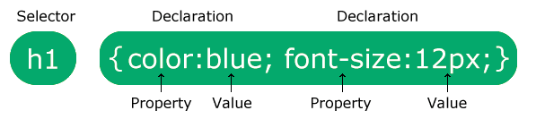

# Introducción a CSS
## Profesor: Lic. Juan José González Ramírez
### Email: juanftp100.edu@gmail.com
### Github: 
- [Repositorio del profe - docencia](https://github.com/gallopeladoprofe)
- [Repositorio del profe - personal](https://github.com/gallopelado)

Aviso: Este documento está en constante actualización, favor dirigirse al email en caso de encontrar errores. Muchas gracias :sunglasses: :stuck_out_tongue_closed_eyes: :heartbeat:. La mayoría de los ejemplos pertenecen a [CSS Tutorial](https://www.w3schools.com/css/default.asp) del inglés.

### ¿Qué es CSS?
CSS es el lenguaje que usamos para estilizar un documento HTML.
CSS describe como los elementos HTML deberían ser mostrados.
Este tutorial va ir de lo básico de CSS a lo avanzado.

#### Ejemplos en cada capítulo
Este tutorial contiene miles de ejemplos de CSS.
En nuestro caso es conveniente crearse un repositorio en Github para ir versionando los avances.

```CSS
body {
  background-color: lightblue; /* cambia de color el fondo del body*/
}

h1 {
  color: white; /* cambia de color de fuente a blanco */
  text-align: center; /* alinea el texto al centro */
}

p {
  font-family: verdana; /* cambia el tipo de fuente del párrafo */
  font-size: 20px; /* cambia el tamaño de la fuente a 20px */
}
```
Ahora veamos el HTML:
```html
<!DOCTYPE html>
<html>
<head>
<style>
body {
  background-color: lightblue;
}

h1 {
  color: white;
  text-align: center;
}

p {
  font-family: verdana;
  font-size: 20px;
}
</style>
</head>
<body>

<h1>My First CSS Example</h1>
<p>This is a paragraph.</p>

</body>
</html>
```

#### Introducción
- CSS es un acrónimo que significa Hoja de estilos cascada (Cascading Style Sheets)
- CSS describe como los elementos HTML son mostrados sobre la pantalla, papel u otro dispositivo multimedia.
- CSS ahorra trabajo. Puede controlar la disposición(*layout*) de múltiples páginas web de una vez.
- Hojas de estilo externas son almacenadas en archivos CSS.

Veamos un ejemplo en línea de [CSS Demo - One HTML Page - Multiple Styles!](https://www.w3schools.com/css/css_intro.asp).

#### ¿Por qué usamos CSS?
CSS se usa para definir estilos para tus páginas web, incluido el diseño, la disposición y variaciones en pantall para diferentes dispositivos y tamaños de pantalla.

#### CSS solucionó un gran problema
HTML nunca tuvo la intención de contener etiquetas para formatear páginas web.
HTML fue creado para describir contenido de una página web, como:
```html
<h1>This is a heading</h1>

<p>This is a paragraph.</p>
```
Cuando las etiquetas como `<font>`, y atributos de color fueron agregadas a la especificación HTML 3.2, empezó la pesadilla para los desarrolladores web.
Desarrollar grandes sitios, donde la fuente y la información de color debían de ser agregadas en cada página, se convirtió en un largo y costoso proceso.

Para solucionar este problema, el consorcio World Wide Web creó CSS.

CSS removió el formateo desde las páginas HTML.

#### CSS ahorra trabajo
La definición de estilos se realizan normalmente en archivos externos con extensión **.css**.
Con un archivo de CSS extenro, puedes cambiar la apariencia de un sitio web modificando en un solo archivo.

#### Sintaxis CSS
Una regla CSS consiste en un selector y una declaración de bloque.


El *selector* marca cual es el elemento HTML al cual quieres darle estilo.
El bloque *declaration* contiene una o más declaraciones separadas por el signo `;`.
Cada declaración de CSS está separada por punto y coma, y los bloques están rodeados de llaves.

Ejemplo:
```css
p {
  color: red;
  text-align: center;
}
```

Ejemplo explicado:
- `p` es un selector en CSS que apunta la etiqueta `<p>` de HTML.
- `color` es una propiedad y `red` es el valor de la propiedad.
- `text-align` es una propiedad y `center` es el valor de la propiedad.

### Selectores en CSS
Un selector en CSS selecciona un(o varios) elemento(os) HTML que quieres darle estilo.

Los selectores son usados para "encontrar" o seleccionar elementos HTML para darles estilo.

Podemos dividirlos en cinco categorías:
- Selectores simples (seleccionar elementos basados en nombre, id, clase).
- Combinator selectors (seleccionan elementos basados en una específica relación entre ellos).
- Pseudo-class selectors (seleccionan elementos basados en un cierto estado).
- Pseudo-elements selectors (seleccionar estilo de una parte de un elemento).
- Attribute selectors (seleccionan elementos basados en un atributo o valor de atributo).

Ejemplo:

Todas las etiquetas `<p>` serán alineadas al centro , y el color de texto será rojo.
```css
p {
  text-align: center;
  color: red;
}
```

#### El selector de id
El selector de id usa el atributo id de un elemento HTML para seleccionarlos.
El id es un elemento único en una página, entonces el id selector es usado para seleccionar un único elemento.
Para seleccionar un elemento que usa id, hay que usar el signo `#` seguido del nombre del id del elemento:

La regla CSS abajo va aplicarse para aquel elemento HTML que tenga el *id="para1"*:
```css
<!DOCTYPE html>
<html>
<head>
<style>
    #para1 {
        text-align: center;
        color: red;
    }
</style>
</head>
<body>

<p id="para1">Hello World!</p>
<p>This paragraph is not affected by the style.</p>

</body>
</html>
```

#### El selector de clase
El selector de clase selecciona un elemento HTML con una clase específica.
Para seleccionar elementos, se utiliza el punto `.` seguido del nombre de la clase.

Ejemplo:
```css
<!DOCTYPE html>
<html>
<head>
<style>
.center {
  text-align: center;
  color: red;
}
</style>
</head>
<body>

<h1 class="center">Red and center-aligned heading</h1>
<p class="center">Red and center-aligned paragraph.</p> 

</body>
</html>

```

También se puede especificar solamente el elemento que tenga esa clase:
```css
p.center {
  text-align: center;
  color: red;
}
```

#### El selector universal
El selector universal es el asterisco (`*`), selecciona todos los elementos de la página:
```css
* {
  text-align: center;
  color: blue;
}
```

#### El selector de grupo
El selector de grupo selecciona todos los elementos HTML con la misma definición de estilo.
Mira el siguiente bloque, h1, h2 y p tienen la misma definición:
```css
1 {
  text-align: center;
  color: red;
}

h2 {
  text-align: center;
  color: red;
}

p {
  text-align: center;
  color: red;
}
```

Sería mejor agrupar los selectores, para minimzar el código, ejemplo:
```css
h1, h2, p {
  text-align: center;
  color: red;
}
```

#### Ejercicios de CSS Selectors:
1. Asigna el color de texto rojo, para todos los elementos `<p>`.
2. Asigna el color de texto rojo, para el elemento que tenga un id="para1".
3. Asigna el color de texto rojo, para los elementos con `class="colortext"`.
4. Asigna el color de texto rojo, para todos las etiquetas `<p>` y `<h1>`. Utiliza la agrupación para minimizar código.